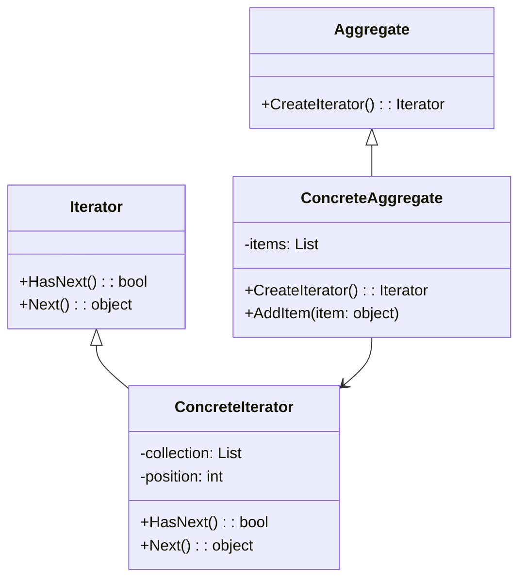
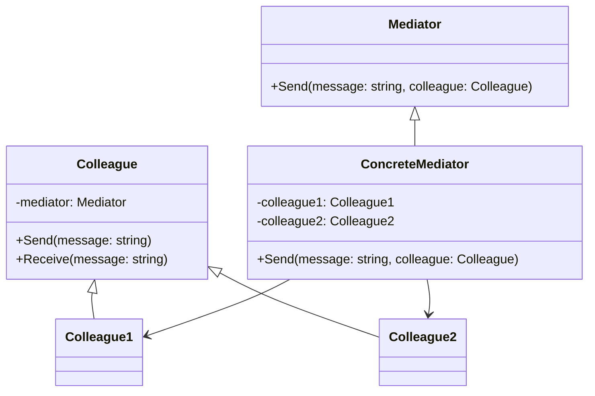
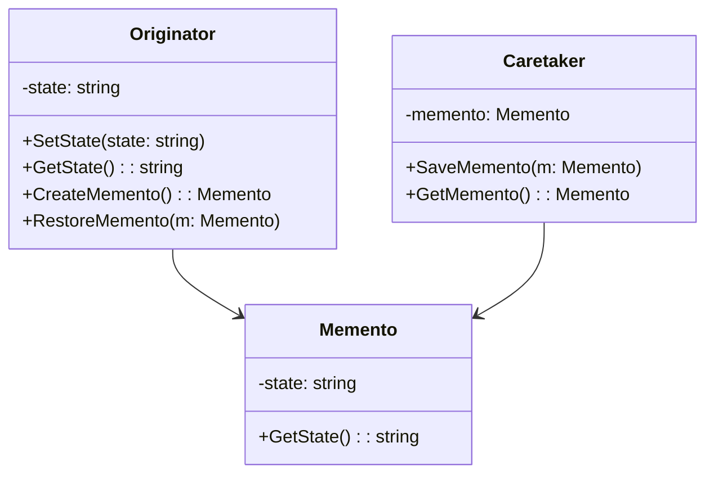
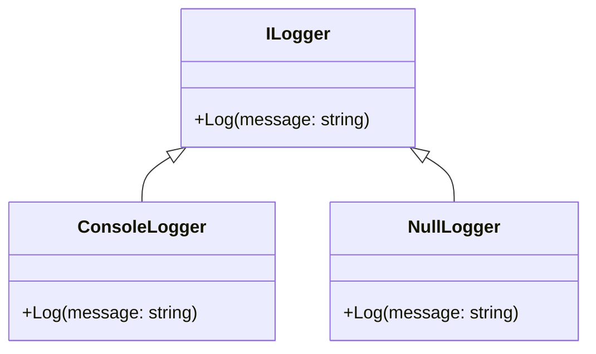
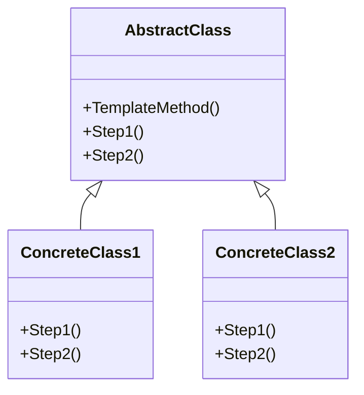
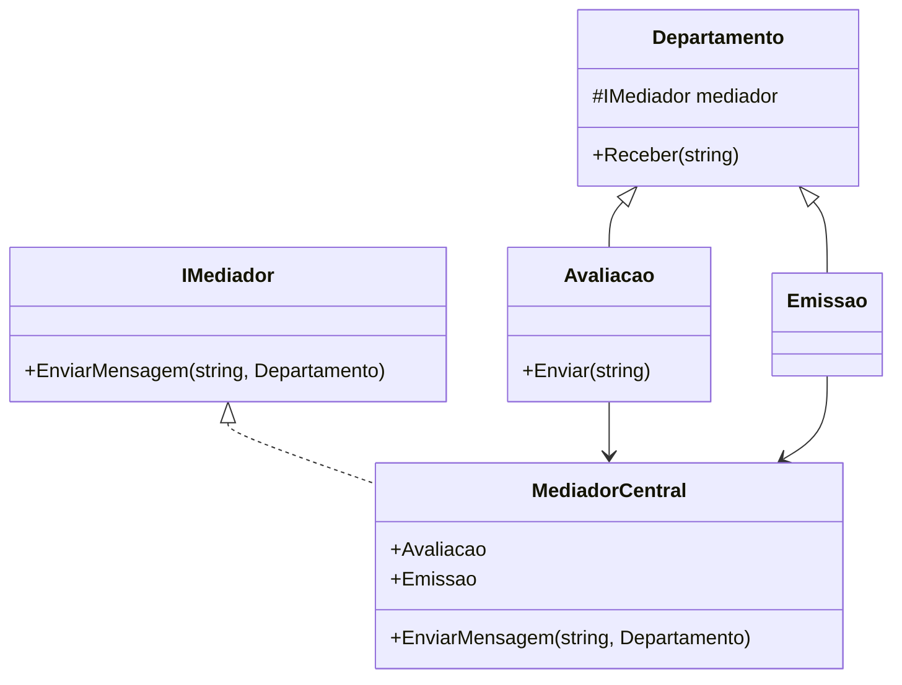
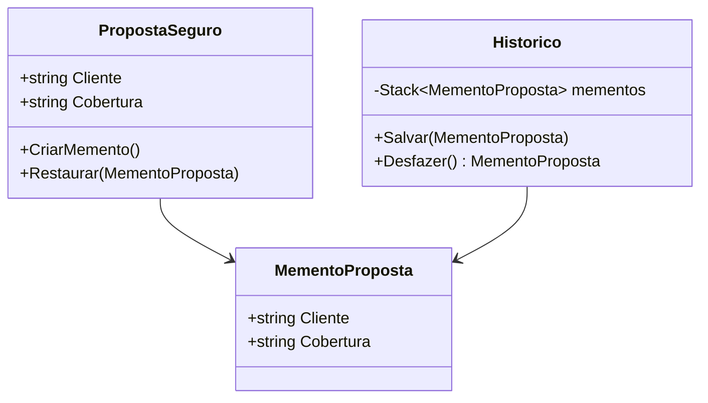
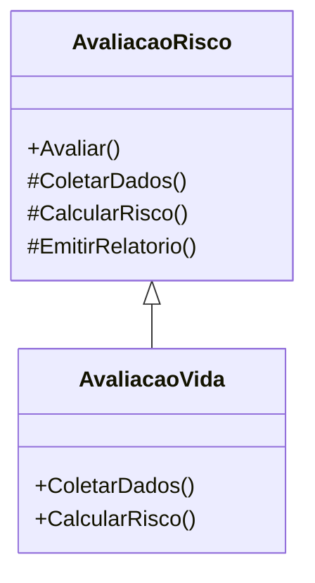

## ✅ **Estrutura Sugerida para a Aula (2h de duração)**

### 🎯 **Objetivos da Aula**

Ao final da aula, os alunos deverão ser capazes de:

* Explicar o propósito e o funcionamento dos padrões comportamentais abordados.
* Identificar situações práticas onde cada padrão pode ser aplicado.
* Implementar exemplos básicos de cada padrão.

---

## 📚 **Conteúdo da Aula**

### 🔸 1. Introdução (10 minutos)

* Relembrar o que são padrões comportamentais.
* Breve revisão dos padrões vistos anteriormente (Observer, State, Strategy etc.).
* Apresentar os 5 padrões da aula de hoje com exemplos práticos do dia a dia.

---

### 🔸 2. Padrões (20 minutos cada = 100 minutos)

#### 🔹 **Iterator**

* **Conceito**: Acesso sequencial a elementos de uma coleção sem expor sua estrutura interna.
* **Diagrama UML** (Iterator, ConcreteIterator, Aggregate, ConcreteAggregate)
* **Exemplo real**: Lista de músicas em um reprodutor de música.
* **Código** (exemplo em Java/Python)
* **Atividade prática rápida**: Implementar um iterador simples para uma lista customizada.

---

#### 🔹 **Mediator**

* **Conceito**: Facilita a comunicação entre objetos, reduzindo acoplamento.
* **Diagrama UML**
* **Exemplo real**: Torre de controle de aeroporto intermediando comunicação entre aviões.
* **Código** (chat entre usuários com um mediador)
* **Discussão**: Vantagens e desvantagens do uso do Mediator.

---

#### 🔹 **Memento**

* **Conceito**: Salva e restaura o estado interno de um objeto.
* **Diagrama UML**
* **Exemplo real**: Ctrl+Z (desfazer) em editores de texto.
* **Código**: Editor de texto com funcionalidade de desfazer.
* **Atividade**: Criar um mini editor com histórico de ações.

---

#### 🔹 **Null Object**

* **Conceito**: Um objeto que substitui `null` com comportamento padrão "vazio".
* **Exemplo real**: Logger que não faz nada quando desativado.
* **Código**: Interface `Log`, implementações `ConsoleLog` e `NullLog`.
* **Discussão**: Comparação entre verificação de `null` e uso de Null Object.

---

#### 🔹 **Template Method**

* **Conceito**: Define o esqueleto de um algoritmo, deixando passos específicos para as subclasses.
* **Diagrama UML**
* **Exemplo real**: Preparação de bebidas (café vs chá).
* **Código**: Classe abstrata `Bebida` com `prepare()` e subclasses `Café`, `Chá`.
* **Atividade**: Criar algoritmo para processar diferentes tipos de relatórios.

---

### 🔸 3. Encerramento e Revisão (10 minutos)

* Recapitular os 5 padrões.
* Dicas para reconhecer qual padrão aplicar em diferentes contextos.
* Tira-dúvidas.


###  **exemplos em C#**, com **explicação** e **diagramas UML em Mermaid.js** para os seguintes padrões comportamentais:

* Iterator
* Mediator
* Memento
* Null Object
* Template Method

---

## ✅ **1. Iterator**

### 🧠 **Explicação**

Permite acessar os elementos de uma coleção sequencialmente sem expor sua implementação interna.

---

### 📊 **UML - Iterator**



---

### 💻 **Exemplo em C#**

```csharp
// Iterator interface
public interface IIterator<T>
{
    bool HasNext();
    T Next();
}

// Aggregate interface
public interface IAggregate<T>
{
    IIterator<T> CreateIterator();
}

// Concrete Iterator
public class ListIterator<T> : IIterator<T>
{
    private readonly List<T> _collection;
    private int _position = 0;

    public ListIterator(List<T> collection)
    {
        _collection = collection;
    }

    public bool HasNext() => _position < _collection.Count;

    public T Next() => _collection[_position++];
}

// Concrete Aggregate
public class MyCollection<T> : IAggregate<T>
{
    private List<T> _items = new();

    public void AddItem(T item) => _items.Add(item);

    public IIterator<T> CreateIterator() => new ListIterator<T>(_items);
}
```

---

## ✅ **2. Mediator**

### 🧠 **Explicação**

Define um objeto que encapsula como um conjunto de objetos interage, promovendo baixo acoplamento.

---

### 📊 **UML - Mediator**



---

### 💻 **Exemplo em C#**

```csharp
public abstract class Colleague
{
    protected Mediator mediator;

    public Colleague(Mediator mediator) => this.mediator = mediator;

    public abstract void Receive(string message);
    public void Send(string message) => mediator.Send(message, this);
}

public class Colleague1 : Colleague
{
    public Colleague1(Mediator mediator) : base(mediator) { }

    public override void Receive(string message) => Console.WriteLine($"Colleague1 received: {message}");
}

public class Colleague2 : Colleague
{
    public Colleague2(Mediator mediator) : base(mediator) { }

    public override void Receive(string message) => Console.WriteLine($"Colleague2 received: {message}");
}

public abstract class Mediator
{
    public abstract void Send(string message, Colleague colleague);
}

public class ConcreteMediator : Mediator
{
    public Colleague1 Colleague1 { get; set; }
    public Colleague2 Colleague2 { get; set; }

    public override void Send(string message, Colleague sender)
    {
        if (sender == Colleague1)
            Colleague2.Receive(message);
        else
            Colleague1.Receive(message);
    }
}
```

---

## ✅ **3. Memento**

### 🧠 **Explicação**

Permite salvar e restaurar o estado anterior de um objeto sem violar o encapsulamento.

---

### 📊 **UML - Memento**



---

### 💻 **Exemplo em C#**

```csharp
public class Memento
{
    private string _state;

    public Memento(string state) => _state = state;

    public string GetState() => _state;
}

public class Originator
{
    private string _state;

    public void SetState(string state)
    {
        Console.WriteLine($"Setting state to {state}");
        _state = state;
    }

    public Memento CreateMemento() => new(_state);
    public void RestoreMemento(Memento memento)
    {
        _state = memento.GetState();
        Console.WriteLine($"Restored to state {_state}");
    }
}

public class Caretaker
{
    public Memento Memento { get; set; }
}
```

---

## ✅ **4. Null Object**

### 🧠 **Explicação**

Evita verificações nulas retornando um objeto "vazio" com comportamento padrão.

---

### 📊 **UML - Null Object**



---

### 💻 **Exemplo em C#**

```csharp
public interface ILogger
{
    void Log(string message);
}

public class ConsoleLogger : ILogger
{
    public void Log(string message) => Console.WriteLine($"[LOG]: {message}");
}

public class NullLogger : ILogger
{
    public void Log(string message) { /* não faz nada */ }
}

public class Service
{
    private readonly ILogger _logger;

    public Service(ILogger logger) => _logger = logger;

    public void Execute()
    {
        _logger.Log("Executando serviço...");
        // lógica do serviço
    }
}
```

---

## ✅ **5. Template Method**

### 🧠 **Explicação**

Define o esqueleto de um algoritmo em uma classe base, permitindo que subclasses definam certos passos.

---

### 📊 **UML - Template Method**



---

### 💻 **Exemplo em C#**

```csharp
public abstract class DataProcessor
{
    public void Process()
    {
        ReadData();
        ProcessData();
        SaveData();
    }

    protected abstract void ReadData();
    protected abstract void ProcessData();
    protected abstract void SaveData();
}

public class CsvProcessor : DataProcessor
{
    protected override void ReadData() => Console.WriteLine("Reading CSV data...");
    protected override void ProcessData() => Console.WriteLine("Processing CSV data...");
    protected override void SaveData() => Console.WriteLine("Saving CSV data...");
}

public class XmlProcessor : DataProcessor
{
    protected override void ReadData() => Console.WriteLine("Reading XML data...");
    protected override void ProcessData() => Console.WriteLine("Processing XML data...");
    protected override void SaveData() => Console.WriteLine("Saving XML data...");
}
```


---- 

Abaixo está a adaptação da **Sessão 10 – Padrões Comportamentais: Parte 3** para o contexto de uma seguradora, incluindo:

* Explicação contextualizada de cada padrão
* Código-fonte em C#
* Diagrama UML em MermaidJS

---

### 🔁 **Iterator – Acesso Sequencial em Propostas de Seguro**

**Contexto:** A seguradora precisa percorrer uma lista de propostas aprovadas para gerar relatórios ou enviar comunicações.

#### 💻 Código C\#

```csharp
public class Proposta
{
    public string NomeCliente { get; set; }
    public string TipoSeguro { get; set; }
}

public interface IIteradorProposta
{
    bool TemProxima();
    Proposta Proxima();
}

public class ColecaoPropostas
{
    private List<Proposta> _propostas = new();

    public void Adicionar(Proposta proposta) => _propostas.Add(proposta);
    public IIteradorProposta CriarIterador() => new IteradorPropostas(_propostas);
}

public class IteradorPropostas : IIteradorProposta
{
    private readonly List<Proposta> _propostas;
    private int _indiceAtual = 0;

    public IteradorPropostas(List<Proposta> propostas)
    {
        _propostas = propostas;
    }

    public bool TemProxima() => _indiceAtual < _propostas.Count;
    public Proposta Proxima() => _propostas[_indiceAtual++];
}
```

#### 📊 Diagrama UML (MermaidJS)

```mermaid
classDiagram
    class Proposta {
        +string NomeCliente
        +string TipoSeguro
    }

    interface IIteradorProposta {
        +bool TemProxima()
        +Proposta Proxima()
    }

    class ColecaoPropostas {
        -List~Proposta~ propostas
        +Adicionar(Proposta)
        +CriarIterador()
    }

    class IteradorPropostas {
        -List~Proposta~ propostas
        -int indiceAtual
        +TemProxima()
        +Proxima()
    }

    ColecaoPropostas --> IteradorPropostas
    IteradorPropostas ..|> IIteradorProposta
```

---

### 🧭 **Mediator – Comunicação entre Departamentos**

**Contexto:** O Mediador facilita a comunicação entre os departamentos de avaliação, emissão e atendimento.

#### 💻 Código C\#

```csharp
public interface IMediador
{
    void EnviarMensagem(string mensagem, Departamento origem);
}

public abstract class Departamento
{
    protected IMediador _mediador;

    public Departamento(IMediador mediador) => _mediador = mediador;
    public abstract void Receber(string mensagem);
}

public class Avaliacao : Departamento
{
    public Avaliacao(IMediador m) : base(m) { }
    public void Enviar(string msg) => _mediador.EnviarMensagem(msg, this);
    public override void Receber(string mensagem) => Console.WriteLine("Avaliação recebeu: " + mensagem);
}

public class Emissao : Departamento
{
    public Emissao(IMediador m) : base(m) { }
    public override void Receber(string mensagem) => Console.WriteLine("Emissão recebeu: " + mensagem);
}

public class MediadorCentral : IMediador
{
    public Avaliacao Avaliacao { get; set; }
    public Emissao Emissao { get; set; }

    public void EnviarMensagem(string mensagem, Departamento origem)
    {
        if (origem == Avaliacao)
            Emissao.Receber(mensagem);
        else
            Avaliacao.Receber(mensagem);
    }
}
```

#### 📊 Diagrama UML



---

### 💾 **Memento – Salvando Estado de Propostas**

**Contexto:** Antes de editar uma proposta, o sistema salva o estado atual para permitir desfazer alterações.

#### 💻 Código C\#

```csharp
public class PropostaSeguro
{
    public string Cliente { get; set; }
    public string Cobertura { get; set; }

    public MementoProposta CriarMemento() => new(Cliente, Cobertura);
    public void Restaurar(MementoProposta memento)
    {
        Cliente = memento.Cliente;
        Cobertura = memento.Cobertura;
    }
}

public class MementoProposta
{
    public string Cliente { get; }
    public string Cobertura { get; }

    public MementoProposta(string cliente, string cobertura)
    {
        Cliente = cliente;
        Cobertura = cobertura;
    }
}

public class Historico
{
    private Stack<MementoProposta> _mementos = new();

    public void Salvar(MementoProposta memento) => _mementos.Push(memento);
    public MementoProposta Desfazer() => _mementos.Pop();
}
```

#### 📊 Diagrama UML



---

### 🚫 **Null Object – Cliente Indefinido**

**Contexto:** Em vez de retornar `null`, o sistema usa um objeto padrão para representar a ausência de um cliente válido.

#### 💻 Código C\#

```csharp
public interface ICliente
{
    string ObterNome();
}

public class ClienteReal : ICliente
{
    private string _nome;
    public ClienteReal(string nome) => _nome = nome;
    public string ObterNome() => _nome;
}

public class ClienteNull : ICliente
{
    public string ObterNome() => "Cliente não definido";
}
```

#### 📊 Diagrama UML

```mermaid
classDiagram
    interface ICliente {
        +ObterNome()
    }

    class ClienteReal {
        -string nome
        +ObterNome()
    }

    class ClienteNull {
        +ObterNome()
    }

    ICliente <|.. ClienteReal
    ICliente <|.. ClienteNull
```

---

### 🧬 **Template Method – Avaliação de Risco**

**Contexto:** Cada tipo de seguro possui uma lógica específica de avaliação de risco, mas o processo geral é padronizado.

#### 💻 Código C\#

```csharp
public abstract class AvaliacaoRisco
{
    public void Avaliar()
    {
        ColetarDados();
        CalcularRisco();
        EmitirRelatorio();
    }

    protected abstract void ColetarDados();
    protected abstract void CalcularRisco();

    protected virtual void EmitirRelatorio()
    {
        Console.WriteLine("Relatório emitido.");
    }
}

public class AvaliacaoVida : AvaliacaoRisco
{
    protected override void ColetarDados() => Console.WriteLine("Coletando dados de saúde...");
    protected override void CalcularRisco() => Console.WriteLine("Calculando risco para seguro de vida...");
}
```

#### 📊 Diagrama UML


