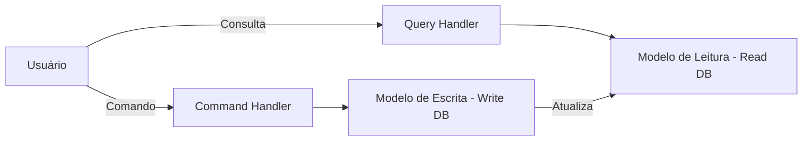
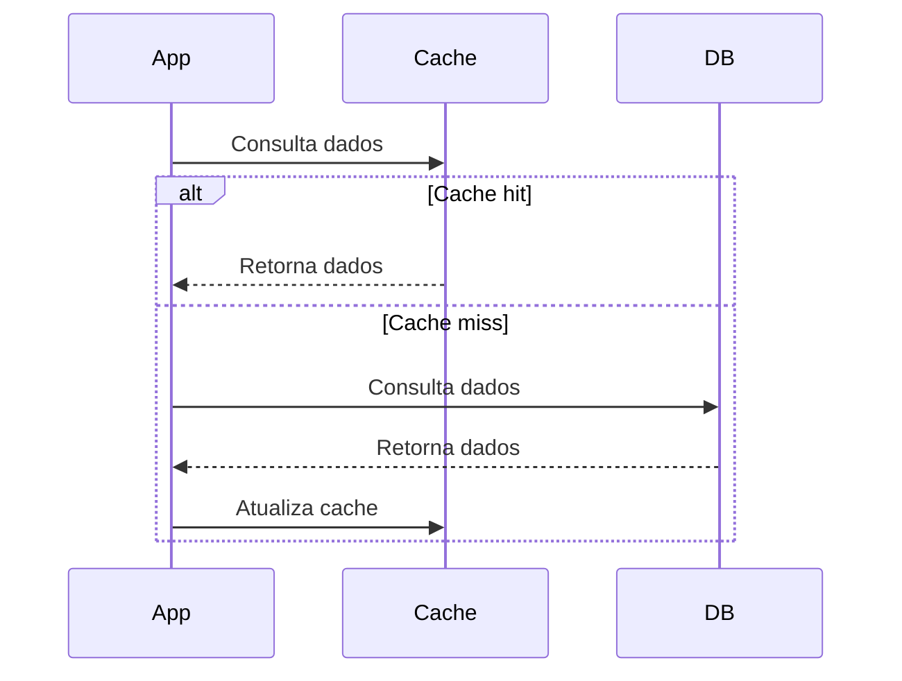
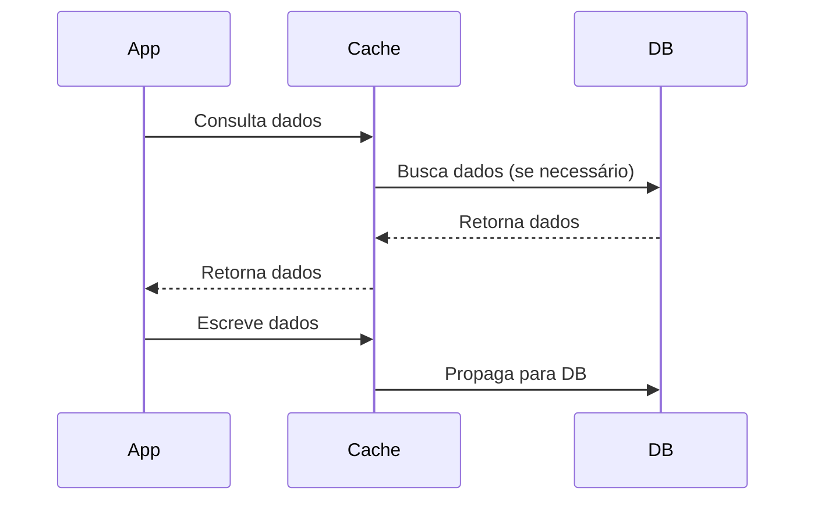
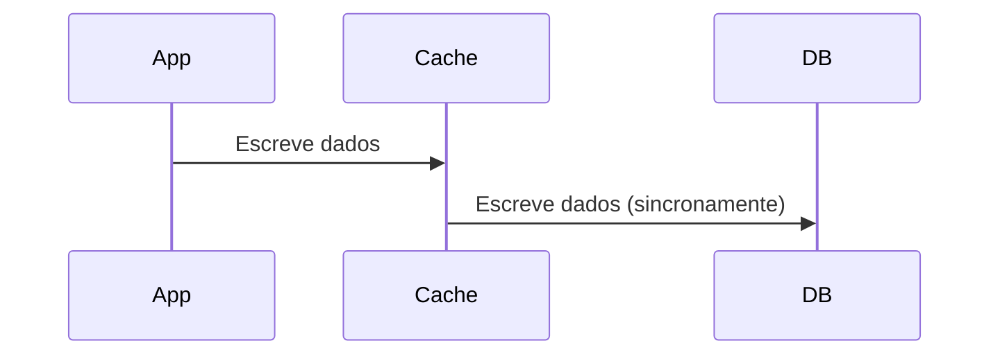
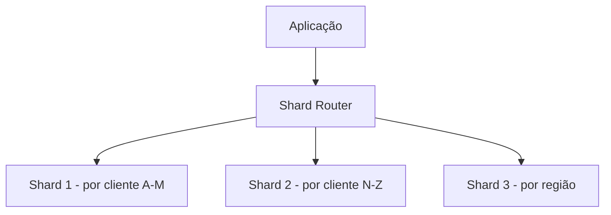
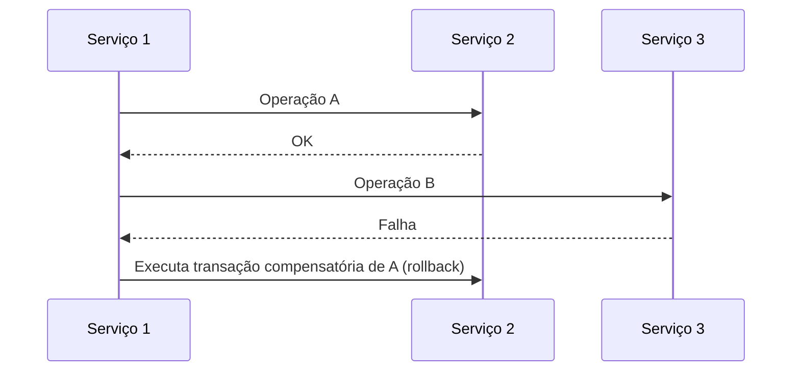
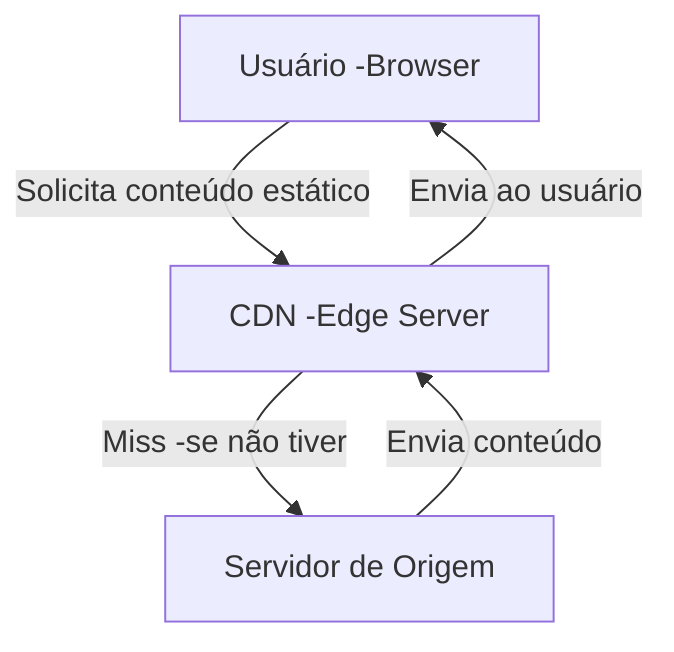
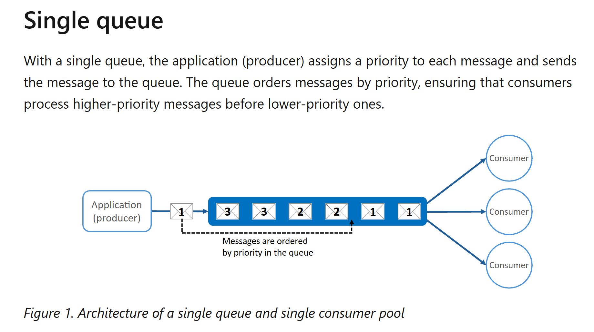
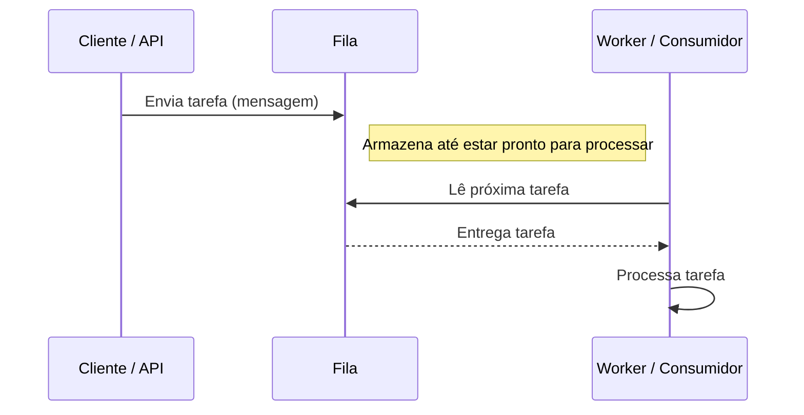

## 🎓 Sessão 13 – Padrões para Escalabilidade e Performance

📅 **Data:** 23/07/2025
⏱️ **Duração:** 2h

---

### 📌 Objetivos da Sessão

* Entender os principais padrões para sistemas escaláveis.
* Compreender técnicas para otimização de performance e throughput.
* Explorar estratégias de latência e escalabilidade automática.
* Aplicar os conceitos no contexto de microsserviços e APIs distribuídas.

---

## 1. 🧠 Conceitos Fundamentais

### ✅ O que é escalabilidade?

> A capacidade de um sistema lidar com crescimento de carga de forma eficiente.

* **Horizontal (scale-out)**: adicionar mais instâncias (ex: mais VMs, containers).
* **Vertical (scale-up)**: adicionar mais recursos à instância atual (CPU, RAM).

### ✅ Performance vs. Throughput vs. Latência

| Termo           | Definição                                 | Exemplo                               |
| --------------- | ----------------------------------------- | ------------------------------------- |
| **Performance** | Capacidade de resposta rápida do sistema. | Uma API responde em 50ms.             |
| **Throughput**  | Quantidade de transações por segundo.     | API lida com 500 requisições/segundo. |
| **Latência**    | Tempo entre requisição e resposta.        | Tempo de ida e volta da resposta.     |

---

## 2. 📦 Padrões para Alta Escalabilidade

### 🔹 CQRS – *Command Query Responsibility Segregation*

* **Separação de leitura e escrita.**
* **Command (escrita)** → altera o estado.
* **Query (leitura)** → retorna dados, sem efeitos colaterais.



**Benefícios:**

* Alta escalabilidade (leitura e escrita independentes).
* Especialização de modelos (read models otimizados).

**Exemplo prático:**

* API de pedidos:

  * Escrita: cria pedidos, altera status.
  * Leitura: consulta pedidos agregados com cache.

---

### 🔹 Cache-Aside / Cache-Through / Write-Through

#### 1. **Cache-Aside (Lazy Loading)**

* A aplicação busca no cache → se não encontrar, busca no banco e popula o cache.
* Mais controle, mas risco de *cache miss* alto.



***Referência:***
- https://learn.microsoft.com/en-us/azure/architecture/patterns/cache-aside
- 

#### 2. **Cache-Through**

* Cache gerencia acesso ao banco.
* A aplicação consulta apenas o cache (que carrega dados do banco, se necessário).



#### 3. **Write-Through**

* Toda escrita é feita simultaneamente no cache e no banco.
* Menos risco de inconsistência, mas mais lento.



**Uso típico em APIs:**
→ Caching de dados lidos com frequência, como catálogos de produtos, configurações, etc.

---

### 🔹 Sharding / Partitioning

* **Partitioning**: Divisão lógica de dados em blocos menores.
* **Sharding**: Tipo de partitioning horizontal com múltiplos nós.



**Exemplo:**

* Banco de usuários com milhões de registros → particionado por região (América, Europa, Ásia).
* Shards em diferentes bancos ou clusters.

**Benefícios:**

* Reduz gargalo de leitura/escrita.
* Facilita paralelismo e distribuição geográfica.


**Referências:**
- https://learn.microsoft.com/en-us/azure/architecture/best-practices/data-partitioning
- https://learn.microsoft.com/en-us/sql/relational-databases/partitions/create-partitioned-tables-and-indexes?view=sql-server-ver17

---

### 🔹 Compensating Transaction

* Estratégia para lidar com **operações falhadas em sistemas distribuídos** (quando rollback não é possível).
* Aplica-se em sistemas **eventualmente consistentes** (ex: Sagas).



**Exemplo prático:**

* Pedido aprovado → pagamento feito → falha na entrega → **ação compensatória**: estorno do pagamento.

---

## 3. 🚀 Performance e Throughput

### 🔹 Considerações de performance

* Evitar chamadas síncronas entre microsserviços.
* Preferir comunicação assíncrona (ex: eventos, filas).
* Indexar corretamente os bancos de dados.
* Aplicar **caching inteligente**.

### 🔹 Minimização de latência

#### 1. **Content Delivery Network (CDN)**

* Distribuição de conteúdo estático (imagens, JS, CSS, arquivos) por servidores geograficamente distribuídos.
* Reduz latência geográfica.


> ✅ Explicação rápida:
>- O usuário requisita um conteúdo (ex: imagem, JS).
>- Se estiver na CDN (cache), retorna direto.
>- Se não, a CDN busca no servidor de origem, armazena e entrega.

#### 2. **Queue-based Load Leveling**

* Uso de **filas (queues)** para desacoplar componentes.
* Evita picos de carga: o consumidor processa em ritmo constante.
* Exemplo: API de upload → envia para uma fila → worker processa.





>✅ Explicação rápida:
>- A API (ou outro produtor) envia mensagens para uma fila.
>- Os workers processam essas mensagens em ritmo controlado.
>- Isso desacopla a produção do consumo, nivelando picos de carga.


**Referências:**
- https://learn.microsoft.com/en-us/azure/architecture/patterns/priority-queue

---

## 4. ⚙️ Estratégias de Auto-Escalabilidade

### 🔹 Horizontal

* Adição automática de instâncias.
* Ex: Kubernetes HPA, Azure App Service Auto-scale.

### 🔹 Vertical

* Aumento automático de recursos da máquina (RAM, CPU).
* Mais caro e menos flexível que o horizontal.

**Boas práticas:**

* Monitoramento com alertas (CPU, latência, uso de memória).
* Regras de escalonamento baseadas em métricas.

---

## 5. 🌐 Aplicação em Microsserviços e APIs Distribuídas

### 🔹 Cenários comuns

| Desafio                        | Solução recomendada                                           |
| ------------------------------ | ------------------------------------------------------------- |
| Carga alta em leitura          | Cache + CQRS                                                  |
| Alta latência em APIs          | CDN + Queue-based Load Leveling                               |
| Transações distribuídas        | Sagas com compensações                                        |
| Dados com milhões de registros | Sharding                                                      |
| Escalar APIs automaticamente   | Auto-scale com HPA (K8s), Azure Monitor, Application Insights |

---

## 📍 Resumo Final (10 min)

* **CQRS** para especializar e escalar leitura e escrita.
* **Padrões de cache** evitam acesso redundante ao banco.
* **Sharding** quebra gargalos em dados massivos.
* **Compensating transactions** lidam com falhas em microsserviços.
* **CDN + Filas** reduzem latência e absorvem carga.
* **Autoescalabilidade** é essencial em arquiteturas elásticas.

---

## 🧩 Atividade Final (Opcional - se sobrar tempo)

**Cenário:** Você tem uma API de processamento de pedidos que sofre com lentidão em horários de pico.
**Pergunta:** Quais padrões e estratégias você aplicaria para melhorar escalabilidade e performance?

---

## Exemplo Seguradora

``` csharp
/*
Mini Projeto: Seguradora Escalável
Objetivo: Demonstrar padrões de escalabilidade e performance no contexto de uma API de sinistros.
Tecnologias: ASP.NET Core 8 (Web API), Redis (Cache), Azure Queue Storage (simulada), Entity Framework Core (In-Memory), MediatR, CQRS.
*/

// --------------------
// 1. Domain Model
// --------------------
public class Sinistro
{
    public Guid Id { get; set; } = Guid.NewGuid();
    public string NumeroApolice { get; set; } = string.Empty;
    public string Descricao { get; set; } = string.Empty;
    public DateTime DataOcorrencia { get; set; } = DateTime.UtcNow;
    public string Status { get; set; } = "Pendente";
}

// --------------------
// 2. DbContext (EF Core In-Memory)
// --------------------
public class SeguradoraDbContext : DbContext
{
    public SeguradoraDbContext(DbContextOptions<SeguradoraDbContext> options) : base(options) {}

    public DbSet<Sinistro> Sinistros => Set<Sinistro>();
}

// --------------------
// 3. CQRS - Commands e Handlers
// --------------------
public record CriarSinistroCommand(string NumeroApolice, string Descricao) : IRequest<Guid>;

public class CriarSinistroHandler : IRequestHandler<CriarSinistroCommand, Guid>
{
    private readonly SeguradoraDbContext _db;
    private readonly IQueueService _queue;

    public CriarSinistroHandler(SeguradoraDbContext db, IQueueService queue)
    {
        _db = db;
        _queue = queue;
    }

    public async Task<Guid> Handle(CriarSinistroCommand request, CancellationToken cancellationToken)
    {
        var sinistro = new Sinistro
        {
            NumeroApolice = request.NumeroApolice,
            Descricao = request.Descricao
        };

        _db.Sinistros.Add(sinistro);
        await _db.SaveChangesAsync(cancellationToken);

        // Simula uso de fila (Queue-Based Load Leveling)
        await _queue.EnqueueAsync($"Novo sinistro registrado: {sinistro.Id}");

        return sinistro.Id;
    }
}

// --------------------
// 4. Cache Service (Redis ou MemoryCache simulada)
// --------------------
public interface ISinistroCacheService
{
    Task<Sinistro?> GetAsync(Guid id);
    Task SetAsync(Sinistro sinistro);
}

public class SinistroCacheService : ISinistroCacheService
{
    private readonly IMemoryCache _cache;
    public SinistroCacheService(IMemoryCache cache) => _cache = cache;

    public Task<Sinistro?> GetAsync(Guid id) => Task.FromResult(_cache.TryGetValue(id, out Sinistro? value) ? value : null);
    public Task SetAsync(Sinistro sinistro)
    {
        _cache.Set(sinistro.Id, sinistro, TimeSpan.FromMinutes(5));
        return Task.CompletedTask;
    }
}

// --------------------
// 5. Queue Service (simulado)
// --------------------
public interface IQueueService
{
    Task EnqueueAsync(string message);
}

public class QueueServiceSimulado : IQueueService
{
    public Task EnqueueAsync(string message)
    {
        Console.WriteLine($"[FILA] {message}");
        return Task.CompletedTask;
    }
}

// --------------------
// 6. API Controller com Cache-Aside Pattern
// --------------------
[ApiController]
[Route("api/sinistros")]
public class SinistrosController : ControllerBase
{
    private readonly SeguradoraDbContext _db;
    private readonly ISinistroCacheService _cache;
    private readonly IMediator _mediator;

    public SinistrosController(SeguradoraDbContext db, ISinistroCacheService cache, IMediator mediator)
    {
        _db = db;
        _cache = cache;
        _mediator = mediator;
    }

    [HttpGet("{id}")]
    public async Task<IActionResult> Get(Guid id)
    {
        var sinistro = await _cache.GetAsync(id);
        if (sinistro != null)
            return Ok(sinistro);

        sinistro = await _db.Sinistros.FindAsync(id);
        if (sinistro == null)
            return NotFound();

        await _cache.SetAsync(sinistro); // Cache-Aside
        return Ok(sinistro);
    }

    [HttpPost]
    public async Task<IActionResult> Post(CriarSinistroCommand command)
    {
        var id = await _mediator.Send(command);
        return CreatedAtAction(nameof(Get), new { id }, id);
    }
}

// --------------------
// 7. Startup Setup
// --------------------
// No Program.cs:
/*
builder.Services.AddDbContext<SeguradoraDbContext>(opt => opt.UseInMemoryDatabase("Seguradora"));
builder.Services.AddMemoryCache();
builder.Services.AddScoped<ISinistroCacheService, SinistroCacheService>();
builder.Services.AddScoped<IQueueService, QueueServiceSimulado>();
builder.Services.AddMediatR(typeof(Program));
builder.Services.AddEndpointsApiExplorer();
builder.Services.AddSwaggerGen();
*/

```


---
> © MoOngy 2025 | Este repositório é parte do programa de formação contínua em Engenharia de Software.
