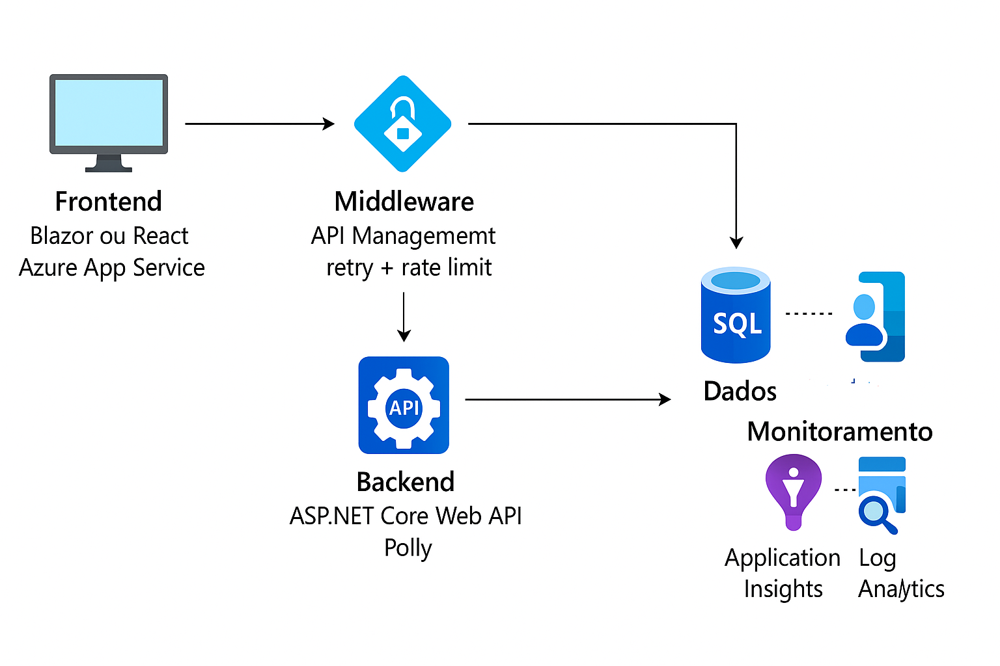

# 🔹 **Sessão 14 – Padrões para Resiliência e Alta Disponibilidade**

📅 Data: 28/07/2025
🕑 Duração: 2h
🎯 Objetivo: Capacitar os participantes a projetar aplicações tolerantes a falhas, resilientes e com alta disponibilidade, utilizando padrões reconhecidos e recursos do Azure.

---

## 🧩 **1. Padrões para Tolerância a Falhas** (45 minutos)

### 🔁 **Retry (Retentativa)**

Reexecutar operações temporariamente falhas.

* ✅ Quando usar: Erros transitórios (ex: timeout de rede, erro 500).
* ⚠️ Cuidados: Exponencial backoff, evitar retries infinitos.
* 🔧 Azure: SDKs do Azure geralmente têm suporte nativo a retry policy.

```csharp
// Exemplo com HttpClient + Polly
RetryPolicy = Policy
  .Handle<HttpRequestException>()
  .WaitAndRetry(3, retryAttempt => TimeSpan.FromSeconds(Math.Pow(2, retryAttempt)));
```


https://learn.microsoft.com/en-us/azure/storage/blobs/storage-retry-policy
---

### ⛔ **Circuit Breaker**

Impede que chamadas contínuas sejam feitas para um serviço instável.

* 🎯 Objetivo: Evitar sobrecarregar sistemas com falhas persistentes.
* ⛓️ Transição de estados: *Closed → Open → Half-Open*.
* 🔧 Azure: Integrável com serviços externos via Polly ou API Management.

---


https://learn.microsoft.com/en-us/azure/architecture/patterns/circuit-breaker

### ⌛ **Timeout**

Limite de tempo máximo para concluir uma operação.

* ⏱️ Evita que recursos fiquem ocupados indefinidamente.
* 🔧 Azure: Azure Functions e App Services permitem configurar timeouts por binding ou app settings.

---

### 🧱 **Bulkhead (Compartimentação)**

Isola recursos para limitar o impacto de falhas.

* 🎯 Exemplo: Limitar threads de processamento por tipo de operação.
* 💡 Inspirado no design de navios.


---

### 🔄 **Failover**

Troca automática para uma instância secundária em caso de falha.

* 🔁 Ativo-Passivo ou Ativo-Ativo.
* 🔧 Azure: Application Gateway + Traffic Manager para failover geográfico.

---

### ❤️ **Health Endpoint Monitoring**

Exposição de endpoint para status de saúde da aplicação.

* ✅ Exemplo: `/health`, `/ready`, `/live`
* 🔧 Azure: Application Gateway pode verificar `/health` para rotear tráfego.
* Libs: `AspNetCore.Diagnostics.HealthChecks`


---

### 🚦 **Throttling e Backpressure**

Limitação de chamadas para proteger sistemas.

* **Throttling**: Rejeita chamadas quando o limite é atingido (HTTP 429).
* **Backpressure**: Reduz a produção de eventos quando o consumidor está sobrecarregado.
* 🔧 Azure:

  * API Management suporta quotas e rate limits.
  * Event Hubs e Service Bus aplicam backpressure automático.

---

## 🌪️ **2. Modelagem para Resiliência em Ambientes Imprevisíveis** (30 minutos)

### ⚠️ **Natureza dos Ambientes Cloud**

* Falhas são inevitáveis (rede, disco, instância).
* “**Design for failure**” é obrigatório.

### 🧠 **Estratégias para lidar com Intermitência de Serviços**

* **Degradação graciosa**: Mostrar dados em cache/local.
* **Feature Toggle para fallback**: Alternar para comportamento alternativo.
* **Idempotência**: Garantir que múltiplas tentativas não causem efeitos colaterais.

### 🔁 **Eventual Consistency vs Strong Consistency**

* Em sistemas distribuídos, *eventual consistency* pode ser aceitável.

---

## ☁️ **3. Cenários com Azure App Services, Azure Functions e APIs Resilientes** (45 minutos)

### 🚀 **App Services**

* **Slots de implantação**: Reduzem downtime.
* **Auto-heal**: Automatiza ações com base em métricas.
* **Availability Zones**: Alta disponibilidade física.

### ⚙️ **Azure Functions**

* Timeouts configuráveis por plano (Consumption: 5 min padrão).
* Retry policies em **triggers de fila/eventos**.
* Durable Functions para orquestração com resiliência embutida.

https://learn.microsoft.com/en-us/azure/azure-functions/durable/durable-functions-overview?tabs=in-process%2Cnodejs-v3%2Cv1-model&pivots=csharp

---

### 🔐 **APIs resilientes com API Management**

* Retry + Throttling configurável por política.
* Backends monitorados com Health Checks.
* Rate limits por subscription/chave.

---

## 🧠 **Resumo dos Padrões (Quick Review)**

| Padrão            | Objetivo                             | Azure Suporte                   |
| ----------------- | ------------------------------------ | ------------------------------- |
| Retry             | Repetir chamadas falhas              | SDKs, API Management, Functions |
| Circuit Breaker   | Bloquear chamadas a serviço instável | Polly, App Gateway custom       |
| Timeout           | Limitar tempo de execução            | App Settings, Functions         |
| Bulkhead          | Isolar falhas                        | Design de pool/thread/resource  |
| Failover          | Alta disponibilidade                 | Traffic Manager, App Gateway    |
| Health Monitoring | Status do sistema                    | Health Check API + Azure        |
| Throttling        | Proteger backend                     | API Management, SDKs            |
| Backpressure      | Controlar fluxo                      | Event Hubs, Service Bus         |

---

## 📚 Referências e Leitura Complementar

* [Microsoft Cloud Design Patterns – Resiliency](https://docs.microsoft.com/en-us/azure/architecture/patterns/category/resiliency)
* [Polly – .NET Resilience Framework](https://github.com/App-vNext/Polly)
* [Azure Well-Architected Framework – Reliability Pillar](https://learn.microsoft.com/en-us/azure/architecture/framework/resiliency/overview)

---

## **exemplos práticos em C# e Azure** para os principais padrões e estratégias de **resiliência e alta disponibilidade** 

---

## 🔁 1. Retry com **Polly** e **HttpClient**

```csharp
var retryPolicy = Policy
    .Handle<HttpRequestException>()
    .WaitAndRetryAsync(3, retryAttempt =>
        TimeSpan.FromSeconds(Math.Pow(2, retryAttempt)));

HttpClient client = new HttpClient();

await retryPolicy.ExecuteAsync(async () =>
{
    var response = await client.GetAsync("https://meuservico.azurewebsites.net/api/dados");
    response.EnsureSuccessStatusCode();
});
```

🔧 **Contexto no Azure**: Pode ser usado para se comunicar com APIs externas ou Azure Functions, especialmente em **Azure App Services** ou **Azure API Management**.

---

## ⛔ 2. Circuit Breaker com Polly

```csharp
var breakerPolicy = Policy
    .Handle<HttpRequestException>()
    .CircuitBreakerAsync(
        exceptionsAllowedBeforeBreaking: 2,
        durationOfBreak: TimeSpan.FromSeconds(30));

try
{
    await breakerPolicy.ExecuteAsync(async () =>
    {
        var response = await client.GetAsync("https://servico-interno/api/falhas");
        response.EnsureSuccessStatusCode();
    });
}
catch (BrokenCircuitException)
{
    Console.WriteLine("Circuito aberto. Ignorando chamada.");
}
```

🔧 **Relevante em APIs que dependem de serviços instáveis**, como APIs de terceiros ou bancos legados.

---

## ⌛ 3. Timeout com CancellationToken

```csharp
var cts = new CancellationTokenSource(TimeSpan.FromSeconds(5));

try
{
    var response = await client.GetAsync("https://servico-lento", cts.Token);
    response.EnsureSuccessStatusCode();
}
catch (TaskCanceledException)
{
    Console.WriteLine("Timeout atingido.");
}
```

🔧 **Importante para chamadas entre microserviços ou para blobs/filas** em Azure.

---

## 🧱 4. Bulkhead com Polly

```csharp
var bulkhead = Policy.BulkheadAsync<HttpResponseMessage>(maxParallelization: 3, maxQueuingActions: 2);

await bulkhead.ExecuteAsync(async () =>
{
    return await client.GetAsync("https://servico-concorrente");
});
```

🔧 Útil para limitar chamadas simultâneas a bancos de dados ou APIs internas.

---

## 🔄 5. Failover com Azure Traffic Manager (Configuração, não código)

* Crie dois endpoints (ex: duas instâncias de App Services: Leste e Oeste).
* Configure o **Azure Traffic Manager** com o modo **Failover**:

  * Endpoint primário: `api-leste.azurewebsites.net`
  * Endpoint secundário: `api-oeste.azurewebsites.net`
* Health Check automático decide o redirecionamento.

📌 **Observação**: Pode ser simulado em sala com DNS customizado e interrupção manual do App Service primário.

---

## ❤️ 6. Health Check com `AspNetCore.Diagnostics.HealthChecks`

### Instalação

```bash
dotnet add package AspNetCore.HealthChecks.UI
dotnet add package AspNetCore.HealthChecks.SqlServer
```

### Startup.cs

```csharp
builder.Services.AddHealthChecks()
    .AddSqlServer(configuration.GetConnectionString("SqlDb"));

app.MapHealthChecks("/health");
```

🔧 Pode ser usado no **Azure Application Gateway**, **App Services**, **App Insights** ou **AKS**.

---

## 🚦 7. Throttling no **Azure API Management**

### Política de exemplo em XML (definida por chamada):

```xml
<inbound>
    <rate-limit calls="5" renewal-period="60" />
</inbound>
```

📌 Isso limita o número de chamadas por minuto por consumidor.

---

## 🔁 8. Retry automático no **Azure Functions** (Trigger de fila ou Event Hub)

### Exemplo: `function.json`

```json
{
  "bindings": [
    {
      "name": "myQueueItem",
      "type": "queueTrigger",
      "direction": "in",
      "queueName": "minhafila",
      "connection": "AzureWebJobsStorage"
    }
  ],
  "retry": {
    "strategy": "fixedDelay",
    "maxRetryCount": 5,
    "delayInterval": "00:00:10"
  }
}
```

🔧 Retry nativo para falhas em bindings como `QueueTrigger`, `EventHubTrigger`, etc.

---

## 🔁 9. Backpressure com **Azure Event Hubs**

* **Backpressure é automático**: se o consumidor estiver lento, o Event Hub ajusta o throughput.
* Ao usar **Azure Functions com EventHubTrigger**, respeite o *batchSize* e *maxBatchWaitTime* para evitar sobrecarga.

```csharp
[FunctionName("EventProcessor")]
public async Task Run(
    [EventHubTrigger("events", Connection = "EventHubConnection")] EventData[] events)
{
    foreach (var e in events)
    {
        // Processa com cuidado para não travar
    }
}
```

---

## 🛠️ Projeto Simples: API Resiliente no Azure

### Arquitetura

* **Frontend**: Blazor ou React + Azure App Service
* **Backend**: ASP.NET Core Web API + Polly
* **Middleware**: API Management com retry + rate limit
* **Dados**: Azure SQL Database + Health Checks
* **Monitoramento**: Application Insights + Log Analytics




---
> © MoOngy 2025 | Este repositório é parte do programa de formação contínua em Engenharia de Software.
