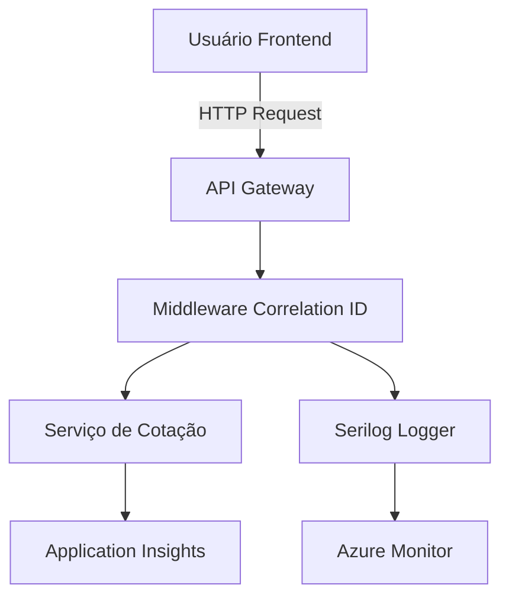
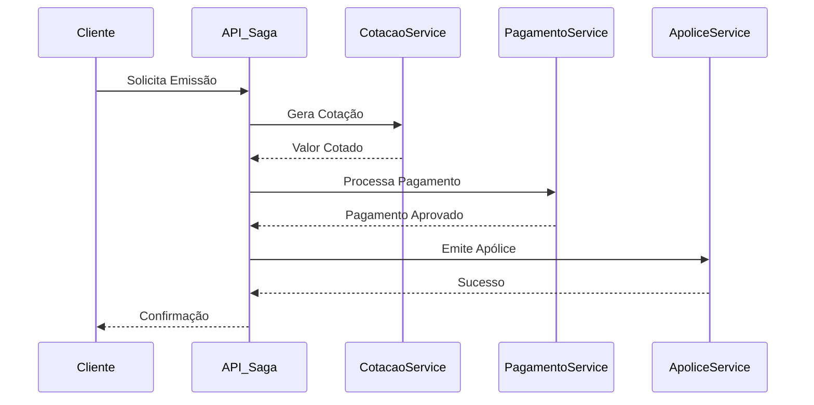
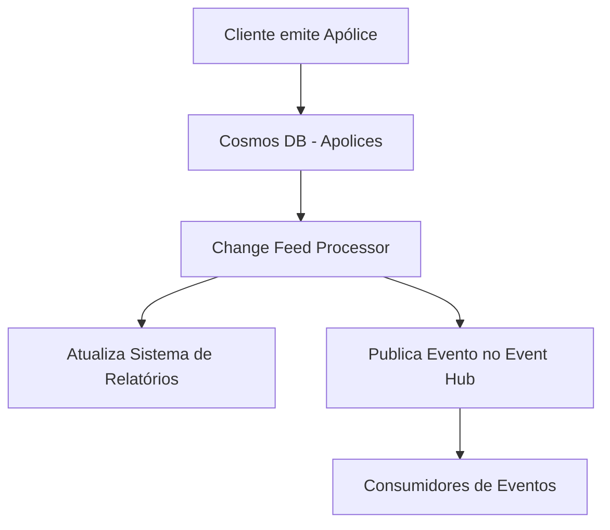
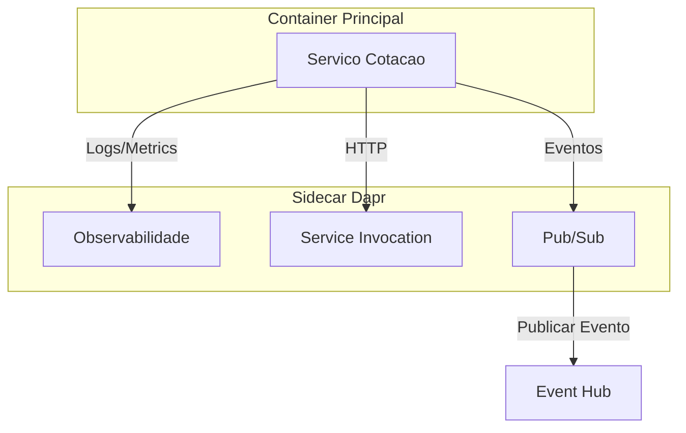
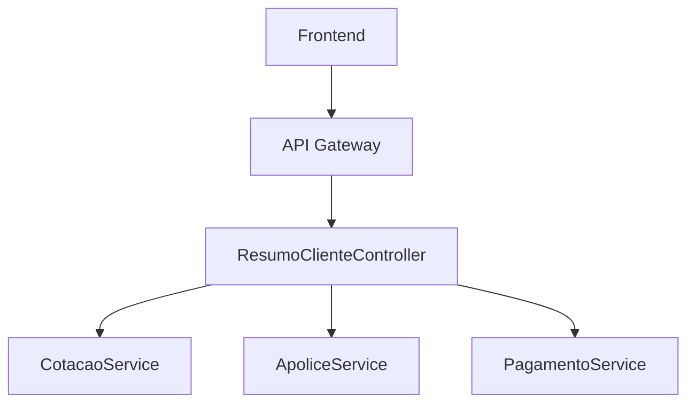
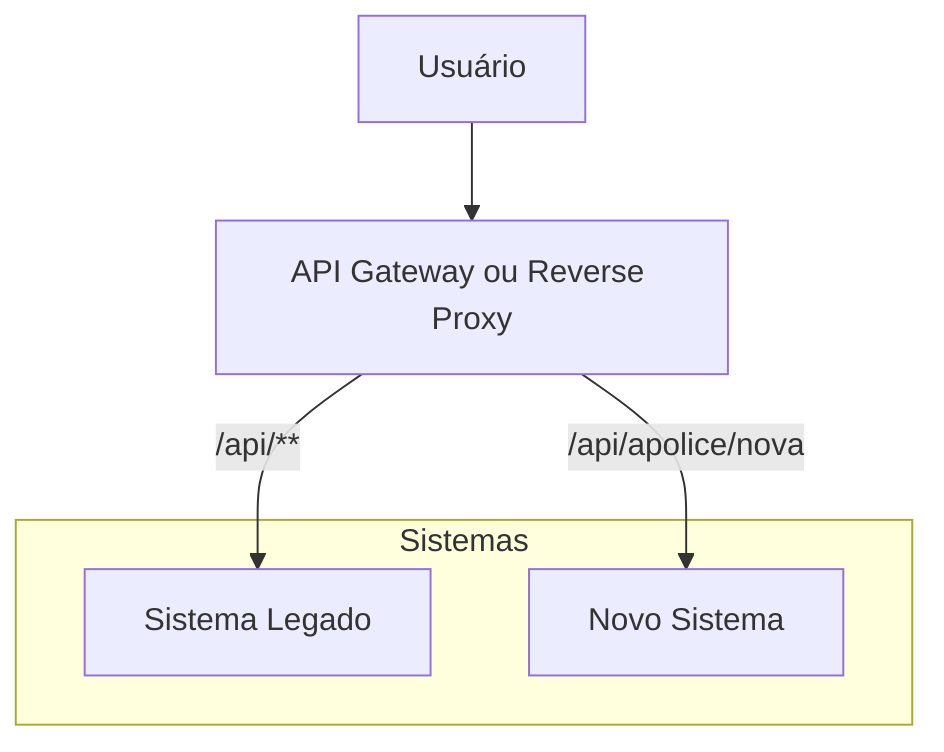

> **Sessão 15 – Padrões de Observabilidade, Consistência e Manutenibilidade**
> 📅 **Data:** 30/07/2025
> ⏱️ **Duração:** 2h

---

## 🧭 Estrutura Geral da Aula

| Tempo estimado | Tópico                                                                        |
| -------------- | ----------------------------------------------------------------------------- |
| 15 min         | Introdução + Motivação para observabilidade, consistência e manutenibilidade  |
| 30 min         | 🔍 Observabilidade: Log Aggregation, Telemetry, Audit Logging, Correlation ID |
| 15 min         | Integração com ferramentas: Azure Monitor, Application Insights, Dynatrace    |
| 30 min         | ⚖️ Consistência eventual vs. forte + Event Sourcing, Saga, Log Tailing        |
| 15 min         | Discussão sobre trade-offs em bancos distribuídos                             |
| 15 min         | 🛠️ Padrões de Manutenibilidade: Sidecar, Gateway Aggregation, Strangler Fig  |
| Últimos 5 min  | Conclusão e discussão final                                                   |

---

## 🎯 Objetivos da Aula

* Entender como tornar sistemas mais observáveis e rastreáveis.
* Discutir os diferentes níveis de consistência e seus impactos.
* Apresentar padrões arquiteturais que favorecem manutenibilidade e evolução segura.

---

## 🔍 Padrões de Observabilidade e Diagnóstico

### 📘 Conceito de Observabilidade

> **Observabilidade** é a capacidade de um sistema fornecer insights sobre seu estado interno por meio da coleta e análise de métricas, logs e rastreamentos.

### 🧩 Componentes Clássicos

| Componente          | Descrição                                                                                                                            |
| ------------------- | ------------------------------------------------------------------------------------------------------------------------------------ |
| **Log Aggregation** | Coleta e centralização de logs de múltiplos serviços (ex: Elastic Stack, Azure Monitor Logs). Permite busca e correlação de eventos. |
| **Telemetry**       | Coleta de métricas operacionais (latência, throughput, falhas). Fundamental para alertas e dashboards.                               |
| **Audit Logging**   | Registro de ações críticas para fins de conformidade, rastreabilidade e segurança. (ex: login, alteração de dados sensíveis)         |
| **Correlation ID**  | Identificador único que atravessa todos os serviços e logs de uma transação. Essencial para tracing distribuído.                     |

### 🎯 Boas Práticas

* Use **JSON estruturado** nos logs.
* Inclua **contexto de usuário e requisição**.
* Automatize geração de Correlation IDs.
* Garanta retenção e criptografia dos logs de auditoria.

---

## 🧩 Integração com Ferramentas

| Ferramenta               | Propósito                                                                                                        |
| ------------------------ | ---------------------------------------------------------------------------------------------------------------- |
| **Azure Monitor**        | Solução nativa da Azure para coleta e visualização de logs, métricas e alertas.                                  |
| **Application Insights** | Integração com apps .NET/Java para telemetria automática, incluindo tempo de resposta, exceções, e dependências. |
| **Dynatrace**            | Plataforma avançada de observabilidade com foco em AIOps, tracing automático e análises de performance.          |

---

## ⚖️ Consistência Eventual vs. Forte

### 🌐 Consistência Forte

* A operação reflete instantaneamente em todos os nós do sistema.
* Ideal para sistemas de **transações bancárias, reservas**.
* Ex: Bancos relacionais, Azure Cosmos DB (modo strong).

### 🌪️ Consistência Eventual

* Os nós atingem consistência "com o tempo".
* Tolerante à latência e falhas temporárias.
* Ex: sistemas distribuídos com replicação assíncrona, Event Hubs.

---

## 🧮 Padrões Arquiteturais para Consistência

### 🔄 **Event Sourcing**

* Em vez de salvar o estado final, armazena-se a sequência de eventos.
* Permite reprocessamento, auditoria e reconstrução de estado.

### 🧵 **Saga Pattern**

* Gerencia transações distribuídas usando uma sequência de passos locais com compensações.
* Útil quando a consistência precisa ser gerida entre microserviços.

### 🪵 **Transaction Log Tailing**

* Leitura contínua de logs de transações para propagar alterações.
* Usado para replicação, sincronização e rastreamento.

---

## ⚔️ Trade-offs em Bancos Distribuídos

### 📚 Exemplos

| Banco/Fila         | Características                                                       |
| ------------------ | --------------------------------------------------------------------- |
| **Cosmos DB**      | Multi-modelo, replicação global, níveis configuráveis de consistência |
| **Event Hub**      | Ingestão massiva de eventos, escalável e eventual                     |
| **Kafka (menção)** | Log distribuído, replicação baseada em partições                      |

### 🔄 CAP Theorem (Resumido)

* **Consistência**
* **Disponibilidade**
* **Tolerância à Partição**

👉 Não é possível maximizar os 3 ao mesmo tempo.

---

## 🛠️ Manutenibilidade e Evolução Arquitetural

### 📦 Sidecar Pattern

* Um contêiner auxiliar que implementa funcionalidades como proxy, logging ou segurança sem acoplar à aplicação principal.
* Ex: Envoy Proxy em service mesh com Istio.

### 🚪 Gateway Aggregation

* Um API Gateway agrega múltiplas chamadas de microserviços em uma única.
* Reduz latência e complexidade no cliente.

### 🌱 Strangler Fig Application

* Substituição progressiva de uma aplicação legada por novos componentes.
* O novo sistema "estrangula" o antigo com tempo.

---
## **Exemplos práticos com Azure e C# no contexto de uma seguradora**, integrando os padrões discutidos:

---

## 🏢 **Contexto: Sistema de Seguradora**

Vamos assumir um cenário com os seguintes serviços:

* `CotacaoService`: gera cotações de seguros
* `ApoliceService`: emite apólices
* `PagamentoService`: processa pagamentos
* `LogService`: centraliza logs, telemetria e auditoria

---

## 🔍 1. **Observabilidade com Azure + C#**

### ✅ **Correlation ID**

```csharp
public class CorrelationIdMiddleware
{
    private const string Header = "X-Correlation-ID";
    private readonly RequestDelegate _next;

    public CorrelationIdMiddleware(RequestDelegate next)
    {
        _next = next;
    }

    public async Task Invoke(HttpContext context)
    {
        var correlationId = context.Request.Headers.ContainsKey(Header)
            ? context.Request.Headers[Header].ToString()
            : Guid.NewGuid().ToString();

        context.Items["CorrelationId"] = correlationId;
        context.Response.Headers[Header] = correlationId;

        using (LogContext.PushProperty("CorrelationId", correlationId))
        {
            await _next(context);
        }
    }
}
```

📦 Configure no pipeline e veja o ID em todos os logs com **Serilog + Azure Monitor**:

```csharp
Log.Logger = new LoggerConfiguration()
    .Enrich.FromLogContext()
    .WriteTo.AzureAnalytics(workspaceId, authenticationId, logName: "LogsCotacao")
    .CreateLogger();
```

---

### 📊 **Telemetry com Application Insights**

```csharp
public class CotacaoService
{
    private readonly TelemetryClient _telemetry;

    public CotacaoService(TelemetryClient telemetry)
    {
        _telemetry = telemetry;
    }

    public Cotacao GerarCotacao(string cpf, string produto)
    {
        var stopwatch = Stopwatch.StartNew();

        try
        {
            // lógica de cotação
            return new Cotacao(...);
        }
        finally
        {
            stopwatch.Stop();
            _telemetry.TrackDependency("CotacaoService", "GerarCotacao", DateTimeOffset.Now, stopwatch.Elapsed, true);
        }
    }
}
```

🔗 Application Insights integra com dashboards no Azure Portal automaticamente.

---

### 🛡️ **Audit Logging**

```csharp
public class AuditoriaService
{
    public void RegistrarAlteracaoApolice(string apoliceId, string usuario, string acao)
    {
        var log = new
        {
            ApoliceId = apoliceId,
            Usuario = usuario,
            Acao = acao,
            Data = DateTime.UtcNow
        };

        File.AppendAllText("logs/auditoria.json", JsonConvert.SerializeObject(log) + Environment.NewLine);
    }
}
```

📌 Pode ser estendido com Azure Blob Storage, Event Hub ou Cosmos DB para persistência escalável.

---

## ⚖️ 2. **Consistência com Event Sourcing, Saga e Log Tailing**

### 🔄 **Event Sourcing – Exemplo: Histórico da Apólice**

```csharp
public class EventoApolice
{
    public string Id { get; set; }
    public string TipoEvento { get; set; } // Criada, Atualizada, Cancelada
    public string Dados { get; set; }
    public DateTime Timestamp { get; set; }
}
```

Armazene no **Cosmos DB** como eventos imutáveis:

```json
{
  "id": "evt-5432",
  "tipoEvento": "Criada",
  "dados": "{ 'valor': 500, 'cliente': 'João' }",
  "timestamp": "2025-07-20T14:25:00Z"
}
```

👉 Para reconstruir o estado:

```csharp
public Apolice Reconstruir(IEnumerable<EventoApolice> eventos)
{
    var apolice = new Apolice();

    foreach (var e in eventos.OrderBy(e => e.Timestamp))
    {
        switch (e.TipoEvento)
        {
            case "Criada": apolice = JsonConvert.DeserializeObject<Apolice>(e.Dados); break;
            case "Atualizada": apolice.Atualizar(e.Dados); break;
            case "Cancelada": apolice.Cancelar(); break;
        }
    }

    return apolice;
}
```

---

### 🧵 **Saga Pattern – Exemplo: Emissão de Apólice**

Fluxo distribuído entre serviços: `Cotacao → Pagamento → Emissao`.

```csharp
public class EmissaoSaga
{
    public async Task EmitirApolice(string cpf, string produto)
    {
        var cotacao = await cotacaoService.GerarCotacao(cpf, produto);
        if (cotacao == null) throw new Exception("Falha na cotação");

        var pagamento = await pagamentoService.Processar(cpf, cotacao.Valor);
        if (!pagamento.Aprovado) throw new Exception("Pagamento rejeitado");

        await apoliceService.Emitir(cpf, produto, cotacao.Valor);
    }
}
```

💡 Para consistência: cada etapa pode ter uma **ação compensatória**, como:

```csharp
await pagamentoService.Estornar(cpf, cotacao.Valor);
```

---

### 🪵 **Transaction Log Tailing com Azure Cosmos DB Change Feed**

Assinatura de alterações automáticas:

```csharp
public class ChangeFeedProcessor
{
    public async Task StartAsync()
    {
        var processor = container
            .GetChangeFeedProcessorBuilder<Apolice>("apoliceProcessor", ProcessChangesAsync)
            .WithInstanceName("InstanceA")
            .WithLeaseContainer(leaseContainer)
            .Build();

        await processor.StartAsync();
    }

    private Task ProcessChangesAsync(IReadOnlyCollection<Apolice> changes, CancellationToken cancellationToken)
    {
        foreach (var apolice in changes)
        {
            Console.WriteLine($"Nova alteração: {apolice.Id}");
        }

        return Task.CompletedTask;
    }
}
```

---

## 🛠️ 3. **Padrões de Manutenibilidade**

### 📦 **Sidecar Pattern – com Dapr**

Com Dapr no sidecar, você separa observabilidade, tracing, e fila de eventos.

```csharp
// Publica evento de Apólice
await daprClient.PublishEventAsync("eventhub-pubsub", "apoliceCriada", novaApolice);
```

📌 O Dapr lida com retries, tracing (OpenTelemetry), e métricas automáticas.

---

### 🚪 **Gateway Aggregation**

```csharp
[HttpGet("resumo-cliente/{cpf}")]
public async Task<IActionResult> ResumoCliente(string cpf)
{
    var cotacoes = await cotacaoService.ListarPorCliente(cpf);
    var apolices = await apoliceService.ListarPorCliente(cpf);

    return Ok(new
    {
        Cliente = cpf,
        Cotacoes = cotacoes,
        Apolices = apolices
    });
}
```

✅ Um único endpoint no API Gateway substitui múltiplas chamadas no frontend.

---

### 🌱 **Strangler Fig Application**

Cenário: sistema legado em .NET Framework → migrando para .NET 8.

* Usa **reverse proxy** (ex: YARP) para redirecionar rotas novas para novo backend:

```json
"Routes": [
  {
    "RouteId": "NovaApolice",
    "ClusterId": "NovoSistema",
    "Match": {
      "Path": "/api/apolice/nova"
    }
  },
  {
    "RouteId": "Legacy",
    "ClusterId": "SistemaLegado",
    "Match": {
      "Path": "/api/{**catch-all}"
    }
  }
]
```

👉 Permite migração gradual e sem interrupção.

---

## ✅ Conclusão

Esses exemplos mostram como usar **Azure + C#** para aplicar padrões modernos em sistemas legados ou distribuídos de uma seguradora. 

---

Perfeito! Abaixo estão os **diagramas de arquitetura em MermaidJS** para os principais padrões aplicados no cenário da seguradora:

---

### 🔍 **1. Observabilidade com Correlation ID + Application Insights**



🧭 **Descrição**:

* Middleware gera e propaga o `Correlation ID`
* Logs estruturados vão para o Azure Monitor
* Telemetria é enviada automaticamente ao Application Insights

---

### 🧵 **2. Saga para Emissão de Apólice**



⚠️ Em caso de falha:

* Se `PagamentoService` falhar → não chama `ApoliceService`
* Se `ApoliceService` falhar → chama `EstornarPagamento`

---

### 🪵 **3. Change Feed com Cosmos DB (Transaction Log Tailing)**



📌 O `Change Feed Processor` lê automaticamente alterações no banco e aciona processos downstream.

---

### 📦 **4. Sidecar Pattern com Dapr**



💡 O sidecar gerencia rastreamento, logs, retries, circuit breaker, etc. sem precisar de código extra no serviço principal.

---

### 🚪 **5. Gateway Aggregation**



📌 `ResumoClienteController` agrega dados de múltiplos serviços e responde em uma única chamada.

---

### 🌱 **6. Strangler Fig Application**



🪴 As rotas novas são interceptadas e encaminhadas ao novo backend, enquanto o legado continua funcionando.


---
> © MoOngy 2025 | Este repositório é parte do programa de formação contínua em Engenharia de Software.