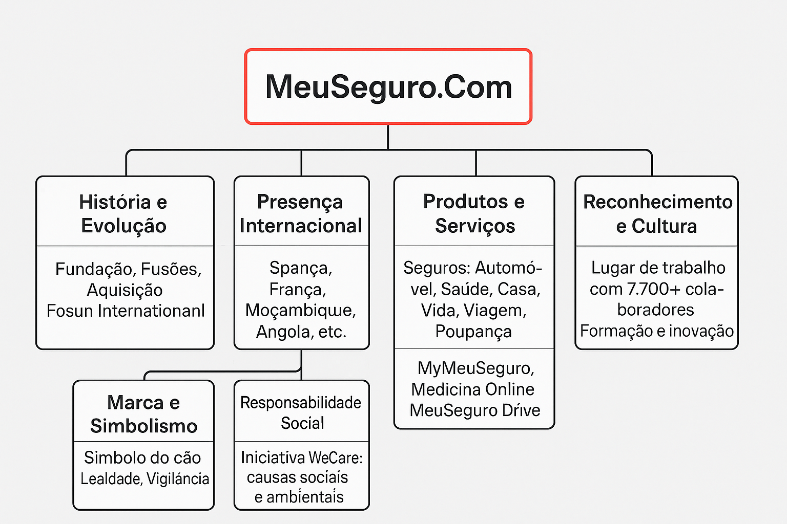
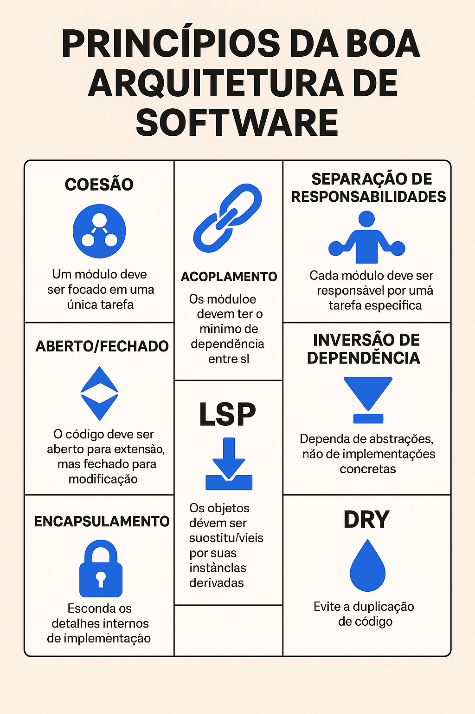

# Estilos e Padrões Arquiteturais

## MeuSeguro.Com

### 🏛 História e Evolução

A seguradora **MeuSeguro.Com** é a maior companhia de seguros de Web, com uma história que remonta a 2020. Atualmente, é líder de mercado na Europa nos ramos de Vida e Não Vida, com uma quota de mercado aproximada de 31,1%. 

A companhia foi fundada em 2020, originando-se da SeguroDosOutros.com. Ao longo dos anos, passou por diversas fusões, consolidando-se como um dos maiores grupos seguradores da web. Em 2024, a **MeuSeguro.Com** foi adquirida pelo conglomerado brasileiro Zuquinha International, o que possibilitou a expansão da empresa a novos mercados.

### 🌍 Presença Internacional

A **MeuSeguro.Com** está presente em diversos países, incluindo Espanha, França, Luxemburgo, Cabo Verde, Angola, Moçambique e Macau. Em Moçambique, adquiriu a Seguradora Internacional Moçambique (SIM), operando sob a marca Ímpar.

### 💼 Produtos e Serviços

A empresa oferece uma ampla gama de produtos, incluindo seguros de automóvel, saúde, casa, vida, viagem, poupança e seguros para animais de estimação. Além disso, disponibiliza serviços digitais como o MyMeuSeguro, Medicina Online e MeuSeguro Drive.

### 🐕 Marca e Simbolismo

O nome "**MeuSeguro.Com**" reflete o compromisso da empresa com seus clientes.

### 🌱 Responsabilidade Social

A **MeuSeguro.Com** destaca-se pelo seu compromisso com a responsabilidade social e sustentabilidade. Através da iniciativa "WeCare", apoia causas sociais e ambientais, promovendo o desenvolvimento sustentável e a inclusão.

## 🏛️ ***Princípios de boa arquitetura de software**

### 🔹 **1. Coesão**

**Definição**: Mede o quão bem os elementos dentro de um módulo (classe, função, componente, etc.) estão relacionados entre si.

* **Alta coesão** é desejável: o módulo faz uma única coisa e faz bem.
* **Baixa coesão** indica mistura de responsabilidades.

**Exemplo**: Uma classe `RelatorioFinanceiro` que gera relatório e envia e-mails tem baixa coesão. Melhor separar.

---

### 🔹 **2. Acoplamento**

**Definição**: Grau de dependência entre módulos.

* **Baixo acoplamento**: módulos independentes, fáceis de trocar ou modificar.
* **Alto acoplamento**: alterações em um módulo quebram outros.

**Boas práticas**:

* Usar interfaces.
* Injeção de dependência.
* Separar contratos (APIs) das implementações.

---

### 🔹 **3. Separação de Responsabilidades (SRP – Single Responsibility Principle)**

**Definição**: Cada módulo/classe deve ter **apenas uma razão para mudar**.

* Ajuda na legibilidade, testabilidade e manutenção.
* Facilita o reuso e evita efeitos colaterais indesejados.

**Exemplo**: Um controller que também valida dados e acessa o banco está violando esse princípio.

---

### 🔹 **4. Princípio Aberto/Fechado (OCP – Open/Closed Principle)**

* "Aberto para extensão, fechado para modificação."
* Você deve poder **adicionar funcionalidades** sem mudar o código existente.
* Uso comum: **polimorfismo, herança, estratégias, plugins.**

---

### 🔹 **5. Inversão de Dependência (DIP – Dependency Inversion Principle)**

* Depender de **abstrações**, não de implementações concretas.
* Evita acoplamento forte e melhora a flexibilidade e testabilidade.

**Exemplo**: Em vez de instanciar um `MySQLRepository`, o código deve depender de `IRepository`.

---

### 🔹 **6. Encapsulamento**

* Esconder detalhes internos de implementação.
* Expõe apenas o que é necessário (através de interfaces bem definidas).

**Vantagem**: Garante controle, segurança e facilidade de manutenção.

---

### 🔹 **7. Princípio da Substituição de Liskov (LSP)**

* Subtipos devem poder ser usados no lugar de seus tipos base **sem alterar o comportamento do sistema**.

**Exemplo ruim**: Uma subclasse `PatoDeBorracha` que lança exceção ao chamar `voar()` se `Pato` define `voar()` como obrigatório.

---

### 🔹 **8. DRY (Don't Repeat Yourself)**

* Evitar duplicação de lógica, regras e estruturas.
* Centralizar conhecimento no código.
* Facilita manutenções e mudanças futuras.

---

### 🔹 **9. YAGNI (You Ain’t Gonna Need It)**

* "Você provavelmente **não vai precisar disso**."
* Evita superengenharia: só implementa o que é necessário agora.

---

### 🔹 **10. KISS (Keep It Simple, Stupid)**

* A solução mais simples possível geralmente é a melhor.
* Simplicidade é amiga da manutenibilidade.

## 🏛️ **Estilos e Padrões Arquiteturais**

### 📐 O que são?

* **Estilos arquiteturais**: Abordagens amplas que definem como os componentes de um sistema interagem. Ex: Monolítico, Microservices, Event-Driven, Serverless.
* **Padrões arquiteturais**: Soluções reutilizáveis para problemas recorrentes na arquitetura de software. Eles operam dentro de estilos, muitas vezes em nível mais granular. Ex: MVC, MVVM, CQRS, etc.

---

## 🔁 **Padrões Arquiteturais Clássicos: MVC, MVP, MVVM**

| Padrão                          | Objetivo                                           | Quando usar                                                        | Pontos-chave                                                      |
| ------------------------------- | -------------------------------------------------- | ------------------------------------------------------------------ | ----------------------------------------------------------------- |
| **MVC (Model-View-Controller)** | Separar responsabilidades entre UI, lógica e dados | Aplicações Web e GUI tradicionais                                  | Muito usado em frameworks como ASP.NET MVC, Ruby on Rails, Django |
| **MVP (Model-View-Presenter)**  | Foco em testes e desacoplamento da UI              | Aplicações com forte camada de UI, como WinForms ou Android nativo | O Presenter tem controle total sobre a View                       |
| **MVVM (Model-View-ViewModel)** | Facilita data binding e reatividade                | Apps WPF, Xamarin, MAUI, Angular, Vue.js                           | ViewModel faz a ponte entre Model e View via binding              |

---

## ⚖️ **Comparação entre os Padrões**

| Aspecto       | MVC        | MVP                    | MVVM                           |
| ------------- | ---------- | ---------------------- | ------------------------------ |
| Acoplamento   | Médio      | Baixo                  | Muito baixo                    |
| Testabilidade | Boa        | Excelente              | Excelente                      |
| Data Binding  | Manual     | Manual                 | Automático (2-way)             |
| Popularidade  | Alta (web) | Média (desktop antigo) | Alta (mobile/frontend moderno) |

---

## 📌 **Discussão de Casos Reais**

### Caso 1: Web API com Frontend React

* **Backend:** MVC com ASP.NET Core → separa Controllers, Models e Views (embora as views sejam APIs)
* **Frontend:** MVVM com React (hooks + estados como ViewModel, componentes como View)
* **Benefício:** Separação de responsabilidades, fácil manutenção

### Caso 2: Aplicativo Mobile com Xamarin/Maui

* Utiliza **MVVM** para aproveitar bindings e facilitar testes.
* ViewModel consome serviços REST e atualiza View automaticamente.

### Caso 3: Sistema legado em WinForms

* Reescrito para usar **MVP**, melhorando a testabilidade da UI
* Presenter foi usado para simular comportamento da View em testes unitários.

---

## 🧠 Dica prática

* **MVVM** brilha onde há data binding e reatividade (mobile/frontend).
* **MVC** ainda é padrão sólido pra APIs e apps web server-side.
* **MVP** funciona bem em aplicações mais antigas ou com UIs complexas, onde você quer isolar a lógica de apresentação.

