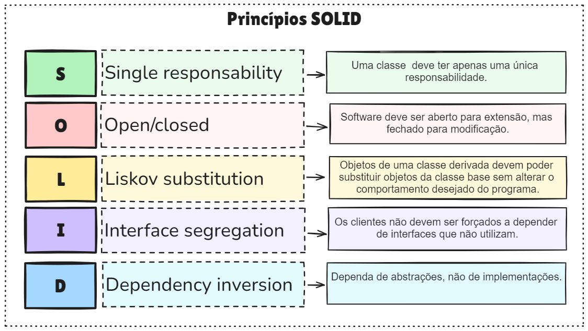

# 3 - Princípios de Design Visão Geral


## 🧠 **Objetivo da Aula**

Apresentar os princípios de design SOLID, com foco nos dois primeiros (SRP e OCP), demonstrando como aplicá-los com exemplos práticos em código.

---

## 📋 **Roteiro da Aula (Duração estimada: 1h30 - 2h)**

### 1. **Aquecimento / Introdução (10 min)**

* **Pergunta motivadora:** "O que torna um código difícil de manter ao longo do tempo?"
* **Mini debate:** Levante dores do dia a dia (código espaguete, difícil de testar, alterações que quebram funcionalidades...)
* **Transição:** "Vamos ver como os princípios SOLID ajudam a evitar esses problemas."

---

### 2. **Visão Geral dos Princípios SOLID (15 min)**

* **Origem:** Criados por Robert C. Martin (Uncle Bob)
* **Acrônimo SOLID:**

  * **S** – *Single Responsibility Principle*
  * **O** – *Open/Closed Principle*
  * **L** – *Liskov Substitution Principle*
  * **I** – *Interface Segregation Principle*
  * **D** – *Dependency Inversion Principle*
* **Objetivo comum:** escrever código **mais legível, reutilizável e de fácil manutenção**




>Exemplos em .NET C# 
>https://github.com/SyncfusionExamples/solid-principle-in-Csharp/tree/master


---

### 3. **SRP – Single Responsibility Principle (25 min)**

#### 📌 Teoria:

* **Definição:** "Uma classe deve ter apenas uma razão para mudar"
* **Explicação simples:** Cada classe deve cuidar de **uma única responsabilidade** dentro do sistema

#### 🧩 Exemplo prático (Java):

**Código ruim (violando SRP):**

```java
public class Invoice {
    public void calculateTotal() { /* lógica de cálculo */ }
    public void printInvoice() { /* lógica de impressão */ }
    public void saveToDatabase() { /* lógica de persistência */ }
}
```

**Refatorado com SRP:**

```java
public class Invoice {
    public void calculateTotal() { /* lógica de cálculo */ }
}

public class InvoicePrinter {
    public void print(Invoice invoice) { /* lógica de impressão */ }
}

public class InvoiceRepository {
    public void save(Invoice invoice) { /* lógica de persistência */ }
}
```

#### 💬 Discussão:

* Quais os benefícios dessa separação?
* Como isso facilita testes, mudanças e legibilidade?

---

### 4. **OCP – Open/Closed Principle (25 min)**

#### 📌 Teoria:

* **Definição:** "Entidades de software devem estar abertas para extensão, mas fechadas para modificação"
* **Explicação simples:** Você deve **adicionar comportamento novo sem modificar código existente**

#### 🧩 Exemplo prático (Java):

**Código ruim (violando OCP):**

```java
public class DiscountCalculator {
    public double calculate(String customerType, double amount) {
        if (customerType.equals("regular")) return amount * 0.9;
        if (customerType.equals("premium")) return amount * 0.8;
        return amount;
    }
}
```

**Refatorado com OCP (usando polimorfismo):**

```java
public interface DiscountStrategy {
    double applyDiscount(double amount);
}

public class RegularDiscount implements DiscountStrategy {
    public double applyDiscount(double amount) {
        return amount * 0.9;
    }
}

public class PremiumDiscount implements DiscountStrategy {
    public double applyDiscount(double amount) {
        return amount * 0.8;
    }
}

public class DiscountCalculator {
    public double calculate(DiscountStrategy strategy, double amount) {
        return strategy.applyDiscount(amount);
    }
}
```

#### 💬 Discussão:

* Como essa estrutura ajuda a adicionar novos tipos de desconto sem mexer na lógica atual?
* Onde usar esse tipo de padrão no mundo real?

---

### 5. **Atividade Prática (20 min)**

* Divida os alunos em duplas/trios e peça:

  * Um exemplo de violação de SRP ou OCP
  * Refatorar o exemplo
  * Compartilhar com a turma

---

### 6. **Fechamento (10 min)**

* **Resumo dos aprendizados**
* **Checklist final:**

  * Por que usar SOLID?
  * Quando usar SRP?
  * Quando aplicar OCP?
