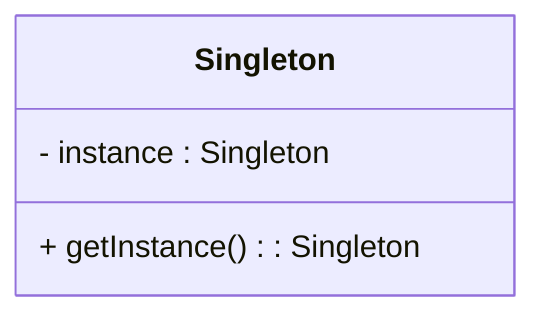
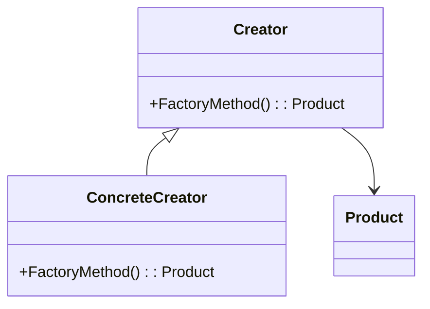
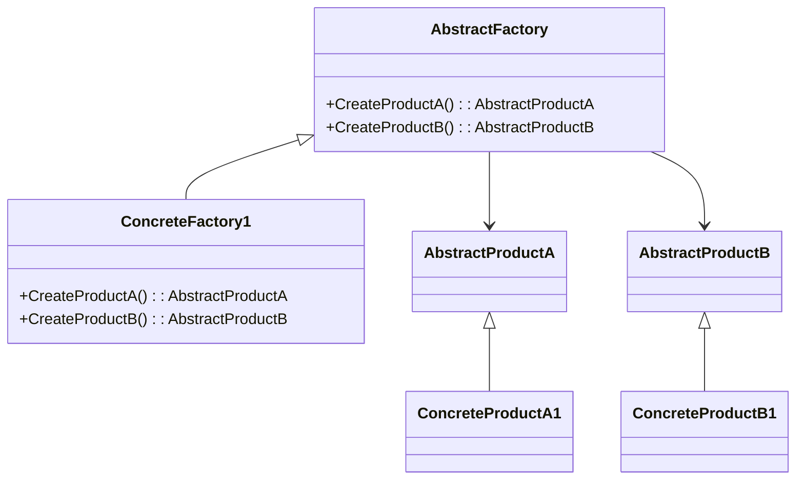
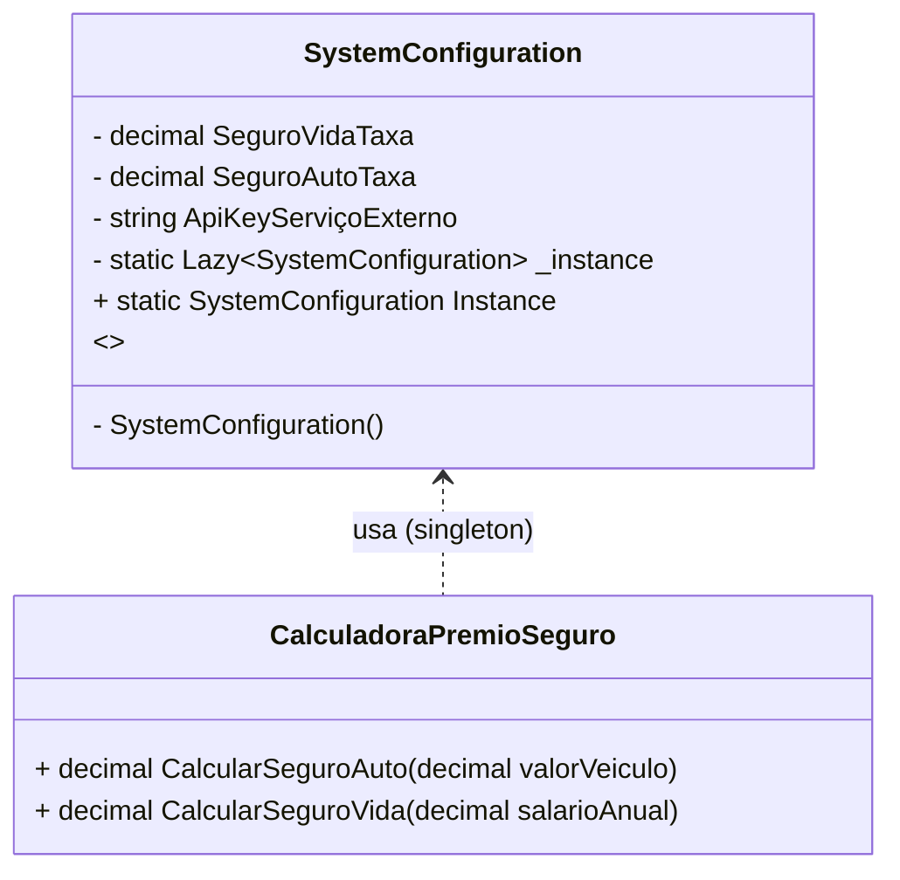
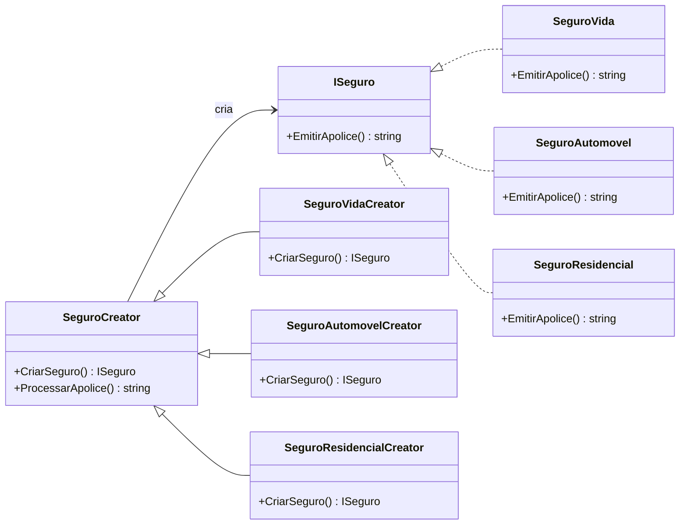
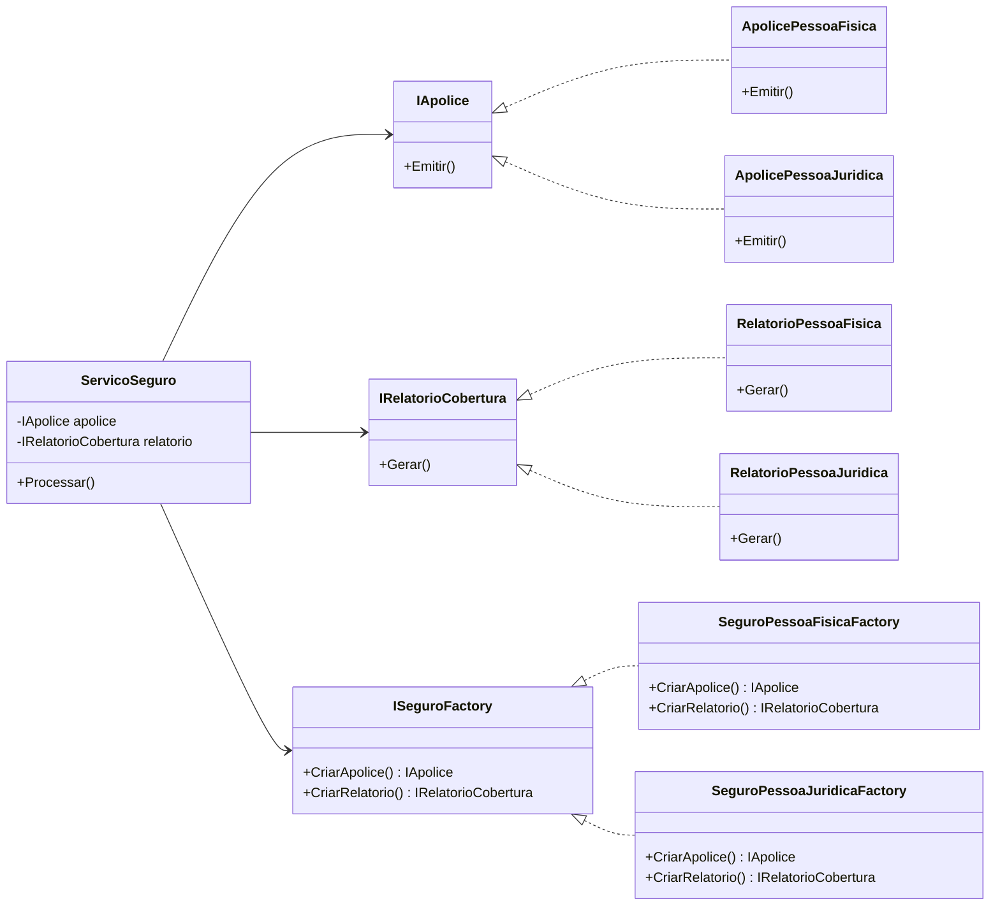

# Aula: Design Patterns - Padrões Criacionais (2h)

## Objetivo:

Compreender os principais padrões de projeto criacionais: Singleton, Factory Method e Abstract Factory, incluindo seus propósitos, implementações e aplicações no mundo real.

---

## Estrutura da Aula (2h)

### 1. Introdução (10 min)

Padrões criacionais são **padrões de design de software** focados em **como criar objetos** de forma flexível, eficiente e controlada. Eles **abstraem o processo de instanciamento**, ajudando a tornar o sistema mais independente de como seus objetos são criados, compostos e representados.

Em vez de simplesmente usar `new` para criar objetos, os padrões criacionais oferecem **maneiras mais estruturadas e flexíveis de fazer isso**, o que facilita a manutenção, testes e evolução do código.

### Os principais padrões criacionais são:

| Padrão               | Descrição rápida                                                                                                                                                                                              |
| -------------------- | ------------------------------------------------------------------------------------------------------------------------------------------------------------------------------------------------------------- |
| **Singleton**        | Garante que uma classe tenha **apenas uma instância** e fornece um ponto de acesso global. Ideal para coisas como conexão com banco ou configuração global.                                                   |
| **Factory Method**   | Define uma **interface para criar um objeto**, mas deixa que as subclasses decidam **qual classe instanciar**. Promove o **desacoplamento** entre cliente e a criação do objeto.                              |
| **Abstract Factory** | Cria **famílias de objetos relacionados** sem depender de suas classes concretas. Útil para cenários com múltiplas variantes de produtos.                                                                     |
| **Builder**          | Separa a construção de um objeto complexo da sua representação, permitindo a criação de diferentes representações **com o mesmo processo de construção**. Ideal para objetos com muitos parâmetros opcionais. |
| **Prototype**        | Cria novos objetos copiando um **protótipo existente**. Útil quando a criação via `new` é cara e o objeto pode ser copiado de forma eficiente.                                                                |


### 2. Singleton (20 min)

**Objetivo:** Garantir que uma classe tenha apenas uma instância e fornecer um ponto de acesso global a ela.

**Aplicabilidade:**

* Gerenciador de configuração
* Log de aplicação

**Estrutura UML (MermaidJS):**



**Imagem exemplo:** Um console de logging com um único arquivo sendo escrito.

**Exemplo C#:**

```csharp
public class Logger {
    private static Logger instance;
    private Logger() {}

    public static Logger GetInstance() {
        if (instance == null) {
            instance = new Logger();
        }
        return instance;
    }
}
```

### 3. Factory Method (30 min)

**Objetivo:** Definir uma interface para criar um objeto, mas deixar as subclasses decidirem qual classe instanciar.

**Aplicabilidade:**

* Quando a classe não sabe de antemão quais subclasses precisarão ser criadas

**Estrutura UML (MermaidJS):**



**Imagem exemplo:** Criador de documentos (PDF, Word, Excel).

**Exemplo C#:**

```csharp
public abstract class Document {
    public abstract void Open();
}

public class PdfDocument : Document {
    public override void Open() {
        Console.WriteLine("Abrindo PDF...");
    }
}

public abstract class Application {
    public abstract Document CreateDocument();
}

public class PdfApplication : Application {
    public override Document CreateDocument() {
        return new PdfDocument();
    }
}
```

### 4. Abstract Factory (30 min)

**Objetivo:** Fornecer uma interface para criar famílias de objetos relacionados ou dependentes sem especificar suas classes concretas.

**Aplicabilidade:**

* Sistemas que precisam ser independentes de como seus objetos são criados
* Famílias de produtos relacionados (ex: UI Windows/Linux/Mac)

**Estrutura UML (MermaidJS):**



**Imagem exemplo:** Um conjunto de widgets para diferentes SOs (BotãoWindows, BotãoMac).

**Exemplo C#:**

```csharp
public interface IButton {
    void Paint();
}

public class WinButton : IButton {
    public void Paint() {
        Console.WriteLine("Botão estilo Windows");
    }
}

public class MacButton : IButton {
    public void Paint() {
        Console.WriteLine("Botão estilo Mac");
    }
}

public interface GUIFactory {
    IButton CreateButton();
}

public class WinFactory : GUIFactory {
    public IButton CreateButton() => new WinButton();
}

public class MacFactory : GUIFactory {
    public IButton CreateButton() => new MacButton();
}
```

### 5. Atividade em Grupo (20 min)

* Criar um exemplo simples aplicando um dos padrões
* Compartilhar no quadro

#### 5.1 - Singleton

Vamos usar um exemplo prático e didático de uma aplicação de **seguradora**, onde o **Singleton Design Pattern** é útil.

---

##### 🎯 **Contexto**

Imagine uma aplicação de uma seguradora que precisa acessar uma **instância centralizada de configuração do sistema**, contendo, por exemplo:

* Taxas de juros para diferentes tipos de seguros
* Limites globais definidos por compliance
* Chaves de API para comunicação com serviços externos

Essas informações raramente mudam em tempo de execução e são lidas com frequência. Para garantir que **apenas uma instância** dessas configurações seja usada em toda a aplicação (evitando inconsistências e desperdício de memória), usamos o **Singleton**.


---

##### 📝 O que esse diagrama mostra:

* `SystemConfiguration` é a **classe Singleton**.
* Tem membros privados e um construtor privado.
* Exposta ao mundo apenas via `Instance`.
* A classe `CalculadoraPremioSeguro` **usa** essa instância singleton para calcular prêmios.

---

##### 💡 **Exemplo em C# com .NET 9**

```csharp
public sealed class SystemConfiguration
{
    private static readonly Lazy<SystemConfiguration> _instance =
        new(() => new SystemConfiguration());

    // Propriedades de configuração
    public decimal SeguroVidaTaxa { get; private set; }
    public decimal SeguroAutoTaxa { get; private set; }
    public string ApiKeyServiçoExterno { get; private set; }

    // Construtor privado para impedir instanciação externa
    private SystemConfiguration()
    {
        // Simula carregamento de dados de um arquivo, banco ou Azure Key Vault
        SeguroVidaTaxa = 0.015m;
        SeguroAutoTaxa = 0.02m;
        ApiKeyServiçoExterno = "abc123-secret";
    }

    public static SystemConfiguration Instance => _instance.Value;
}
```

---

##### 🛠 **Uso em um serviço da seguradora**

```csharp
public class CalculadoraPremioSeguro
{
    public decimal CalcularSeguroAuto(decimal valorVeiculo)
    {
        var config = SystemConfiguration.Instance;
        return valorVeiculo * config.SeguroAutoTaxa;
    }

    public decimal CalcularSeguroVida(decimal salarioAnual)
    {
        var config = SystemConfiguration.Instance;
        return salarioAnual * config.SeguroVidaTaxa;
    }
}
```

---

##### ✅ **Benefícios do Singleton nesse cenário**

* ✅ Instância única para evitar múltiplos carregamentos da mesma informação.
* ✅ Mais performance e menor uso de memória.
* ✅ Fácil de manter e expandir.

---

#### 5.2 - Factory Method

Vamos usar um **exemplo prático** de aplicação do padrão **Factory Method** em uma **seguradora** que oferece diferentes tipos de seguros, como:

* Seguro de **Vida**
* Seguro de **Automóvel**
* Seguro de **Residência**

A ideia é que, em vez de instanciar diretamente objetos de cada tipo de seguro, usamos o **Factory Method** para delegar essa responsabilidade para subclasses específicas, promovendo **extensibilidade** e **baixo acoplamento**.


---

Esse diagrama mostra:

* A interface `ISeguro` como contrato para os produtos.
* Três implementações: `SeguroVida`, `SeguroAutomovel`, `SeguroResidencial`.
* A classe base `SeguroCreator` que define o método `CriarSeguro()`.
* Três fábricas concretas que herdam de `SeguroCreator`.


---

##### 🔧 Estrutura do Padrão Factory Method

* **Produto (Product)**: `ISeguro`
* **Produtos Concretos (Concrete Products)**: `SeguroVida`, `SeguroAutomovel`, `SeguroResidencial`
* **Creator (Fábrica base)**: `SeguroCreator`
* **Concrete Creators (Fábricas concretas)**: `SeguroVidaCreator`, `SeguroAutomovelCreator`, `SeguroResidencialCreator`

---

##### ✅ Interface do Produto

```csharp
public interface ISeguro
{
    string EmitirApolice();
}
```

---

##### ✅ Implementações Concretas

```csharp
public class SeguroVida : ISeguro
{
    public string EmitirApolice() => "Apólice de Seguro de Vida emitida.";
}

public class SeguroAutomovel : ISeguro
{
    public string EmitirApolice() => "Apólice de Seguro de Automóvel emitida.";
}

public class SeguroResidencial : ISeguro
{
    public string EmitirApolice() => "Apólice de Seguro Residencial emitida.";
}
```

---

##### 🏭 Fábrica Abstrata (Creator)

```csharp
public abstract class SeguroCreator
{
    public abstract ISeguro CriarSeguro();

    public string ProcessarApolice()
    {
        var seguro = CriarSeguro();
        return seguro.EmitirApolice();
    }
}
```

---

##### 🏭 Fábricas Concretas

```csharp
public class SeguroVidaCreator : SeguroCreator
{
    public override ISeguro CriarSeguro() => new SeguroVida();
}

public class SeguroAutomovelCreator : SeguroCreator
{
    public override ISeguro CriarSeguro() => new SeguroAutomovel();
}

public class SeguroResidencialCreator : SeguroCreator
{
    public override ISeguro CriarSeguro() => new SeguroResidencial();
}
```

---

##### 📦 Uso na Aplicação

```csharp
public class Programa
{
    public static void Main()
    {
        SeguroCreator criador;

        criador = new SeguroVidaCreator();
        Console.WriteLine(criador.ProcessarApolice());

        criador = new SeguroAutomovelCreator();
        Console.WriteLine(criador.ProcessarApolice());

        criador = new SeguroResidencialCreator();
        Console.WriteLine(criador.ProcessarApolice());
    }
}
```

---

##### 🧠 Benefícios no contexto da seguradora

* Fácil adicionar novos tipos de seguro sem alterar código existente.
* Encapsula a lógica de criação dos seguros.
* Aplica o **Open/Closed Principle** (aberto para extensão, fechado para modificação).


#### 5.3 - Abstract Factory

Vamos ilustrar o **padrão Abstract Factory** no **contexto de uma seguradora**, onde você precisa criar **famílias de produtos relacionados** sem acoplar diretamente às classes concretas.

---

##### 🧠 **Cenário:**

Imagine que sua seguradora vende **seguros para pessoas físicas e jurídicas**. Para cada tipo, ela precisa gerar:

* Uma **apólice de seguro** (`IApolice`)
* Um **relatório de cobertura** (`IRelatorioCobertura`)

Esses dois objetos estão relacionados, e você quer garantir que, para pessoa física, use os objetos específicos para esse tipo, e o mesmo para pessoa jurídica.

---

##### **Diagrama:**



###### Elementos principais do diagrama:

1. **Interfaces de fábrica e produtos abstratos:**

* `ISeguroFactory`: Interface que declara os métodos para criar os produtos (`CriarApolice()` e `CriarRelatorio()`).
* `IApolice`: Interface para o produto "Apólice".
* `IRelatorioCobertura`: Interface para o produto "Relatório de cobertura".

2. **Fábricas concretas (implementações de `ISeguroFactory`):**

* `SeguroPessoaFisicaFactory`: Cria produtos concretos para pessoa física.
* `SeguroPessoaJuridicaFactory`: Cria produtos concretos para pessoa jurídica.

3. **Produtos concretos:**

* `ApolicePessoaFisica` e `ApolicePessoaJuridica`: implementam `IApolice`.
* `RelatorioPessoaFisica` e `RelatorioPessoaJuridica`: implementam `IRelatorioCobertura`.

4. **Cliente que consome a fábrica e produtos:**

* `ServicoSeguro`: Classe que depende das interfaces abstratas para operar, ou seja, usa a fábrica para criar os produtos e depois utiliza eles (emitir apólice e gerar relatório).

---

###### Relacionamentos mostrados:

* As fábricas concretas herdam/implementam `ISeguroFactory`.
* Os produtos concretos herdam/implementam suas respectivas interfaces (`IApolice` ou `IRelatorioCobertura`).
* A classe `ServicoSeguro` depende da interface da fábrica (`ISeguroFactory`) para criar os produtos abstratos e depois trabalha com os produtos através das interfaces abstratas.

---

###### Por que isso importa?

Esse diagrama deixa claro que:

* O cliente **não sabe nem precisa saber** das classes concretas que está usando.
* A criação dos objetos é **desacoplada** da sua utilização.
* É fácil adicionar novos tipos/famílias de seguros, basta criar novas fábricas e produtos concretos, sem mudar o cliente.


##### 🎯 **Objetivo do Abstract Factory:**

Separar a criação de objetos da família "Pessoa Física" e "Pessoa Jurídica" em **fábricas abstratas** para que o cliente use sem saber das classes concretas.

---

##### 🧱 **Interfaces base (produtos abstratos):**

```csharp
// Produtos abstratos
public interface IApolice
{
    void Emitir();
}

public interface IRelatorioCobertura
{
    void Gerar();
}
```

---

##### 🏢 **Família Pessoa Física (produtos concretos):**

```csharp
public class ApolicePessoaFisica : IApolice
{
    public void Emitir() => Console.WriteLine("Emitindo apólice para pessoa física...");
}

public class RelatorioPessoaFisica : IRelatorioCobertura
{
    public void Gerar() => Console.WriteLine("Gerando relatório de cobertura para pessoa física...");
}
```

---

##### 🏬 **Família Pessoa Jurídica (produtos concretos):**

```csharp
public class ApolicePessoaJuridica : IApolice
{
    public void Emitir() => Console.WriteLine("Emitindo apólice para pessoa jurídica...");
}

public class RelatorioPessoaJuridica : IRelatorioCobertura
{
    public void Gerar() => Console.WriteLine("Gerando relatório de cobertura para pessoa jurídica...");
}
```

---

##### 🏭 **Abstract Factory:**

```csharp
public interface ISeguroFactory
{
    IApolice CriarApolice();
    IRelatorioCobertura CriarRelatorio();
}
```

---

##### 🏗️ **Concrete Factories:**

```csharp
public class SeguroPessoaFisicaFactory : ISeguroFactory
{
    public IApolice CriarApolice() => new ApolicePessoaFisica();
    public IRelatorioCobertura CriarRelatorio() => new RelatorioPessoaFisica();
}

public class SeguroPessoaJuridicaFactory : ISeguroFactory
{
    public IApolice CriarApolice() => new ApolicePessoaJuridica();
    public IRelatorioCobertura CriarRelatorio() => new RelatorioPessoaJuridica();
}
```

---

##### 👨‍💼 **Cliente que usa a fábrica (sem conhecer implementações concretas):**

```csharp
public class ServicoSeguro
{
    private readonly IApolice _apolice;
    private readonly IRelatorioCobertura _relatorio;

    public ServicoSeguro(ISeguroFactory factory)
    {
        _apolice = factory.CriarApolice();
        _relatorio = factory.CriarRelatorio();
    }

    public void Processar()
    {
        _apolice.Emitir();
        _relatorio.Gerar();
    }
}
```

---

##### 🚀 **Uso no programa:**

```csharp
class Program
{
    static void Main()
    {
        ISeguroFactory factory = new SeguroPessoaFisicaFactory();
        var servico = new ServicoSeguro(factory);
        servico.Processar();

        Console.WriteLine("---");

        factory = new SeguroPessoaJuridicaFactory();
        servico = new ServicoSeguro(factory);
        servico.Processar();
    }
}
```

---

##### ✅ **Vantagens no cenário da seguradora:**

* Fácil adicionar novas famílias (ex: seguro rural, viagem, etc.)
* Separação clara entre lógica de negócio e criação dos objetos
* Testes ficam mais fáceis ao mockar a factory


### 6. Encerramento e Dúvidas (10 min)

* Quando usar cada padrão
* Vantagens e desvantagens


### 7. Referências:

* https://sourcemaking.com/design_patterns/creational_patterns


---
> © MoOngy 2025 | Este repositório é parte do programa de formação contínua em Engenharia de Software.
