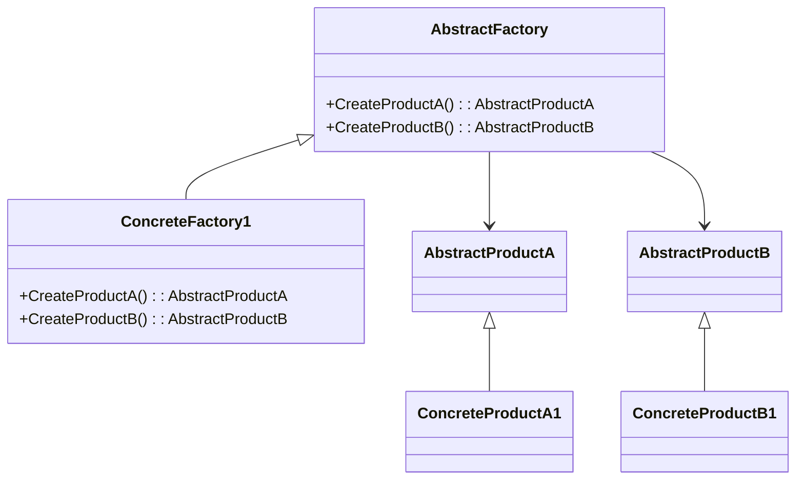

# Aula: Design Patterns - Padrões Criacionais (2h)

## Objetivo:

Compreender os principais padrões de projeto criacionais: Singleton, Factory Method e Abstract Factory, incluindo seus propósitos, implementações e aplicações no mundo real.

---

## Estrutura da Aula (2h)

### 1. Introdução (10 min)

* Definição de Design Patterns
* Importância dos padrões criacionais
* Quando usar

### 2. Singleton (20 min)

**Objetivo:** Garantir que uma classe tenha apenas uma instância e fornecer um ponto de acesso global a ela.

**Aplicabilidade:**

* Gerenciador de configuração
* Log de aplicação

**Estrutura UML:**

```
+------------------+
|    Singleton     |
+------------------+
| - instance       |
+------------------+
| + getInstance()  |
+------------------+
```



**Imagem exemplo:** Um console de logging com um único arquivo sendo escrito.

**Exemplo C#:**

```csharp
public class Logger {
    private static Logger instance;
    private Logger() {}

    public static Logger GetInstance() {
        if (instance == null) {
            instance = new Logger();
        }
        return instance;
    }
}
```

### 3. Factory Method (30 min)

**Objetivo:** Definir uma interface para criar um objeto, mas deixar as subclasses decidirem qual classe instanciar.

**Aplicabilidade:**

* Quando a classe não sabe de antemão quais subclasses precisarão ser criadas

**Estrutura UML:**

```
+-------------------+       +-----------------+
| Creator           |<>---->| Product         |
+-------------------+       +-----------------+
| + FactoryMethod() |       |                 |
+-------------------+       +-----------------+
        ^
        |
+-------------------+
| ConcreteCreator    |
+-------------------+
| + FactoryMethod()  |
+-------------------+
```

**Imagem exemplo:** Criador de documentos (PDF, Word, Excel).

**Exemplo C#:**

```csharp
public abstract class Document {
    public abstract void Open();
}

public class PdfDocument : Document {
    public override void Open() {
        Console.WriteLine("Abrindo PDF...");
    }
}

public abstract class Application {
    public abstract Document CreateDocument();
}

public class PdfApplication : Application {
    public override Document CreateDocument() {
        return new PdfDocument();
    }
}
```

### 4. Abstract Factory (30 min)

**Objetivo:** Fornecer uma interface para criar famílias de objetos relacionados ou dependentes sem especificar suas classes concretas.

**Aplicabilidade:**

* Sistemas que precisam ser independentes de como seus objetos são criados
* Famílias de produtos relacionados (ex: UI Windows/Linux/Mac)

**Estrutura UML:**

```
+---------------------------+      +----------------+
| AbstractFactory           |<>--->| AbstractProduct |
+---------------------------+      +----------------+
| + CreateProductA()        |
| + CreateProductB()        |
+---------------------------+
         ^                             ^
         |                             |
+----------------------+   +-----------------------+
| ConcreteFactory1      |   | ConcreteProductA1     |
+----------------------+   +-----------------------+
| + CreateProductA()    |   |                       |
| + CreateProductB()    |   +-----------------------+
+----------------------+
```

**Imagem exemplo:** Um conjunto de widgets para diferentes SOs (BotãoWindows, BotãoMac).

**Exemplo C#:**

```csharp
public interface IButton {
    void Paint();
}

public class WinButton : IButton {
    public void Paint() {
        Console.WriteLine("Botão estilo Windows");
    }
}

public class MacButton : IButton {
    public void Paint() {
        Console.WriteLine("Botão estilo Mac");
    }
}

public interface GUIFactory {
    IButton CreateButton();
}

public class WinFactory : GUIFactory {
    public IButton CreateButton() => new WinButton();
}

public class MacFactory : GUIFactory {
    public IButton CreateButton() => new MacButton();
}
```

### 5. Atividade em Grupo (20 min)

* Criar um exemplo simples aplicando um dos padrões
* Compartilhar no quadro

### 6. Encerramento e Dúvidas (10 min)

* Quando usar cada padrão
* Vantagens e desvantagens

