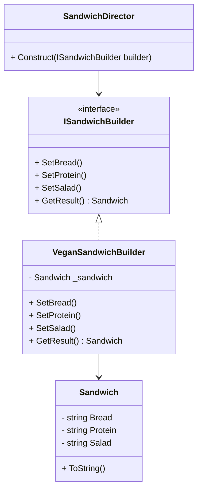
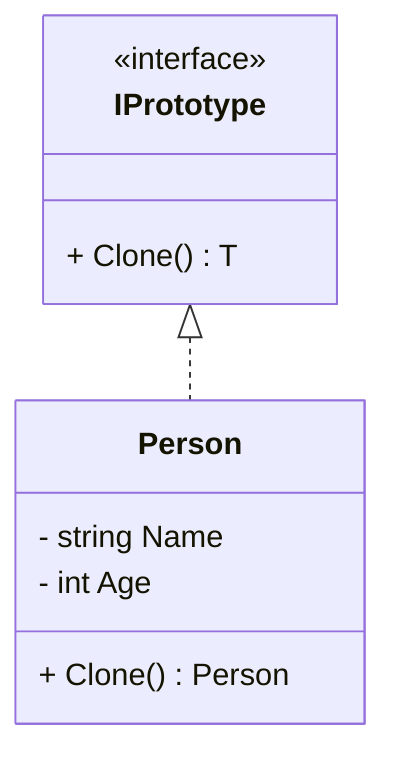

## 🧠 **Aula: Padrões de Projeto Criacionais (Continuação) – Builder e Prototype**

### 🎯 **Objetivos da Aula**

* Compreender o propósito dos padrões criacionais no design de software.
* Aplicar os padrões Builder e Prototype com exemplos práticos.
* Avaliar vantagens, desvantagens e quando usar cada padrão.

---

## 🕑 **Duração Total: 2 horas**

| Tempo       | Atividade                                        |
| ----------- | ------------------------------------------------ |
| 0–10 min    | Introdução aos Padrões Criacionais               |
| 10–45 min   | Padrão Builder – Conceito, Exemplo e Exercício   |
| 45–80 min   | Padrão Prototype – Conceito, Exemplo e Exercício |
| 80–110 min  | Análise de trade-offs e comparações práticas     |
| 110–120 min | Encerramento, dúvidas e insights                 |

---

## 🧩 **1. Introdução aos Padrões Criacionais (10 min)**

**Conceito geral:**

* Padrões criacionais tratam da **instanciação de objetos**, encapsulando o processo de criação.
* Objetivo: **reduzir o acoplamento** entre o sistema e a forma como objetos são criados.

**Padrões mais comuns:**

* Singleton, Factory Method, Abstract Factory, Builder, Prototype


### Revisão:

| Padrão               | Descrição rápida                                                                                                                                                                                              |
| -------------------- | ------------------------------------------------------------------------------------------------------------------------------------------------------------------------------------------------------------- |
| **Singleton**        | Garante que uma classe tenha **apenas uma instância** e fornece um ponto de acesso global. Ideal para coisas como conexão com banco ou configuração global.                                                   |
| **Factory Method**   | Define uma **interface para criar um objeto**, mas deixa que as subclasses decidam **qual classe instanciar**. Promove o **desacoplamento** entre cliente e a criação do objeto.                              |
| **Abstract Factory** | Cria **famílias de objetos relacionados** sem depender de suas classes concretas. Útil para cenários com múltiplas variantes de produtos.                                                                     |
| **Builder**          | Separa a construção de um objeto complexo da sua representação, permitindo a criação de diferentes representações **com o mesmo processo de construção**. Ideal para objetos com muitos parâmetros opcionais. |
| **Prototype**        | Cria novos objetos copiando um **protótipo existente**. Útil quando a criação via `new` é cara e o objeto pode ser copiado de forma eficiente.                                                                |


#### Diferenças entre o Factory Method e o Abstract Factory

| Característica           | **Factory Method**                               | **Abstract Factory**                                            |
| ------------------------ | ------------------------------------------------ | --------------------------------------------------------------- |
| **Propósito**            | Criar objetos de uma mesma família, um por vez   | Criar **famílias de objetos relacionados** entre si             |
| **Padrão base**          | Herança (classes derivadas definem a criação)    | Composição (fábricas concretas retornam famílias de produtos)   |
| **Criação de objetos**   | Um único produto por vez                         | Múltiplos produtos relacionados                                 |
| **Escalabilidade**       | Mais simples, menos flexível                     | Mais flexível para famílias inteiras de produtos                |
| **Exemplo clássico**     | Criar um botão (WindowsButton, LinuxButton)      | Criar UI inteira (Botão, Menu, Janela para Windows, Linux, etc) |
| **Número de interfaces** | Interface única para o produto                   | Múltiplas interfaces (uma para cada tipo de produto)            |
| **Complexidade**         | Média                                            | Alta                                                            |
| **Quando usar**          | Quando subclasses decidem qual objeto instanciar | Quando produtos **precisam funcionar juntos** (consistência)    |


---

## 📊 Comparativo aplicado à seguradora

| Característica                  | **Factory Method**                     | **Abstract Factory**                                            |
| ------------------------------- | -------------------------------------- | --------------------------------------------------------------- |
| **Exemplo aplicado**            | Criar apólice individual: Auto ou Vida | Criar conjunto completo de apólices (Auto + Vida) para PF ou PJ |
| **Escopo de criação**           | Um tipo de apólice por vez             | Conjunto de produtos relacionados                               |
| **Flexibilidade de combinação** | Limitada – uma apólice por fábrica     | Alta – combinação de múltiplos produtos em família              |
| **Consistência entre produtos** | Não garantida                          | Garantida (ex: todos produtos compatíveis com PF ou PJ)         |


---

## 🏗️ **2. Padrão Builder (35 min)**

### 📘 Conceito:

* Separação da construção de um objeto complexo da sua representação.
* Permite criar diferentes representações de um objeto usando o mesmo processo de construção.

### 🧪 Exemplo prático (C#):

```csharp
// Produto final
class Sandwich {
    public string Bread { get; set; }
    public string Protein { get; set; }
    public string Salad { get; set; }

    public override string ToString() =>
        $"Sanduíche com {Protein}, pão {Bread} e salada {Salad}";
}

// Builder
interface ISandwichBuilder {
    void SetBread();
    void SetProtein();
    void SetSalad();
    Sandwich GetResult();
}

// Concrete Builder
class VeganSandwichBuilder : ISandwichBuilder {
    private Sandwich _sandwich = new Sandwich();
    public void SetBread() => _sandwich.Bread = "Integral";
    public void SetProtein() => _sandwich.Protein = "Tofu";
    public void SetSalad() => _sandwich.Salad = "Alface e tomate";
    public Sandwich GetResult() => _sandwich;
}

// Director
class SandwichDirector {
    public void Construct(ISandwichBuilder builder) {
        builder.SetBread();
        builder.SetProtein();
        builder.SetSalad();
    }
}
```




### 💡 Vantagens:

* Modularidade na construção de objetos.
* Facilita a criação de representações diferentes de um mesmo objeto.

### ❗ Desvantagens:

* Mais classes e complexidade.
* Pode ser overkill para objetos simples.

### 👨‍🏫 Atividade:

> Crie um Builder para montar um computador (CPU, GPU, RAM, SSD), com pelo menos 2 tipos de configuração (ex: gamer e escritório).

---

## 🧬 **3. Padrão Prototype (35 min)**

### 📘 Conceito:

* Cria novos objetos copiando uma instância existente.
* Útil quando a criação de um objeto é custosa (por performance ou complexidade).

### 🧪 Exemplo prático (C#):

```csharp
interface IPrototype<T> {
    T Clone();
}

class Person : IPrototype<Person> {
    public string Name { get; set; }
    public int Age { get; set; }

    public Person Clone() => (Person)this.MemberwiseClone();
}
```



### 💡 Vantagens:

* Reduz custo de criação de objetos complexos.
* Evita código de inicialização repetido.

### ❗ Desvantagens:

* Exige atenção com **deep copy** vs **shallow copy**.
* Pode ser difícil manter clones se a hierarquia for grande.

### 👨‍🏫 Atividade:

> Modele um sistema de cadastro com templates de contratos clonáveis (ex: "Contrato Padrão", "Contrato Premium") que pode ser personalizado depois.

---

## ⚖️ **4. Análise de Trade-offs e Aplicações Práticas (30 min)**

### 🔍 Comparação entre Builder e Prototype:

| Critério         | Builder                                       | Prototype                         |
| ---------------- | --------------------------------------------- | --------------------------------- |
| Uso principal    | Construção passo a passo de objetos complexos | Cópia de objetos existentes       |
| Complexidade     | Média/Alta                                    | Baixa/Média                       |
| Flexibilidade    | Alta                                          | Média                             |
| Custo de criação | Irrelevante                                   | Alto (prototype é vantajoso)      |
| Quando usar      | Objetos com muitas variações                  | Objetos com inicialização custosa |

### 🌍 Aplicações práticas:

* **Builder**: Criação de relatórios PDF, configuração de UI, workflows de pipeline.
* **Prototype**: Jogos (clonar inimigos), documentos com templates, IA (clonagem de agentes).

---

## 📚 **5. Encerramento e Dúvidas (10 min)**

### ✔️ Recapitulando:

* Padrões criacionais reduzem o acoplamento da lógica de negócio com o modo de instanciar objetos.
* **Builder** é ideal para construções complexas e flexíveis.
* **Prototype** brilha em situações onde copiar objetos é mais eficiente do que construí-los do zero.
