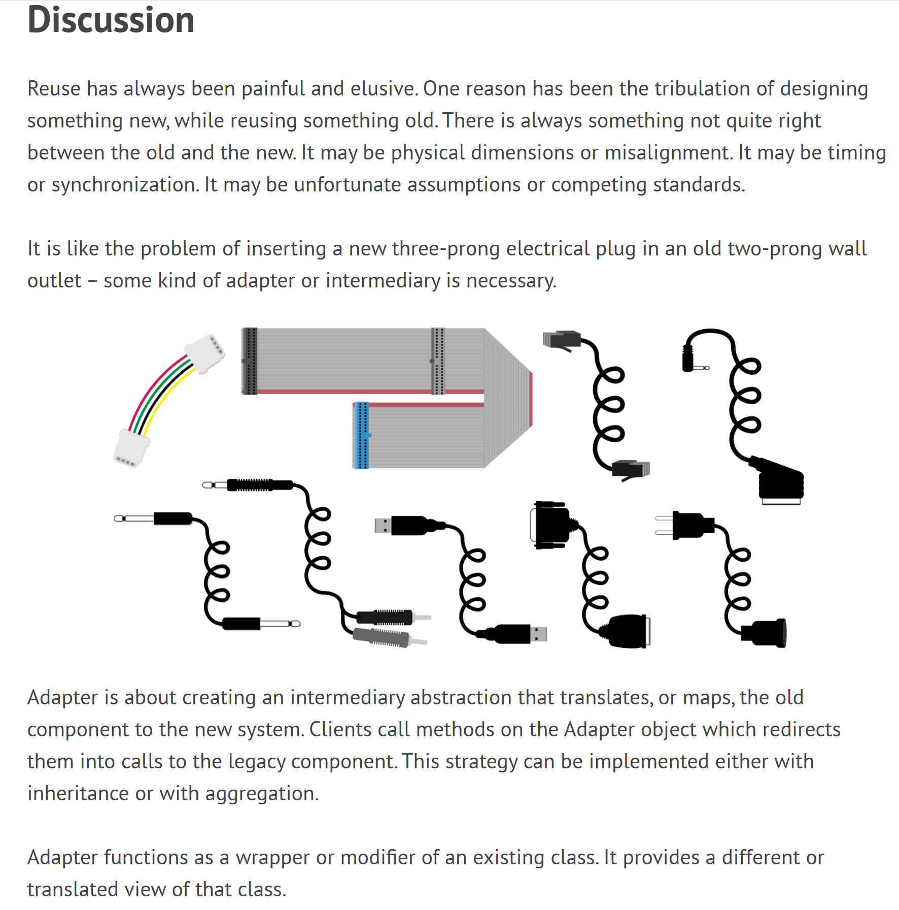
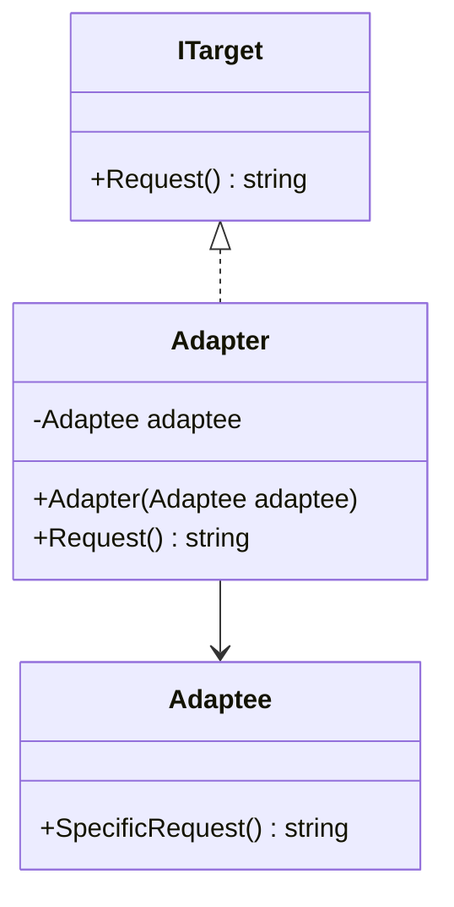

## 🎓 Aula: Padrões de Projeto Estruturais – Adapter, Bridge e Composite

**Público-alvo**: Desenvolvedores júnior/intermediários
**Duração**: 2 horas
**Pré-requisitos**: Conhecimentos básicos de orientação a objetos (herança, composição, interfaces)

---

### 📘 Objetivos da Aula

* Compreender o propósito dos padrões estruturais no design de software
* Estudar em detalhe os padrões Adapter, Bridge e Composite
* Aplicar cada padrão em um exemplo prático
* Refletir sobre quando usar cada padrão no dia a dia

---

## 🧭 Roteiro da Aula (120 minutos)

| Tempo       | Atividade                                         |
| ----------- | ------------------------------------------------- |
| 0–10 min    | Introdução aos padrões estruturais                |
| 10–35 min   | **Adapter** – Teoria e prática                    |
| 35–60 min   | **Bridge** – Teoria e prática                     |
| 60–65 min   | Intervalo rápido                                  |
| 65–95 min   | **Composite** – Teoria e prática                  |
| 95–115 min  | Desafio prático (mini projeto com um dos padrões) |
| 115–120 min | Encerramento e dúvidas                            |

---

## 🧩 Parte 1: Introdução aos Padrões Estruturais (10 min)

**Conceito:**
Padrões estruturais lidam com a **composição de classes e objetos**, ajudando a formar estruturas maiores de maneira flexível e reutilizável.

**Padrões que veremos:**

* Adapter → Conversão de interfaces
* Bridge → Separação de abstração e implementação
* Composite → Hierarquias com comportamento uniforme

---

## 🔌 Parte 2: Adapter (25 min)

### 🎯 Intenção:

Permitir que classes com interfaces incompatíveis trabalhem juntas.




### 📚 Exemplo conceitual:

```csharp
// Interface esperada
public interface ITarget {
    string Request();
}

// Classe existente com interface diferente
public class Adaptee {
    public string SpecificRequest() => "Requisição específica";
}

// Adapter
public class Adapter : ITarget {
    private readonly Adaptee _adaptee;
    public Adapter(Adaptee adaptee) => _adaptee = adaptee;

    public string Request() => _adaptee.SpecificRequest();
}
```



### 💡 Explicação:

* `ITarget` é a **interface esperada**.
* `Adaptee` é a **classe existente** com uma interface incompatível.
* `Adapter` **implementa** `ITarget` e **comunica-se** com `Adaptee` internamente.


### 💬 Discussão:

* Onde encontramos isso no mundo real? (ex: APIs externas, bibliotecas legadas)
* Diferença entre Object Adapter e Class Adapter

### 🛠️ Atividade rápida (5 min):

Transformar uma classe `JsonLogger` para se adaptar à interface `ILogger`.

---

## 🌉 Parte 3: Bridge (25 min)

### 🎯 Intenção:

Separar uma abstração de sua implementação para que as duas possam variar independentemente.

### 📚 Exemplo conceitual:

```csharp
// Implementor
public interface IRenderer {
    void Render(string shape);
}

// Concrete Implementors
public class VectorRenderer : IRenderer {
    public void Render(string shape) => Console.WriteLine($"Renderizando {shape} vetorialmente.");
}
public class RasterRenderer : IRenderer {
    public void Render(string shape) => Console.WriteLine($"Renderizando {shape} com pixels.");
}

// Abstraction
public abstract class Shape {
    protected IRenderer renderer;
    protected Shape(IRenderer renderer) => this.renderer = renderer;
    public abstract void Draw();
}

// Refined Abstraction
public class Circle : Shape {
    public Circle(IRenderer renderer) : base(renderer) { }
    public override void Draw() => renderer.Render("círculo");
}
```

### 💬 Discussão:

* Quando usar Bridge em vez de herança?
* Flexibilidade com composição

### 🛠️ Atividade rápida (5 min):

Criar uma forma `Square` com ambos os renderizadores.

---

## 🌲 Parte 4: Composite (30 min)

### 🎯 Intenção:

Permitir tratar objetos individuais e composições de objetos de forma uniforme.

### 📚 Exemplo conceitual:

```csharp
// Component
public abstract class Graphic {
    public abstract void Draw();
}

// Leaf
public class Line : Graphic {
    public override void Draw() => Console.WriteLine("Desenha linha");
}

// Composite
public class Picture : Graphic {
    private List<Graphic> _children = new();
    public void Add(Graphic g) => _children.Add(g);

    public override void Draw() {
        Console.WriteLine("Desenhando figura composta:");
        foreach (var g in _children) g.Draw();
    }
}
```

### 💬 Discussão:

* Útil para representar hierarquias (menus, árvores, documentos)
* Perfeito para estruturas recursivas

### 🛠️ Atividade rápida (5 min):

Criar um `Menu` composto com submenus e itens.

---

## 💡 Parte 5: Desafio Prático (20 min)

### Desafio:

Você tem um sistema de notificação que envia mensagens via e-mail, SMS ou push notification. O cliente deseja poder agrupar notificações e disparar tudo com uma só chamada. Além disso, os provedores têm APIs diferentes.

**Objetivo:**
Usar os padrões discutidos para:

* Adaptar as APIs de envio
* Criar uma ponte entre o tipo de mensagem e o canal
* Compor múltiplas mensagens em uma estrutura

📦 Entregar uma estrutura que combine Adapter + Bridge + Composite (livre criatividade)

---

## 🏁 Encerramento (5 min)

* Recapitulação rápida dos três padrões
* Quando **não** usar esses padrões (overengineering)
* Dicas para estudar: livros como *Design Patterns: Elements of Reusable Object-Oriented Software* e repositórios no GitHub

---

## 📎 Materiais de Apoio 
