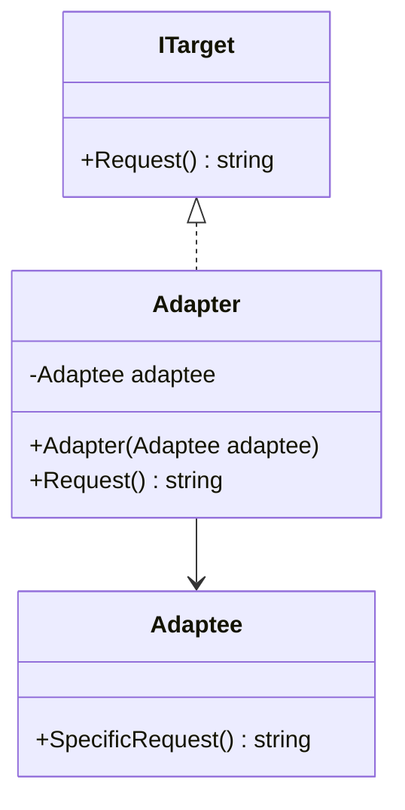
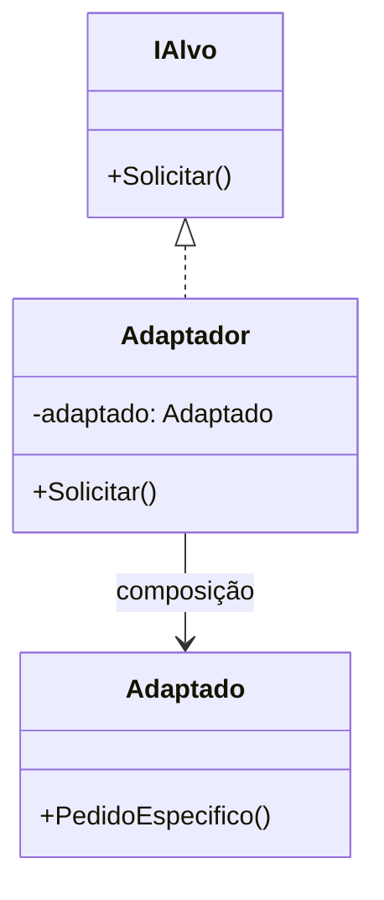
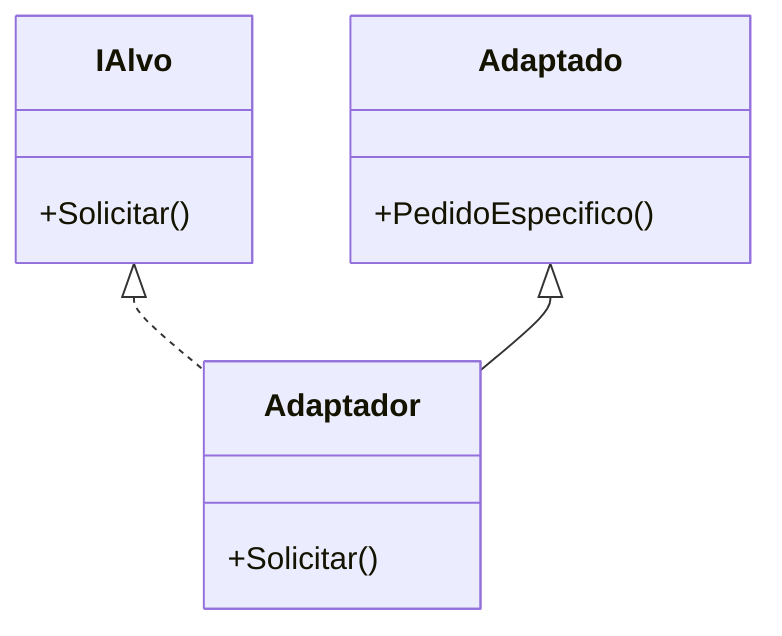
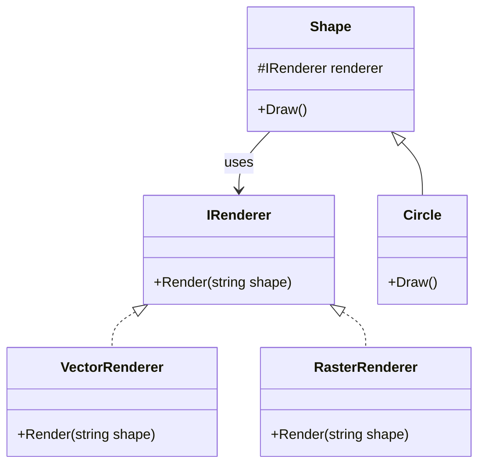
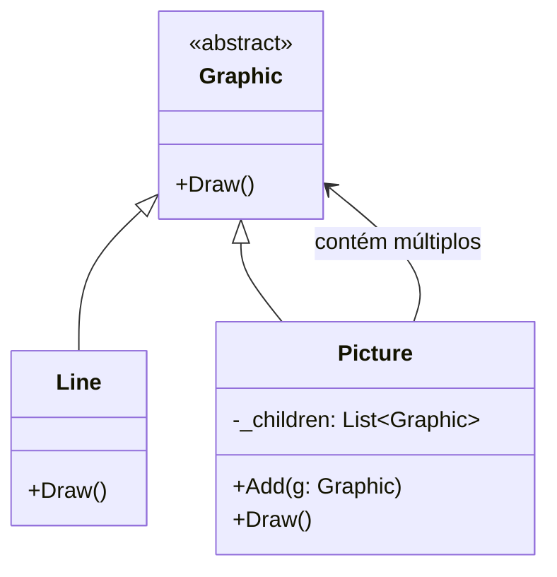
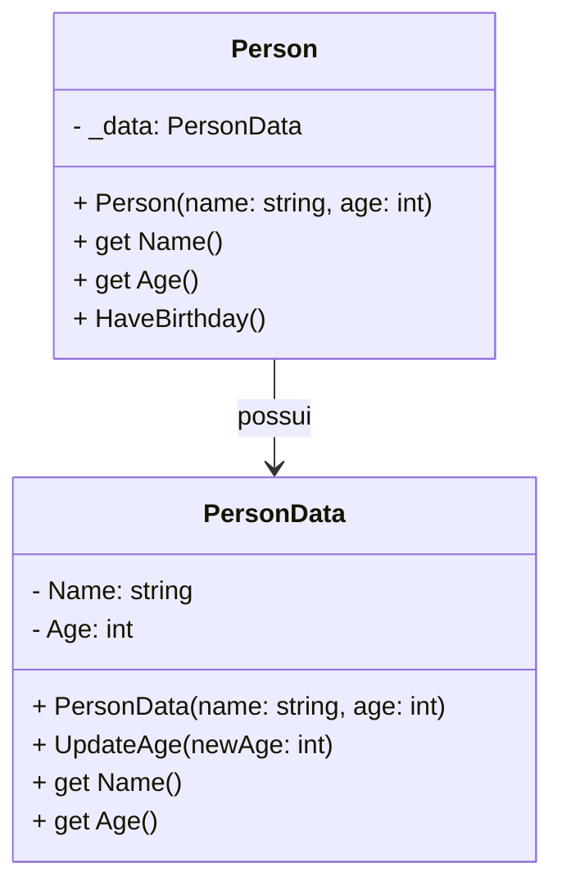

## 🎓 Aula: Padrões de Projeto Estruturais – Adapter, Bridge e Composite

**Público-alvo**: Desenvolvedores júnior/intermediários
**Duração**: 2 horas
**Pré-requisitos**: Conhecimentos básicos de orientação a objetos (herança, composição, interfaces)

---

### 📘 Objetivos da Aula

* Compreender o propósito dos padrões estruturais no design de software
* Estudar em detalhe os padrões Adapter, Bridge e Composite
* Aplicar cada padrão em um exemplo prático
* Refletir sobre quando usar cada padrão no dia a dia

---

## 🧭 Roteiro da Aula (120 minutos)

| Tempo       | Atividade                                         |
| ----------- | ------------------------------------------------- |
| 0–10 min    | Introdução aos padrões estruturais                |
| 10–35 min   | **Adapter** – Teoria e prática                    |
| 35–60 min   | **Bridge** – Teoria e prática                     |
| 60–65 min   | Intervalo rápido                                  |
| 65–95 min   | **Composite** – Teoria e prática                  |
| 95–115 min  | Desafio prático (mini projeto com um dos padrões) |
| 115–120 min | Encerramento e dúvidas                            |

---

## 🧩 Parte 1: Introdução aos Padrões Estruturais (10 min)

**Conceito:**
Padrões estruturais lidam com a **composição de classes e objetos**, ajudando a formar estruturas maiores de maneira flexível e reutilizável.

**Padrões que veremos:**

* Adapter → Conversão de interfaces
* Bridge → Separação de abstração e implementação
* Composite → Hierarquias com comportamento uniforme

---

## 🔌 Parte 2: Adapter (25 min)

### 🎯 Intenção:

Permitir que classes com interfaces incompatíveis trabalhem juntas.


### 📚 Exemplo conceitual:

```csharp
// Interface esperada
public interface ITarget {
    string Request();
}

// Classe existente com interface diferente
public class Adaptee {
    public string SpecificRequest() => "Requisição específica";
}

// Adapter
public class Adapter : ITarget {
    private readonly Adaptee _adaptee;
    public Adapter(Adaptee adaptee) => _adaptee = adaptee;

    public string Request() => _adaptee.SpecificRequest();
}
```



### 💡 Explicação:

* `ITarget` é a **interface esperada**.
* `Adaptee` é a **classe existente** com uma interface incompatível.
* `Adapter` **implementa** `ITarget` e **comunica-se** com `Adaptee` internamente.


### 💬 Discussão:

* Onde encontramos isso no mundo real? (ex: APIs externas, bibliotecas legadas)
* Diferença entre Object Adapter e Class Adapter


A diferença entre **Object Adapter** e **Class Adapter** está principalmente na forma como cada um implementa o **padrão Adapter**, que tem como objetivo permitir que duas interfaces incompatíveis trabalhem juntas. Ambos seguem o mesmo propósito, mas com abordagens diferentes:

---

### 🔌 **Object Adapter** (Adaptador por Composição)

* **Como funciona**: Usa **composição** — o adaptador mantém uma instância da classe que está sendo adaptada.
* **Estrutura**:

  * O adaptador **implementa a interface esperada** (target).
  * **Encapsula** um objeto da classe adaptada (adaptee).
  * Redireciona chamadas para o objeto interno.

#### ✅ Vantagens:

* Funciona mesmo que a classe adaptada não permita herança (ex: classes `final`).
* Pode adaptar várias subclasses de uma classe base.
* Mais flexível: pode adaptar vários adaptees diferentes, inclusive em tempo de execução.

#### ❌ Desvantagens:

* Um pouco mais verboso (precisa de delegação explícita).

#### 📦 Exemplo em C#:

```csharp
// Interface esperada
public interface IAlvo {
    void Solicitar();
}

// Classe existente com interface diferente
public class Adaptado {
    public void PedidoEspecifico() {
        Console.WriteLine("Pedido Específico");
    }
}

// Adaptador por composição
public class Adaptador : IAlvo {
    private Adaptado _adaptado = new Adaptado();

    public void Solicitar() {
        _adaptado.PedidoEspecifico(); // delega
    }
}
```

---

### 🧬 **Class Adapter** (Adaptador por Herança)

* **Como funciona**: Usa **herança múltipla** (ou interface + herança), ou seja, o adaptador **herda** da classe a ser adaptada e **implementa** a interface esperada.
* **Só é possível em linguagens que suportam herança múltipla ou interfaces junto com herança (como C++, mas não C# ou Java diretamente).**

#### ✅ Vantagens:

* Mais simples, com menos código (sem delegação).
* Boa performance (chamada direta via herança).

#### ❌ Desvantagens:

* **Menos flexível**: está fortemente acoplado à classe adaptada.
* Só funciona se você puder herdar da adaptee (não funciona com classes `final`).
* Você não pode adaptar múltiplos adaptees (por limitação da herança).

#### 📦 Exemplo em C++ (pois C# e Java não suportam herança múltipla de classes):

```cpp
class Alvo {
public:
    virtual void Solicitar() = 0;
};

class Adaptado {
public:
    void PedidoEspecifico() {
        std::cout << "Pedido Específico" << std::endl;
    }
};

// Adaptador por herança
class Adaptador : public Alvo, public Adaptado {
public:
    void Solicitar() override {
        PedidoEspecifico();
    }
};
```

---

### 📊 Resumo das Diferenças

| Aspecto                      | **Object Adapter**         | **Class Adapter**                      |
| ---------------------------- | -------------------------- | -------------------------------------- |
| Técnica usada                | Composição                 | Herança                                |
| Flexibilidade                | Alta                       | Baixa                                  |
| Acesso a métodos             | Apenas públicos do adaptee | Pode acessar métodos protegidos também |
| Pode adaptar várias classes? | Sim, via composição        | Não, só uma por vez                    |
| Suporte em Java/C#           | ✅ Sim                      | ❌ Não (por falta de herança múltipla)  |

---

### 🧩 **Object Adapter (por composição)**



---

### 🧬 **Class Adapter (por herança)**



---

Esses diagramas ilustram claramente:

* No **Object Adapter**, a relação é por **composição** (`Adaptador --> Adaptado`).
* No **Class Adapter**, a relação é por **herança dupla** (`Adaptador` herda tanto de `IAlvo` quanto de `Adaptado`).


### 🛠️ Atividade rápida (5 min):

Transformar uma classe `JsonLogger` para se adaptar à interface `ILogger`.

---

## 🌉 Parte 3: Bridge (25 min)

### 🎯 Intenção:

Separar uma abstração de sua implementação para que as duas possam variar independentemente.

### 📚 Exemplo conceitual:

```csharp
// Implementor
public interface IRenderer {
    void Render(string shape);
}

// Concrete Implementors
public class VectorRenderer : IRenderer {
    public void Render(string shape) => Console.WriteLine($"Renderizando {shape} vetorialmente.");
}
public class RasterRenderer : IRenderer {
    public void Render(string shape) => Console.WriteLine($"Renderizando {shape} com pixels.");
}

// Abstraction
public abstract class Shape {
    protected IRenderer renderer;
    protected Shape(IRenderer renderer) => this.renderer = renderer;
    public abstract void Draw();
}

// Refined Abstraction
public class Circle : Shape {
    public Circle(IRenderer renderer) : base(renderer) { }
    public override void Draw() => renderer.Render("círculo");
}
```



### 💡 Explicação:

* `IRenderer` é a **implementação** (interface).
* `VectorRenderer` e `RasterRenderer` são implementações concretas.
* `Shape` é a **abstração**.
* `Circle` é uma abstração refinada que depende da composição de `IRenderer`.


### 💬 Discussão:

* Quando usar Bridge em vez de herança?
* Flexibilidade com composição

### 🛠️ Atividade rápida (5 min):

Criar uma forma `Square` com ambos os renderizadores.

---

## 🌲 Parte 4: Composite (30 min)

### 🎯 Intenção:

Permitir tratar objetos individuais e composições de objetos de forma uniforme.

### 📚 Exemplo conceitual:

```csharp
// Component
public abstract class Graphic {
    public abstract void Draw();
}

// Leaf
public class Line : Graphic {
    public override void Draw() => Console.WriteLine("Desenha linha");
}

// Composite
public class Picture : Graphic {
    private List<Graphic> _children = new();
    public void Add(Graphic g) => _children.Add(g);

    public override void Draw() {
        Console.WriteLine("Desenhando figura composta:");
        foreach (var g in _children) g.Draw();
    }
}
```


---

Esse diagrama representa:

* `Graphic` como componente abstrato.
* `Line` como **folha** (Leaf).
* `Picture` como **composite** que contém uma lista de `Graphic`.

### 💬 Discussão:

* Útil para representar hierarquias (menus, árvores, documentos)
* Perfeito para estruturas recursivas

### 🛠️ Atividade rápida (5 min):

Criar um `Menu` composto com submenus e itens.

---

## 💡 Parte 5: Desafio Prático (20 min)

### Desafio:

Você tem um sistema de notificação que envia mensagens via e-mail, SMS ou push notification. O cliente deseja poder agrupar notificações e disparar tudo com uma só chamada. Além disso, os provedores têm APIs diferentes.

**Objetivo:**
Usar os padrões discutidos para:

* Adaptar as APIs de envio
* Criar uma ponte entre o tipo de mensagem e o canal
* Compor múltiplas mensagens em uma estrutura

📦 Entregar uma estrutura que combine Adapter + Bridge + Composite (livre criatividade)

---

## 🏁 Encerramento (5 min)

* Recapitulação rápida dos três padrões
* Quando **não** usar esses padrões (overengineering)
* Dicas para estudar: livros como *Design Patterns: Elements of Reusable Object-Oriented Software* e repositórios no GitHub

---


## Bônus - Private Class Data


Claro! Aqui está a tradução para o português do texto que você enviou sobre o padrão **Private Class Data**:

---

### Dados Privados da Classe (Private Class Data)

**Intenção**

* Controlar o acesso de escrita aos atributos da classe
* Separar os dados dos métodos que os utilizam
* Encapsular a inicialização dos dados da classe
* Fornecer um novo tipo de `final` — final após o construtor

**Problema**
Uma classe pode expor seus atributos (variáveis da classe) para manipulação mesmo quando essa manipulação não é mais desejável, por exemplo, após a construção do objeto. O uso do padrão de projeto *Private Class Data* previne essa manipulação indesejada.

Uma classe pode ter atributos mutáveis que devem ser definidos uma única vez e que não podem ser declarados como `final`. Usar esse padrão permite que esses atributos sejam configurados uma única vez.

A motivação para esse padrão vem do objetivo de proteger o estado da classe minimizando a visibilidade dos seus atributos (dados).

**Discussão**
O padrão *Private Class Data* busca reduzir a exposição dos atributos limitando sua visibilidade.

Ele reduz o número de atributos da classe encapsulando-os em um único objeto de dados. Isso permite que o designer da classe remova o privilégio de escrita dos atributos que devem ser configurados apenas durante a construção, mesmo para os métodos da própria classe.

**Estrutura**
O padrão *Private Class Data* resolve os problemas acima extraindo uma classe de dados para a classe alvo e dando à instância da classe alvo uma instância da classe de dados extraída.

**Esquema do Private Class Data**

**Lista de verificação**

* Criar uma classe de dados. Mover para essa classe todos os atributos que precisam ficar escondidos.
* Criar na classe principal uma instância da classe de dados.
* A classe principal deve inicializar a classe de dados por meio do construtor da classe de dados.
* Expor cada atributo (variável ou propriedade) da classe de dados por meio de um getter.
* Expor cada atributo que poderá ser alterado posteriormente por meio de um setter.

---

### Exemplo C\#

```csharp
// Classe de dados que encapsula os atributos privados
public class PersonData
{
    public string Name { get; private set; }
    public int Age { get; private set; }

    public PersonData(string name, int age)
    {
        Name = name;
        Age = age;
    }

    // Se quiser permitir alteração futura, expõe setter controlado
    public void UpdateAge(int newAge)
    {
        if (newAge > Age) Age = newAge;
    }
}

// Classe principal que usa PersonData para encapsular dados
public class Person
{
    private readonly PersonData _data;

    public Person(string name, int age)
    {
        _data = new PersonData(name, age);
    }

    public string Name => _data.Name;
    public int Age => _data.Age;

    public void HaveBirthday()
    {
        _data.UpdateAge(_data.Age + 1);
    }
}
```

---

### Diagrama Mermaid (Markdown)



---

Esse exemplo mostra a **separação dos dados** em `PersonData`, protegendo os atributos, enquanto a classe `Person` oferece acesso controlado, limitando a mutabilidade.


## 📎 Materiais de Apoio 

https://sourcemaking.com/design_patterns/private_class_data 