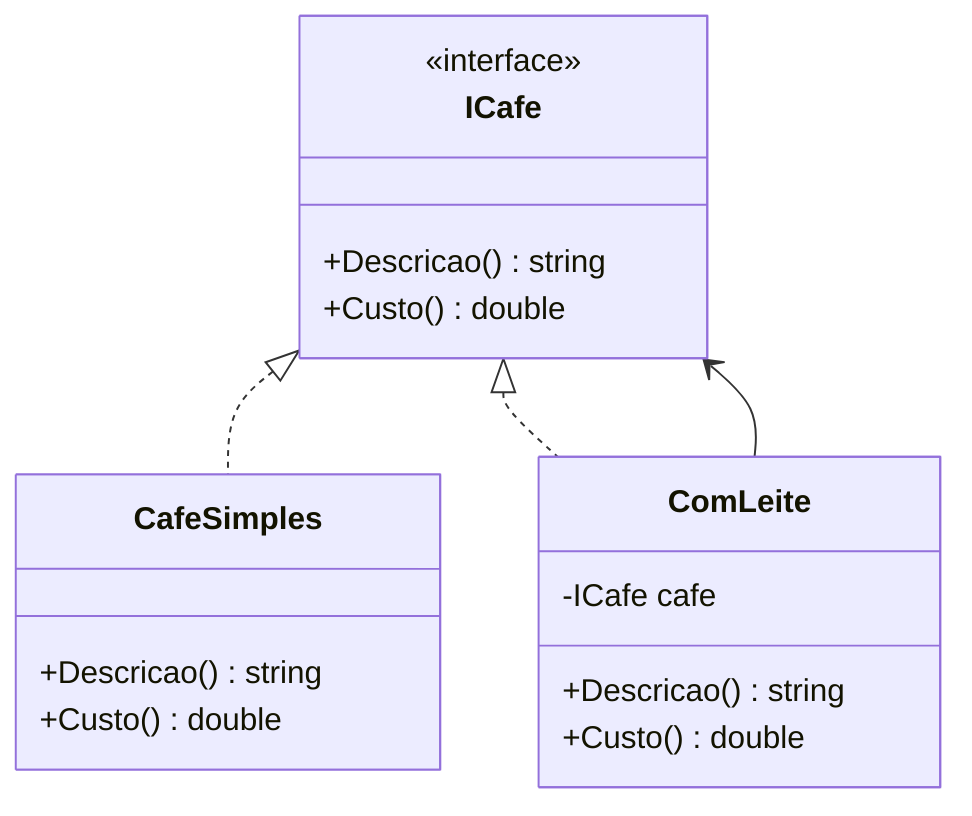
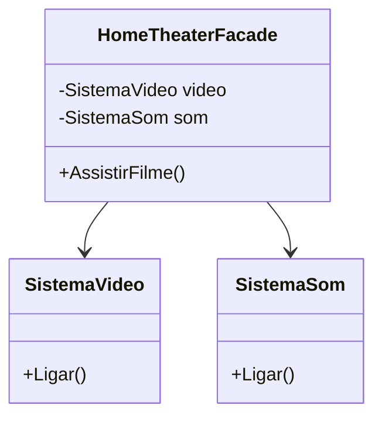
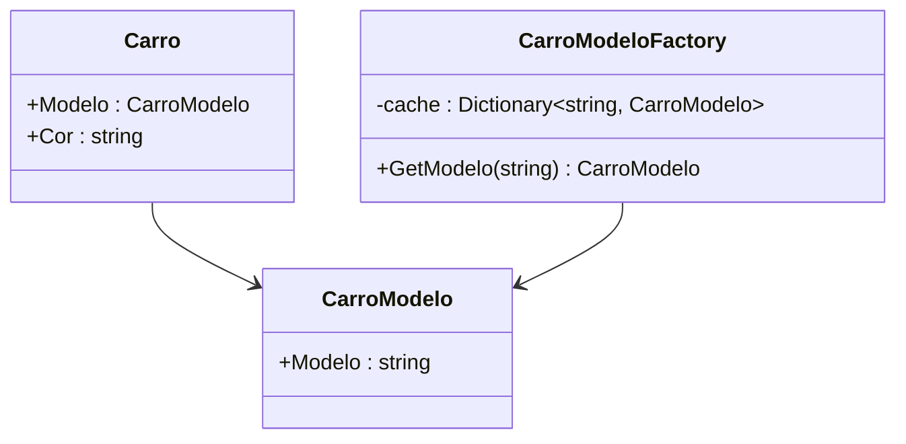
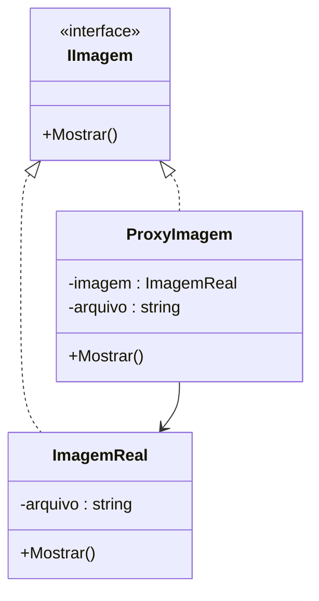
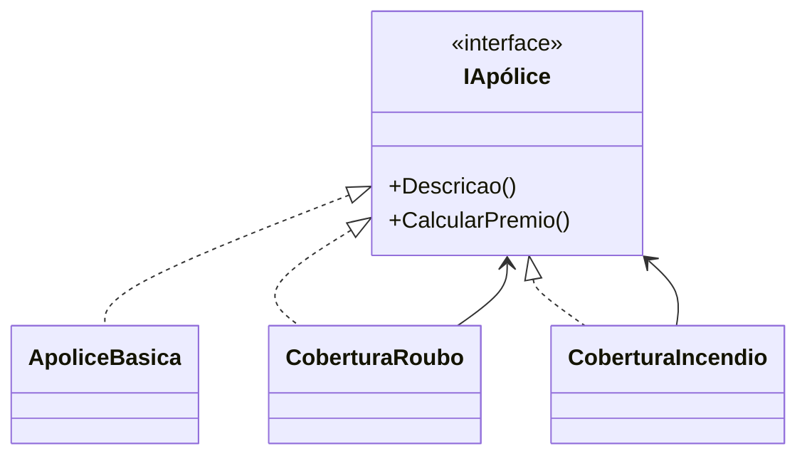
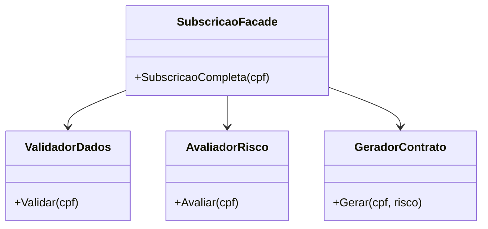
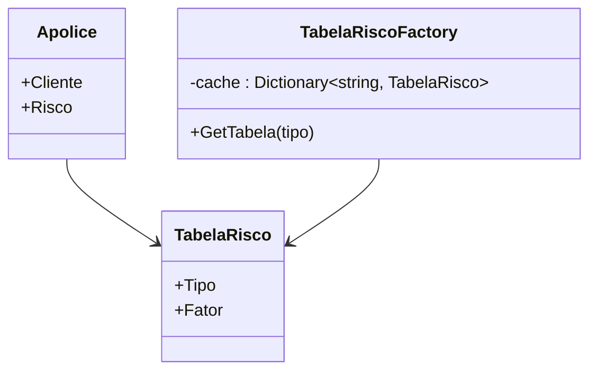
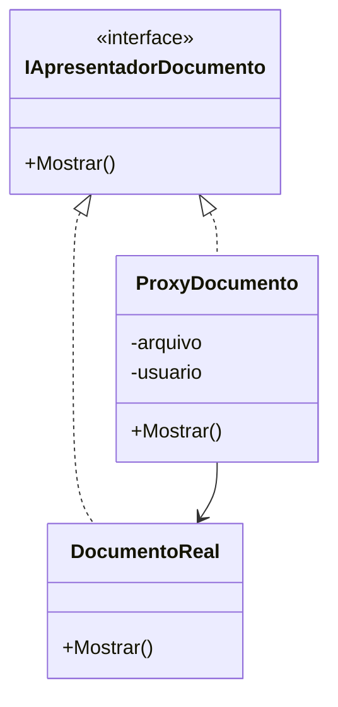

## 🎓 Aula: Padrões de Projeto Estruturais Continuação – Decorator, Facade, Flyweight e Proxy

**Público-alvo**: Desenvolvedores júnior/intermediários
**Duração**: 2 horas
**Pré-requisitos**: Conhecimentos básicos de orientação a objetos (herança, composição, interfaces)

---

### 📘 Objetivos da Aula

* Compreender o propósito dos padrões estruturais no design de software
* Estudar em detalhe os padrões Decorator, Facade, Flyweight e Proxy
* Aplicar cada padrão em um exemplo prático
* Refletir sobre quando usar cada padrão no dia a dia

---

## 🧭 Roteiro da Aula (120 minutos)

| Tempo       | Atividade                                         |
| ----------- | ------------------------------------------------- |
| 0–10 min    | Introdução aos padrões estruturais                |
| 10–35 min   | **Decorator** – Teoria e prática                    |
| 35–60 min   | **Facade** – Teoria e prática                     |
| 60–65 min   | Intervalo rápido                                  |
| 65–95 min   | **Flyweight** – Teoria e prática                  |
| 95–115 min  | Desafio prático (mini projeto com um dos padrões) |
| 115–120 min | Encerramento e dúvidas                            |

---

## 🧩 Parte 1: Introdução aos Padrões Estruturais (10 min)

**Conceito:**
Padrões estruturais lidam com a **composição de classes e objetos**, ajudando a formar estruturas maiores de maneira flexível e reutilizável.

* Padrões estruturais se concentram em **como objetos e classes se organizam** para formar estruturas maiores.
* Benefícios:

  * Redução do acoplamento
  * Aumento da reutilização
  * Melhor manutenção e leitura de código

🧩 **Metáfora simples:** Padrões estruturais são como formas diferentes de montar peças LEGO.


**Padrões que veremos:**

* **Decorator** → adiciona comportamento sem mexer na classe
* **Facade** → interface simples para subsistemas complexos
* **Flyweight** → otimização de memória
* **Proxy** → controle de acesso a um objeto

---

| Padrão           | Descrição rápida                                                                                                                                                        |
| ---------------- | ----------------------------------------------------------------------------------------------------------------------------------------------------------------------- |
| 🧩 **Adapter**   | Permite que interfaces incompatíveis trabalhem juntas, adaptando uma interface para outra esperada pelo cliente.                                                        |
| 🌉 **Bridge**    | Desacopla uma abstração da sua implementação, permitindo que ambas possam variar independentemente.                                                                     |
| 🌲 **Composite** | Compõe objetos em estruturas de árvore para representar hierarquias parte-todo, permitindo que clientes tratem objetos individuais e composições de forma uniforme.     |
| 🎭 **Decorator** | Adiciona responsabilidades adicionais a um objeto dinamicamente, sem alterar sua estrutura original.                                                                    |
| 🚪 **Facade**    | Fornece uma interface simplificada para um conjunto complexo de interfaces em um subsistema, facilitando o uso do sistema.                                              |
| 🪶 **Flyweight** | Usa compartilhamento para suportar grandes quantidades de objetos com eficiência, reduzindo uso de memória ao compartilhar estados comuns.                              |
| 🛡️ **Proxy**    | Fornece um substituto ou representante de outro objeto para controlar o acesso a ele, podendo adicionar funcionalidades extras como controle de acesso ou lazy loading. |


---

## 🎭 Decorator

### 🧩 **Problema**: Você quer adicionar funcionalidades a objetos em tempo de execução, sem mexer na classe original.

### 📐 Estrutura:

```csharp
interface ICafe {
    string Descricao();
    double Custo();
}

class CafeSimples : ICafe {
    public string Descricao() => "Café";
    public double Custo() => 1.0;
}

class ComLeite : ICafe {
    private ICafe _cafe;
    public ComLeite(ICafe cafe) => _cafe = cafe;
    public string Descricao() => _cafe.Descricao() + ", Leite";
    public double Custo() => _cafe.Custo() + 0.5;
}
```




### ✅ **Vantagens**

* Adição flexível de comportamentos
* Sem necessidade de herança múltipla

### 🔥 **Exercício rápido**:

Implemente um `ComChocolate` que também decora o `ICafe`.

---

## 🚪 Facade

### 🧩 **Problema**: Sistemas complexos têm muitas classes; você quer simplificar a interface para usá-los.

### 📐 Exemplo prático:

```csharp
class SistemaVideo {
    public void Ligar() => Console.WriteLine("Video ligado");
}

class SistemaSom {
    public void Ligar() => Console.WriteLine("Som ligado");
}

class HomeTheaterFacade {
    private SistemaVideo video = new SistemaVideo();
    private SistemaSom som = new SistemaSom();
    
    public void AssistirFilme() {
        video.Ligar();
        som.Ligar();
        Console.WriteLine("Filme iniciado!");
    }
}
```





### ✅ **Vantagens**

* Esconde complexidade
* Interface única e simplificada

### 💬 Discussão:

Você já criou uma classe utilitária que agrupa chamadas a outras? Isso é uma **Facade**.

---

## 🪶 Flyweight

### 🧩 **Problema**: Criar muitos objetos com o mesmo estado consome muita memória.

### 🪶 **Flyweight separa o estado compartilhado do estado único.**

```csharp
class CarroModelo {
    public string Modelo { get; }
    public CarroModelo(string modelo) => Modelo = modelo;
}

class Carro {
    public CarroModelo Modelo { get; }
    public string Cor { get; }

    public Carro(CarroModelo modelo, string cor) {
        Modelo = modelo;
        Cor = cor;
    }
}
```

### 🗂️ **Fábrica Flyweight**

```csharp
class CarroModeloFactory {
    private Dictionary<string, CarroModelo> _cache = new();

    public CarroModelo GetModelo(string modelo) {
        if (!_cache.ContainsKey(modelo))
            _cache[modelo] = new CarroModelo(modelo);
        return _cache[modelo];
    }
}
```





### ✅ **Vantagens**

* Redução de memória em larga escala (ex: jogos, renderização)

### 🤓 Analogia:

Personagens em um jogo que compartilham sprites.

---

## 🛡️ Proxy

### 🧩 **Problema**: Precisa de um "substituto" para controlar acesso a um objeto real.

### 🔑 Tipos de Proxy:

* **Virtual Proxy**: criação sob demanda
* **Remote Proxy**: representa objetos remotos
* **Protection Proxy**: controle de acesso

### 📐 Exemplo:

```csharp
interface IImagem {
    void Mostrar();
}

class ImagemReal : IImagem {
    private string _arquivo;
    public ImagemReal(string arquivo) {
        _arquivo = arquivo;
        Console.WriteLine("Carregando imagem: " + arquivo);
    }

    public void Mostrar() => Console.WriteLine("Mostrando imagem: " + _arquivo);
}

class ProxyImagem : IImagem {
    private ImagemReal _imagem;
    private string _arquivo;

    public ProxyImagem(string arquivo) => _arquivo = arquivo;

    public void Mostrar() {
        if (_imagem == null)
            _imagem = new ImagemReal(_arquivo);
        _imagem.Mostrar();
    }
}
```





### ✅ **Vantagens**

* Lazy loading
* Controle de acesso
* Logging

---

## 🛠️ Atividade prática

### 🧩 Proposta:

* Criar uma **cafeteria** com `CafeSimples`, `ComLeite`, `ComChocolate` usando Decorator.
* Criar uma **Facade** que chama `PrepararCafe()`.
* Adicionar um **Proxy** que cobra o café apenas se ele for servido.
* Compartilhar os ingredientes com **Flyweight**.


---

Aqui estão **exemplos para os padrões Decorator, Facade, Flyweight e Proxy**, todos adaptados para **o contexto de uma seguradora**, com **código em C#** e **diagramas Mermaid** para visualização.

---

## 🎭 **Decorator** – Adicionando Coberturas Extras a uma Apólice

### 🎯 **Problema**: você quer adicionar coberturas extras a uma apólice de forma flexível, sem criar heranças para cada combinação.

---

### 🏛️ **Exemplo C#**

```csharp
interface IApólice {
    string Descricao();
    decimal CalcularPremio();
}

class ApoliceBasica : IApólice {
    public string Descricao() => "Apolice Básica";
    public decimal CalcularPremio() => 1000;
}

class CoberturaRoubo : IApólice {
    private readonly IApólice _apolice;
    public CoberturaRoubo(IApólice apolice) => _apolice = apolice;

    public string Descricao() => _apolice.Descricao() + " + Cobertura Roubo";
    public decimal CalcularPremio() => _apolice.CalcularPremio() + 250;
}

class CoberturaIncendio : IApólice {
    private readonly IApólice _apolice;
    public CoberturaIncendio(IApólice apolice) => _apolice = apolice;

    public string Descricao() => _apolice.Descricao() + " + Cobertura Incêndio";
    public decimal CalcularPremio() => _apolice.CalcularPremio() + 400;
}
```

---

### 📐 **Mermaid – Decorator**



---

## 🚪 **Facade** – Subscrição de Apólice com Vários Sistemas

### 🎯 **Problema**: subscrever uma apólice exige interação com múltiplos sistemas (validação, cálculo de risco, geração de contrato).

---

### 🏛️ **Exemplo C#**

```csharp
class ValidadorDados {
    public void Validar(string cpf) => Console.WriteLine($"Validação de CPF: {cpf}");
}

class AvaliadorRisco {
    public int Avaliar(string cpf) => 85;
}

class GeradorContrato {
    public void Gerar(string cpf, int risco) =>
        Console.WriteLine($"Contrato gerado para {cpf} com risco {risco}");
}

// Facade
class SubscricaoFacade {
    private ValidadorDados _validador = new();
    private AvaliadorRisco _avaliador = new();
    private GeradorContrato _gerador = new();

    public void SubscricaoCompleta(string cpf) {
        _validador.Validar(cpf);
        int risco = _avaliador.Avaliar(cpf);
        _gerador.Gerar(cpf, risco);
    }
}
```

---

### 📐 **Mermaid – Facade**



---

## 🪶 **Flyweight** – Compartilhando Tabelas de Cálculo

### 🎯 **Problema**: várias apólices usam as **mesmas tabelas de risco**, ocupando muita memória se duplicadas.

---

### 🏛️ **Exemplo C#**

```csharp
class TabelaRisco {
    public string Tipo { get; }
    public decimal Fator { get; }

    public TabelaRisco(string tipo, decimal fator) {
        Tipo = tipo;
        Fator = fator;
    }
}

class TabelaRiscoFactory {
    private Dictionary<string, TabelaRisco> _cache = new();

    public TabelaRisco GetTabela(string tipo) {
        if (!_cache.ContainsKey(tipo))
            _cache[tipo] = new TabelaRisco(tipo, tipo == "Alta" ? 1.5m : 1.0m);
        return _cache[tipo];
    }
}

class Apolice {
    public string Cliente { get; }
    public TabelaRisco Risco { get; }

    public Apolice(string cliente, TabelaRisco risco) {
        Cliente = cliente;
        Risco = risco;
    }

    public void Imprimir() =>
        Console.WriteLine($"{Cliente} usa tabela {Risco.Tipo} (fator {Risco.Fator})");
}
```

---

### 📐 **Mermaid – Flyweight**



---

## 🛡️ **Proxy** – Controle de Acesso a Documentos de Apólice

### 🎯 **Problema**: só usuários autorizados podem visualizar documentos confidenciais (como PDF da apólice).

---

### 🏛️ **Exemplo C#**

```csharp
interface IApresentadorDocumento {
    void Mostrar();
}

class DocumentoReal : IApresentadorDocumento {
    private readonly string _arquivo;

    public DocumentoReal(string arquivo) {
        _arquivo = arquivo;
        Console.WriteLine($"Carregando documento: {_arquivo}");
    }

    public void Mostrar() => Console.WriteLine($"Mostrando: {_arquivo}");
}

class ProxyDocumento : IApresentadorDocumento {
    private DocumentoReal _real;
    private readonly string _arquivo;
    private readonly string _usuario;

    public ProxyDocumento(string arquivo, string usuario) {
        _arquivo = arquivo;
        _usuario = usuario;
    }

    public void Mostrar() {
        if (_usuario != "corretor")
            Console.WriteLine("Acesso negado.");
        else {
            _real ??= new DocumentoReal(_arquivo);
            _real.Mostrar();
        }
    }
}
```

---

### 📐 **Mermaid – Proxy**


