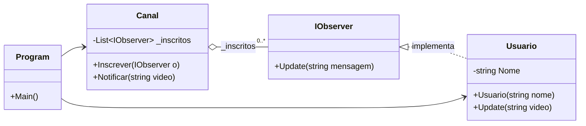
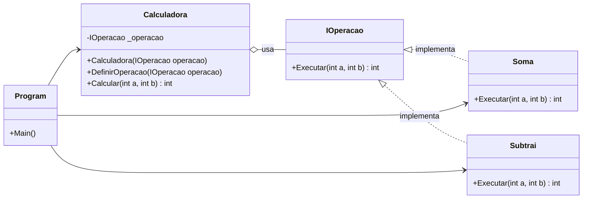
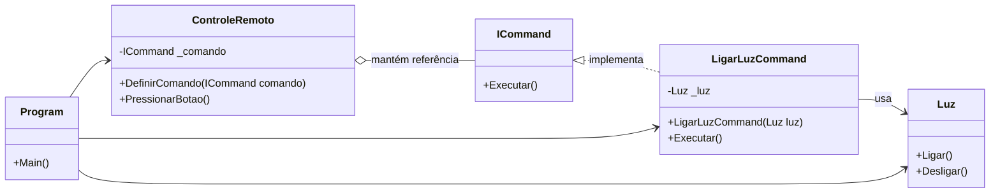

Claro! Aqui está uma sugestão de **aula de 2h de duração** para a **Sessão 8 – Padrões Comportamentais: Parte 1**, abordando os padrões **Observer**, **Strategy** e **Command**.

---

## 📘 **Plano de Aula – Sessão 8: Padrões Comportamentais – Parte 1**

**Duração total:** 2h
**Data:** 07/07/2025
**Formato:** Teórico + Prático (Slides + Código)

---

### 🧭 **Objetivos da Aula**

* Entender o papel dos padrões comportamentais no Design de Software.
* Compreender o funcionamento e aplicabilidade dos padrões:

  * **Observer**
  * **Strategy**
  * **Command**

* Analisar e implementar exemplos práticos de cada padrão.

---

### 🕘 **Estrutura da Aula (120 minutos)**

| Tempo      | Atividade                                               |
| ---------- | ------------------------------------------------------- |
| 0–10min    | Abertura e contextualização dos padrões comportamentais |
| 10–35min   | Padrão **Observer** (teoria + exemplo)                  |
| 35–55min   | Exercício prático com **Observer**                      |
| 55–80min   | Padrão **Strategy** (teoria + exemplo)                  |
| 80–95min   | Exercício prático com **Strategy**                      |
| 95–110min  | Padrão **Command** (teoria + exemplo)                   |
| 110–120min | Exercício prático com **Command** + Encerramento        |

---

### 🔹 0–10min: Introdução aos Padrões Comportamentais

* O que são padrões comportamentais?

Padrões comportamentais (behavioral patterns) em design patterns são um grupo de padrões de projeto que focam em **como os objetos interagem e se comunicam entre si** para realizar tarefas e distribuir responsabilidades. Ou seja, eles descrevem **a forma de comunicação e colaboração entre objetos**, definindo como eles trocam mensagens, controlam o fluxo e reagem a eventos.

Esses padrões ajudam a organizar a interação, facilitando a flexibilidade, a reutilização e a manutenção do código, evitando acoplamento forte entre componentes.

### Exemplos comuns de padrões comportamentais:

* **Observer** — Define uma dependência um-para-muitos, onde quando um objeto muda de estado, todos os seus dependentes são notificados automaticamente.
* **Strategy** — Permite alterar o algoritmo usado por um objeto em tempo de execução, encapsulando-os em classes separadas.
* **Command** — Encapsula uma solicitação como um objeto, permitindo parametrizar clientes com diferentes solicitações, enfileirar ou registrar comandos.
* **Iterator** — Fornece uma maneira de acessar elementos de uma coleção sequencialmente, sem expor sua representação interna.
* **Mediator** — Centraliza a comunicação entre objetos, reduzindo o acoplamento entre eles.
* **State** — Permite que um objeto altere seu comportamento quando seu estado interno muda.

### Resumindo:

* **Padrões comportamentais são sobre o "comportamento" e a "interação" entre objetos.**
* Eles ajudam a definir quem faz o quê, quando e como, e a forma como objetos colaboram sem ficarem fortemente acoplados.

* Qual o foco: **comunicação entre objetos**.
* Quando aplicar esses padrões?


Aplicar padrões comportamentais faz sentido quando você quer resolver problemas específicos relacionados à **interação, comunicação e flexibilidade do comportamento entre objetos** no seu sistema.

---

### Quando aplicar padrões comportamentais

1. **Quer organizar e controlar a comunicação entre objetos para evitar acoplamento forte**
   Exemplo: você tem muitos objetos que se comunicam diretamente e o código está ficando difícil de manter. Usar o **Mediator** pode ajudar a centralizar essa comunicação.

2. **Precisa permitir variações no comportamento do objeto em tempo de execução**
   Exemplo: seu objeto deve alterar sua estratégia ou algoritmo conforme o contexto. O padrão **Strategy** é ideal para encapsular essas variações e trocar o comportamento dinamicamente.

3. **Quer notificar vários objetos sobre mudanças sem criar dependências rígidas**
   Exemplo: em sistemas que precisam reagir a eventos, como interfaces gráficas ou sistemas reativos, o **Observer** permite que vários objetos acompanhem o estado de um objeto sem acoplamento direto.

4. **Quer encapsular ações como objetos para controlar, adiar ou registrar operações**
   Exemplo: sistemas que precisam guardar histórico, desfazer operações, ou enviar comandos para execução em fila podem usar o **Command**.

5. **Precisa percorrer coleções sem expor sua estrutura interna**
   Exemplo: para navegar numa lista, árvore ou conjunto sem que o cliente saiba o funcionamento interno da coleção, o **Iterator** é a escolha certa.

6. **Deseja que um objeto mude seu comportamento conforme seu estado interno**
   Exemplo: máquinas de estados, onde o comportamento muda conforme o status atual, se beneficiam do padrão **State**.

---

### Em resumo:

* Aplique padrões comportamentais quando seu foco for **flexibilidade, desacoplamento e organização das interações**.
* Evite comunicação direta demais entre muitos objetos, que gera dependência e código rígido.
* Use esses padrões para que o sistema seja mais fácil de estender, modificar e manter.


* Breve visão geral dos 3 padrões do dia:

  * **Observer**: eventos e notificações
  * **Strategy**: escolha dinâmica de algoritmos
  * **Command**: encapsular ações como objetos


| Padrão          | Descrição aplicada ao contexto de seguradora                                                                                                                       |
| --------------- | ------------------------------------------------------------------------------------------------------------------------------------------------------------------ |
| 👀 **Observer** | Permite notificar automaticamente clientes e sistemas internos quando uma apólice for atualizada, como no caso de inclusão de coberturas ou mudanças de cláusulas. |
| 🧠 **Strategy** | Permite aplicar diferentes regras de cálculo de prêmio de seguro (ex: veículo, vida, residencial), trocando o algoritmo sem alterar o código da lógica principal.  |
| 📝 **Command**  | Encapsula ações como **emitir**, **cancelar** ou **revisar apólices** em objetos, facilitando o agendamento, histórico ou execução posterior dessas solicitações.  |


---

### 🔸 10–35min: Padrão Observer – *"Pub-Sub Pattern"*

#### 📖 Teoria (10min)

* Intenção: notificar múltiplos objetos sobre mudanças de estado.
* Participantes:

  * **Subject**: objeto observado
  * **Observers**: interessados nas mudanças
* Exemplo do mundo real: sistema de notificações, apps de clima, etc.


#### 💻 Exemplo em código (Java ou Python, 10min)




```csharp
using System;
using System.Collections.Generic;

// Observer
public interface IObserver
{
    void Update(string mensagem);
}

// Subject
public class Canal
{
    private List<IObserver> _inscritos = new List<IObserver>();

    public void Inscrever(IObserver o)
    {
        _inscritos.Add(o);
    }

    public void Notificar(string video)
    {
        foreach (var inscrito in _inscritos)
        {
            inscrito.Update(video);
        }
    }
}

// Observador concreto
public class Usuario : IObserver
{
    public string Nome { get; }

    public Usuario(string nome)
    {
        Nome = nome;
    }

    public void Update(string video)
    {
        Console.WriteLine($"{Nome} recebeu notificação: Novo vídeo - {video}");
    }
}

// Programa principal
class Program
{
    static void Main()
    {
        var canal = new Canal();
        var joao = new Usuario("João");
        var maria = new Usuario("Maria");

        canal.Inscrever(joao);
        canal.Inscrever(maria);

        canal.Notificar("Design Patterns em C# - Observer");
    }
}

```

---

### 🧪 35–55min: Exercício com Observer

* Os alunos devem implementar um sistema de notificações (ex: canal de YouTube).
* O "canal" publica novos vídeos e os "inscritos" são notificados.
* Dica: usar listas para gerenciar os observadores.

---

### 🔸 55–80min: Padrão Strategy – *"Escolhendo o Algoritmo"*

#### 📖 Teoria (10min)

* Intenção: encapsular algoritmos e torná-los intercambiáveis.
* Participantes:

  * **Context**: usa a estratégia
  * **Strategy (interface)**: define a operação
  * **ConcreteStrategy**: implementações específicas
* Exemplo: diferentes formas de ordenação ou cálculo de frete.


#### 💻 Exemplo em código (Java ou Python, 10min)




```csharp
using System;

// Strategy
public interface IOperacao
{
    int Executar(int a, int b);
}

// Estratégias concretas
public class Soma : IOperacao
{
    public int Executar(int a, int b) => a + b;
}

public class Subtrai : IOperacao
{
    public int Executar(int a, int b) => a - b;
}

// Contexto
public class Calculadora
{
    private IOperacao _operacao;

    public Calculadora(IOperacao operacao)
    {
        _operacao = operacao;
    }

    public void DefinirOperacao(IOperacao operacao)
    {
        _operacao = operacao;
    }

    public int Calcular(int a, int b)
    {
        return _operacao.Executar(a, b);
    }
}

// Programa principal
class Program
{
    static void Main()
    {
        var calc = new Calculadora(new Soma());
        Console.WriteLine("Soma: " + calc.Calcular(5, 3));

        calc.DefinirOperacao(new Subtrai());
        Console.WriteLine("Subtração: " + calc.Calcular(5, 3));
    }
}

```

---

### 🧪 80–95min: Exercício com Strategy

* Os alunos criam um sistema de desconto com estratégias diferentes:

  * Por valor fixo
  * Por percentual
  * Por fidelidade do cliente
* O sistema deve permitir trocar a estratégia em tempo de execução.

---

### 🔸 95–110min: Padrão Command – *"Encapsulando Ações"*

#### 📖 Teoria (10min)

* Intenção: encapsular uma solicitação como um objeto.
* Participantes:

  * **Command (interface)**
  * **ConcreteCommand**: implementações da ação
  * **Invoker**: quem executa o comando
  * **Receiver**: quem realiza a ação
* Exemplo: controle remoto, histórico de comandos (undo/redo).


#### 💻 Exemplo em código (Python, 5min)



```csharp
using System;

// Command
public interface ICommand
{
    void Executar();
}

// Receiver
public class Luz
{
    public void Ligar()
    {
        Console.WriteLine("Luz ligada");
    }

    public void Desligar()
    {
        Console.WriteLine("Luz desligada");
    }
}

// Command concreto
public class LigarLuzCommand : ICommand
{
    private readonly Luz _luz;

    public LigarLuzCommand(Luz luz)
    {
        _luz = luz;
    }

    public void Executar()
    {
        _luz.Ligar();
    }
}

// Invoker
public class ControleRemoto
{
    private ICommand _comando;

    public void DefinirComando(ICommand comando)
    {
        _comando = comando;
    }

    public void PressionarBotao()
    {
        _comando.Executar();
    }
}

// Programa principal
class Program
{
    static void Main()
    {
        var luz = new Luz();
        var comandoLigar = new LigarLuzCommand(luz);
        var controle = new ControleRemoto();

        controle.DefinirComando(comandoLigar);
        controle.PressionarBotao();
    }
}

```

Excelente! Vamos adaptar os padrões **Observer**, **Strategy** e **Command** para um **domínio realista de uma seguradora**. Esses exemplos estarão em **C#** e serão voltados para contextos típicos como:

* **Notificações de apólices** (Observer)
* **Cálculo de prêmios de seguro com diferentes estratégias** (Strategy)
* **Solicitação e histórico de ações como emissão de apólice ou cancelamento** (Command)

---

## 🔷 Exemplos de Padrões para o Domínio de Seguradora (em C#)

---

### 🔹 1. **Observer** – *Notificar clientes sobre mudanças na apólice*

#### 💡 Cenário:

Quando uma **apólice é atualizada**, os clientes interessados devem ser notificados automaticamente (via e-mail, SMS, push etc).

```csharp
using System;
using System.Collections.Generic;

// Observer
public interface IClienteObserver
{
    void Notificar(string mensagem);
}

// Subject
public class Apolice
{
    private List<IClienteObserver> _clientes = new List<IClienteObserver>();
    public string Numero { get; }

    public Apolice(string numero)
    {
        Numero = numero;
    }

    public void AdicionarCliente(IClienteObserver cliente)
    {
        _clientes.Add(cliente);
    }

    public void AtualizarApolice(string detalhe)
    {
        Console.WriteLine($"Apólice {Numero} atualizada: {detalhe}");
        NotificarClientes($"Sua apólice {Numero} foi atualizada: {detalhe}");
    }

    private void NotificarClientes(string mensagem)
    {
        foreach (var cliente in _clientes)
        {
            cliente.Notificar(mensagem);
        }
    }
}

// Observador concreto
public class Cliente : IClienteObserver
{
    public string Nome { get; }

    public Cliente(string nome)
    {
        Nome = nome;
    }

    public void Notificar(string mensagem)
    {
        Console.WriteLine($"{Nome} recebeu notificação: {mensagem}");
    }
}

// Programa principal
class Program
{
    static void Main()
    {
        var apolice = new Apolice("POL123456");
        var cliente1 = new Cliente("Ana");
        var cliente2 = new Cliente("Carlos");

        apolice.AdicionarCliente(cliente1);
        apolice.AdicionarCliente(cliente2);

        apolice.AtualizarApolice("Cobertura de roubo adicionada");
    }
}
```

---

### 🔹 2. **Strategy** – *Cálculo de prêmio de seguro com estratégias distintas*

#### 💡 Cenário:

Diferentes tipos de seguro (veículo, vida, residência) têm **formas distintas de cálculo de prêmio**.

```csharp
using System;

// Strategy
public interface ICalculoPremioStrategy
{
    decimal CalcularPremio(decimal valorBemSegurado, int idadeCliente);
}

// Estratégias concretas
public class CalculoSeguroVeiculo : ICalculoPremioStrategy
{
    public decimal CalcularPremio(decimal valorBemSegurado, int idadeCliente)
    {
        return valorBemSegurado * 0.05m + (idadeCliente < 25 ? 200 : 100);
    }
}

public class CalculoSeguroVida : ICalculoPremioStrategy
{
    public decimal CalcularPremio(decimal valorBemSegurado, int idadeCliente)
    {
        return idadeCliente < 30 ? 300 : 500;
    }
}

// Contexto
public class Seguro
{
    private ICalculoPremioStrategy _estrategia;

    public Seguro(ICalculoPremioStrategy estrategia)
    {
        _estrategia = estrategia;
    }

    public void DefinirEstrategia(ICalculoPremioStrategy estrategia)
    {
        _estrategia = estrategia;
    }

    public decimal Calcular(decimal valor, int idade)
    {
        return _estrategia.CalcularPremio(valor, idade);
    }
}

// Programa principal
class Program
{
    static void Main()
    {
        var seguro = new Seguro(new CalculoSeguroVeiculo());
        Console.WriteLine("Prêmio Seguro Veículo: R$" + seguro.Calcular(50000, 24));

        seguro.DefinirEstrategia(new CalculoSeguroVida());
        Console.WriteLine("Prêmio Seguro Vida: R$" + seguro.Calcular(0, 45));
    }
}
```

---

### 🔹 3. **Command** – *Solicitações como emissão e cancelamento de apólices*

#### 💡 Cenário:

O sistema permite **emitir e cancelar apólices**, e essas ações devem ser executadas por comandos reutilizáveis (com possibilidade de histórico, "undo", etc).

```csharp
using System;

// Command
public interface IComandoApolice
{
    void Executar();
}

// Receiver
public class GestorApolices
{
    public void Emitir(string numero)
    {
        Console.WriteLine($"Apólice {numero} emitida com sucesso.");
    }

    public void Cancelar(string numero)
    {
        Console.WriteLine($"Apólice {numero} cancelada.");
    }
}

// Comandos concretos
public class EmitirApoliceCommand : IComandoApolice
{
    private readonly GestorApolices _gestor;
    private readonly string _numero;

    public EmitirApoliceCommand(GestorApolices gestor, string numero)
    {
        _gestor = gestor;
        _numero = numero;
    }

    public void Executar()
    {
        _gestor.Emitir(_numero);
    }
}

public class CancelarApoliceCommand : IComandoApolice
{
    private readonly GestorApolices _gestor;
    private readonly string _numero;

    public CancelarApoliceCommand(GestorApolices gestor, string numero)
    {
        _gestor = gestor;
        _numero = numero;
    }

    public void Executar()
    {
        _gestor.Cancelar(_numero);
    }
}

// Invoker
public class CentralComandos
{
    public void ExecutarComando(IComandoApolice comando)
    {
        comando.Executar();
    }
}

// Programa principal
class Program
{
    static void Main()
    {
        var gestor = new GestorApolices();
        var emitirCmd = new EmitirApoliceCommand(gestor, "POL78910");
        var cancelarCmd = new CancelarApoliceCommand(gestor, "POL78910");

        var central = new CentralComandos();
        central.ExecutarComando(emitirCmd);
        central.ExecutarComando(cancelarCmd);
    }
}
```

---

## ✅ Conclusão

Esses exemplos demonstram como **padrões de projeto podem ser aplicados diretamente em contextos reais** do setor de seguros:

* **Observer:** Notificações automatizadas para clientes.
* **Strategy:** Cálculos flexíveis de prêmios.
* **Command:** Fluxo controlado de ações administrativas.

