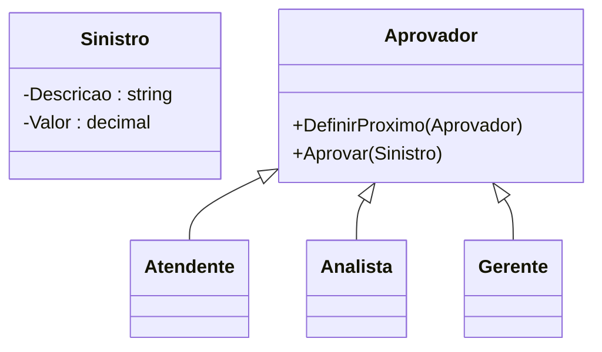
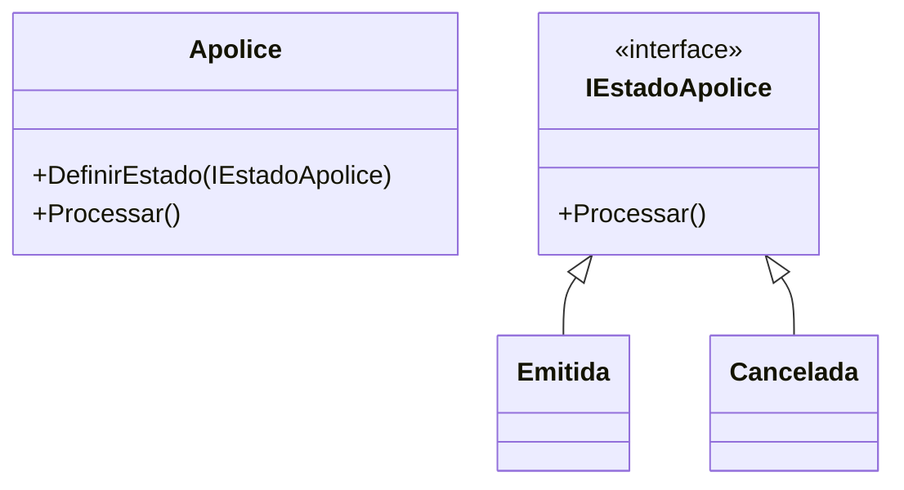
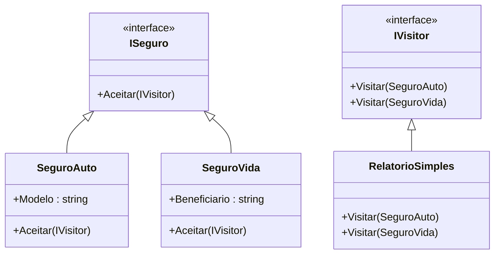
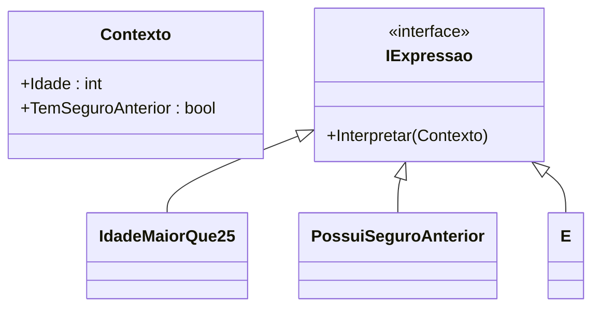

# 🧑‍🏫 Aula 9 – Padrões Comportamentais (Parte 2)

📅 Data: 09/07/2025
⏱ Duração: 2h

🎯 **Objetivo:** Compreender e aplicar os padrões comportamentais:

* **Chain of Responsibility**
* **State**
* **Visitor**
* **Interpreter**
  No contexto de **sistemas de seguradora**.

---

## 🗂️ Estrutura da Aula

| Etapa                   | Tempo | Atividade                                              |
| ----------------------- | ----- | ------------------------------------------------------ |
| Abertura                | 10min | Recapitulação da Aula 8 + Introdução aos novos padrões |
| Chain of Responsibility | 25min | Conceito + Exemplo + Exercício em pares                |
| State                   | 25min | Conceito + Exemplo + Exercício orientado               |
| Intervalo               | 5min  | Pausa rápida                                           |
| Visitor                 | 25min | Conceito + Exemplo + Atividade guiada + Discussão      |
| Interpreter             | 20min | Conceito + Exemplo + Mini-desafio em grupos            |
| Encerramento            | 10min | Resumo + Dicas + Orientações para próxima aula         |

---

Claro! Aqui está a **versão adaptada da introdução** para os padrões comportamentais **Chain of Responsibility**, **State**, **Visitor** e **Interpreter**, seguindo o mesmo estilo claro e didático aplicado anteriormente, com foco também no **contexto de uma seguradora**.

---

## 🔄 Chain of Responsibility, State, Visitor e Interpreter

**(Padrões Comportamentais – Parte 2)**

### 🧠 O que são padrões comportamentais?

Padrões comportamentais lidam com **a comunicação entre objetos**, determinando **quem faz o quê, quando e como**, de forma **flexível e desacoplada**.
Eles são fundamentais para evitar código rígido e fortemente dependente, favorecendo manutenção e extensibilidade.

---

### 📌 Quando aplicar padrões comportamentais?

Você deve considerar aplicar **Chain of Responsibility**, **State**, **Visitor** ou **Interpreter** quando:

1. 🧭 **Quer distribuir responsabilidades entre vários objetos sem acoplamento direto**
   → Use **Chain of Responsibility** quando múltiplos objetos podem tratar uma mesma solicitação.

2. 🔄 **Deseja que objetos mudem seu comportamento dependendo de seu estado interno**
   → Use **State** quando o objeto precisa se comportar de formas diferentes em diferentes "modos".

3. 🧳 **Quer adicionar operações a objetos sem modificar suas classes**
   → Use **Visitor** para aplicar operações variadas a objetos complexos sem tocar na estrutura deles.

4. 🧮 **Precisa interpretar regras ou linguagens específicas (DSLs)**
   → Use **Interpreter** para montar interpretadores simples com gramática própria.

---

## 🧪 Visão Geral Aplicada ao Domínio de uma Seguradora

| Padrão                         | Aplicação prática no sistema de uma seguradora                                                                                   |
| ------------------------------ | -------------------------------------------------------------------------------------------------------------------------------- |
| 🔗 **Chain of Responsibility** | Aprovação escalonada de sinistros: Atendente → Analista → Gerente, onde cada um trata o que está sob sua alçada.                 |
| 🔄 **State**                   | Estados de uma apólice: Em Análise, Emitida, Cancelada, Expirada — o comportamento muda conforme o status atual.                 |
| 🧭 **Visitor**                 | Relatórios ou exportações para diferentes tipos de seguro (auto, vida, residencial), sem alterar as classes dos seguros.         |
| 🧮 **Interpreter**             | Regras de aceitação de propostas personalizadas como: `"idade > 25 AND temSeguroAnterior = true"` — interpretadas dinamicamente. |

---

## 🛠️ Breve visão técnica dos padrões de hoje

| Padrão                     | Propósito                                                               | Benefício chave                           |
| -------------------------- | ----------------------------------------------------------------------- | ----------------------------------------- |
| 🔗 Chain of Responsibility | Passa uma solicitação por uma cadeia de objetos até que algum a trate   | Desacoplamento entre remetente e receptor |
| 🔄 State                   | Altera o comportamento de um objeto com base em seu estado              | Elimina estruturas condicionais complexas |
| 🧭 Visitor                 | Permite adicionar operações sem mudar as classes dos objetos            | Mantém a lógica separada das estruturas   |
| 🧮 Interpreter             | Define uma gramática e avalia expressões baseadas em regras específicas | Permite criar linguagens e DSLs simples   |

---

## 💡 Quando aplicar cada um

### 🔗 **Chain of Responsibility**

**Quando?**

* Quando múltiplos objetos podem lidar com uma requisição, e você quer que a requisição passe por eles até alguém tratá-la.

**Na seguradora:**

* Sinistros com valores diferentes são aprovados por diferentes níveis: atendente, analista, gerente.

---

### 🔄 **State**

**Quando?**

* Quando o comportamento de um objeto depende do seu estado, e você quer evitar `if-else` ou `switch-case` complexos.

**Na seguradora:**

* Apólices mudam de estado e isso afeta o que pode ou não ser feito com elas (ex: só pode pagar se estiver emitida).

---

### 🧭 **Visitor**

**Quando?**

* Quando há uma hierarquia de objetos e você precisa realizar diferentes operações sobre eles sem alterar suas classes.

**Na seguradora:**

* Relatórios distintos para seguros diferentes (ex: seguro de carro, seguro de vida), usando um visitante para gerar o conteúdo.

---

### 🧮 **Interpreter**

**Quando?**

* Quando você precisa interpretar expressões ou linguagens específicas, especialmente regras de negócio configuráveis.

**Na seguradora:**

* Regras definidas por analistas para aceitação de propostas, como `"idade > 30 AND temSeguro = true"`, são interpretadas dinamicamente.

---

## ✅ Resumo final

| Padrão                     | Use quando...                                                                              |
| -------------------------- | ------------------------------------------------------------------------------------------ |
| 🔗 Chain of Responsibility | Vários objetos podem tentar tratar a mesma solicitação                                     |
| 🔄 State                   | Um objeto deve mudar de comportamento baseado em seu estado interno                        |
| 🧭 Visitor                 | Você quer aplicar novas operações a uma estrutura de objetos complexa sem alterá-los       |
| 🧮 Interpreter             | Você precisa interpretar regras ou expressões customizadas (ex: DSLs) em tempo de execução |

---

## 🏢 Domínio: Sistema de uma Seguradora

Trabalharemos com exemplos reais como:

* Processamento de **sinistros**
* Avaliação de **riscos**
* **Emissão de apólices**
* **Geração de relatórios** de seguros

---

## 🔗 Chain of Responsibility – Aprovação de Sinistro

🎯 *Permite que uma solicitação percorra uma cadeia de manipuladores até que alguém a trate.*

**Exemplo na seguradora:**
Sinistros de valores diferentes são tratados por Atendente, Analista ou Gerente.

### 💡 Diagrama Mermaid



### 💻 Código

```csharp
public class Sinistro {
    public string Descricao { get; set; }
    public decimal Valor { get; set; }
}
abstract class Aprovador {
    protected Aprovador Proximo;
    public void DefinirProximo(Aprovador proximo) => Proximo = proximo;
    public abstract void Aprovar(Sinistro sinistro);
}
class Atendente : Aprovador {
    public override void Aprovar(Sinistro s) {
        if (s.Valor < 5000) Console.WriteLine("Atendente aprovou");
        else Proximo?.Aprovar(s);
    }
}
```

---

## 🔄 State – Ciclo de Vida da Apólice

🎯 *Permite que um objeto altere seu comportamento de acordo com seu estado interno.*

**Exemplo na seguradora:**
Uma apólice pode estar `Emitida`, `Cancelada`, `Expirada`, etc.

### 💡 Diagrama Mermaid



### 💻 Código

```csharp
public interface IEstadoApolice {
    void Processar();
}
public class Emitida : IEstadoApolice {
    public void Processar() => Console.WriteLine("Apólice pode ser paga.");
}
public class Apolice {
    private IEstadoApolice _estado;
    public void DefinirEstado(IEstadoApolice estado) => _estado = estado;
    public void Processar() => _estado.Processar();
}
```

---

## 🧭 Visitor – Relatórios de Seguros

🎯 *Permite adicionar novas operações a objetos sem alterar suas classes.*

**Exemplo na seguradora:**
Gerar relatórios distintos para tipos de seguro (Auto, Vida, etc).

### 💡 Diagrama Mermaid



### 💻 Código

```csharp
public interface ISeguro {
    void Aceitar(IVisitor visitor);
}
public class SeguroAuto : ISeguro {
    public string Modelo { get; set; } = "Sedan";
    public void Aceitar(IVisitor visitor) => visitor.Visitar(this);
}
public class RelatorioSimples : IVisitor {
    public void Visitar(SeguroAuto s) => Console.WriteLine($"Relatório: {s.Modelo}");
}
```

---

## 🧮 Interpreter – Regras de Aceitação

🎯 *Define uma linguagem e um interpretador para expressões específicas.*

**Exemplo na seguradora:**
Regras como: `idade > 25 AND temSeguroAnterior = true`

### 💡 Diagrama Mermaid



### 💻 Código

```csharp
public interface IExpressao {
    bool Interpretar(Contexto contexto);
}
public class E : IExpressao {
    private IExpressao _esq, _dir;
    public E(IExpressao e1, IExpressao e2) { _esq = e1; _dir = e2; }
    public bool Interpretar(Contexto c) => _esq.Interpretar(c) && _dir.Interpretar(c);
}
```

---

## ✅ Resumo Visual

| Padrão                     | Aplicação na Seguradora                                             |
| -------------------------- | ------------------------------------------------------------------- |
| 🔗 Chain of Responsibility | Aprovação escalonada de sinistros (atendente → analista → gerente)  |
| 🔄 State                   | Comportamento de apólice conforme estado (emitida, cancelada, etc.) |
| 🧭 Visitor                 | Geração de relatórios para tipos diferentes de seguro               |
| 🧮 Interpreter             | Regras configuráveis de aceitação de proposta                       |

---

## 📚 Dica para Próxima Aula

📝 **Exercício sugerido:** Escolha um padrão apresentado e implemente no seu próprio projeto.

📘 **Leitura recomendada:**

* *Design Patterns – GoF*
* Refactoring.guru
