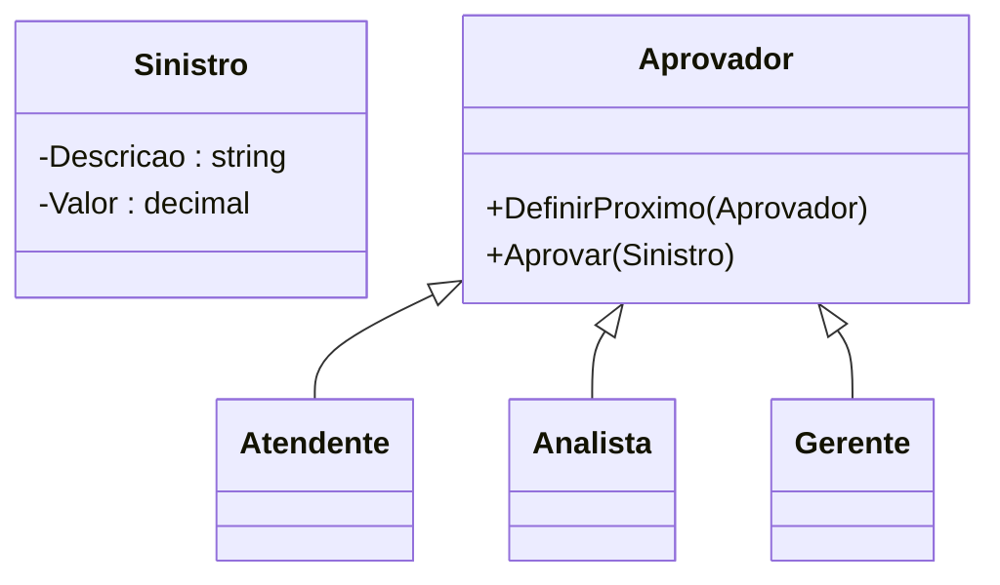
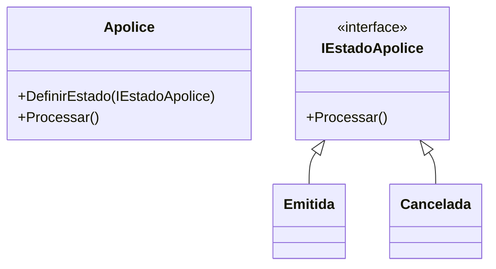
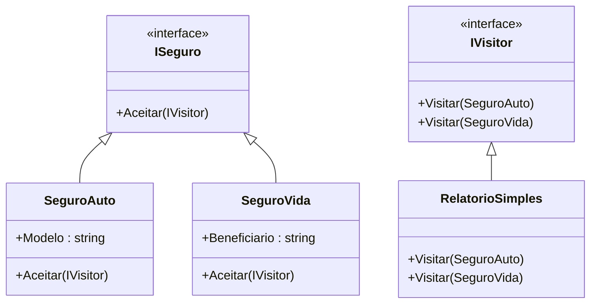
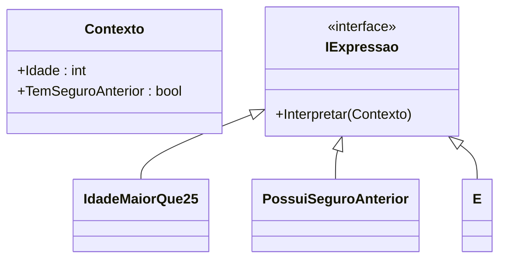

# 🧑‍🏫 Aula 9 – Padrões Comportamentais (Parte 2)

📅 Data: 09/07/2025
⏱ Duração: 2h

🎯 **Objetivo:** Compreender e aplicar os padrões comportamentais:

* **Chain of Responsibility**
* **State**
* **Visitor**
* **Interpreter**
  No contexto de **sistemas de seguradora**.

---

## 🗂️ Estrutura da Aula

| Etapa                   | Tempo | Atividade                                              |
| ----------------------- | ----- | ------------------------------------------------------ |
| Abertura                | 10min | Recapitulação da Aula 8 + Introdução aos novos padrões |
| Chain of Responsibility | 25min | Conceito + Exemplo + Exercício em pares                |
| State                   | 25min | Conceito + Exemplo + Exercício orientado               |
| Intervalo               | 5min  | Pausa rápida                                           |
| Visitor                 | 25min | Conceito + Exemplo + Atividade guiada + Discussão      |
| Interpreter             | 20min | Conceito + Exemplo + Mini-desafio em grupos            |
| Encerramento            | 10min | Resumo + Dicas + Orientações para próxima aula         |

---

## 🏢 Domínio: Sistema de uma Seguradora

Trabalharemos com exemplos reais como:

* Processamento de **sinistros**
* Avaliação de **riscos**
* **Emissão de apólices**
* **Geração de relatórios** de seguros

---

## 🔗 Chain of Responsibility – Aprovação de Sinistro

🎯 *Permite que uma solicitação percorra uma cadeia de manipuladores até que alguém a trate.*

**Exemplo na seguradora:**
Sinistros de valores diferentes são tratados por Atendente, Analista ou Gerente.

### 💡 Diagrama Mermaid



### 💻 Código

```csharp
public class Sinistro {
    public string Descricao { get; set; }
    public decimal Valor { get; set; }
}
abstract class Aprovador {
    protected Aprovador Proximo;
    public void DefinirProximo(Aprovador proximo) => Proximo = proximo;
    public abstract void Aprovar(Sinistro sinistro);
}
class Atendente : Aprovador {
    public override void Aprovar(Sinistro s) {
        if (s.Valor < 5000) Console.WriteLine("Atendente aprovou");
        else Proximo?.Aprovar(s);
    }
}
```

---

## 🔄 State – Ciclo de Vida da Apólice

🎯 *Permite que um objeto altere seu comportamento de acordo com seu estado interno.*

**Exemplo na seguradora:**
Uma apólice pode estar `Emitida`, `Cancelada`, `Expirada`, etc.

### 💡 Diagrama Mermaid



### 💻 Código

```csharp
public interface IEstadoApolice {
    void Processar();
}
public class Emitida : IEstadoApolice {
    public void Processar() => Console.WriteLine("Apólice pode ser paga.");
}
public class Apolice {
    private IEstadoApolice _estado;
    public void DefinirEstado(IEstadoApolice estado) => _estado = estado;
    public void Processar() => _estado.Processar();
}
```

---

## 🧭 Visitor – Relatórios de Seguros

🎯 *Permite adicionar novas operações a objetos sem alterar suas classes.*

**Exemplo na seguradora:**
Gerar relatórios distintos para tipos de seguro (Auto, Vida, etc).

### 💡 Diagrama Mermaid



### 💻 Código

```csharp
public interface ISeguro {
    void Aceitar(IVisitor visitor);
}
public class SeguroAuto : ISeguro {
    public string Modelo { get; set; } = "Sedan";
    public void Aceitar(IVisitor visitor) => visitor.Visitar(this);
}
public class RelatorioSimples : IVisitor {
    public void Visitar(SeguroAuto s) => Console.WriteLine($"Relatório: {s.Modelo}");
}
```

---

## 🧮 Interpreter – Regras de Aceitação

🎯 *Define uma linguagem e um interpretador para expressões específicas.*

**Exemplo na seguradora:**
Regras como: `idade > 25 AND temSeguroAnterior = true`

### 💡 Diagrama Mermaid



### 💻 Código

```csharp
public interface IExpressao {
    bool Interpretar(Contexto contexto);
}
public class E : IExpressao {
    private IExpressao _esq, _dir;
    public E(IExpressao e1, IExpressao e2) { _esq = e1; _dir = e2; }
    public bool Interpretar(Contexto c) => _esq.Interpretar(c) && _dir.Interpretar(c);
}
```

---

## ✅ Resumo Visual

| Padrão                     | Aplicação na Seguradora                                             |
| -------------------------- | ------------------------------------------------------------------- |
| 🔗 Chain of Responsibility | Aprovação escalonada de sinistros (atendente → analista → gerente)  |
| 🔄 State                   | Comportamento de apólice conforme estado (emitida, cancelada, etc.) |
| 🧭 Visitor                 | Geração de relatórios para tipos diferentes de seguro               |
| 🧮 Interpreter             | Regras configuráveis de aceitação de proposta                       |

---

## 📚 Dica para Próxima Aula

📝 **Exercício sugerido:** Escolha um padrão apresentado e implemente no seu próprio projeto.

📘 **Leitura recomendada:**

* *Design Patterns – GoF*
* Refactoring.guru
