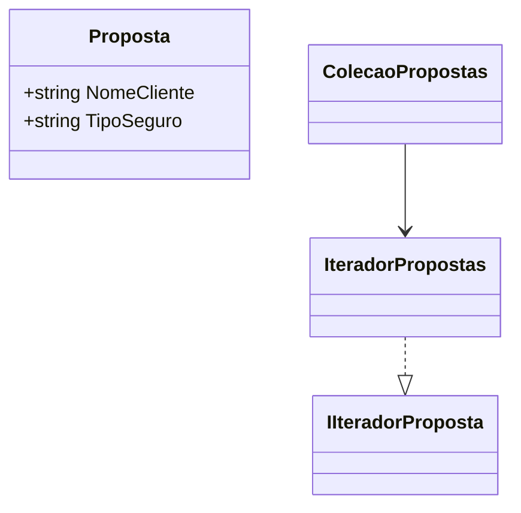
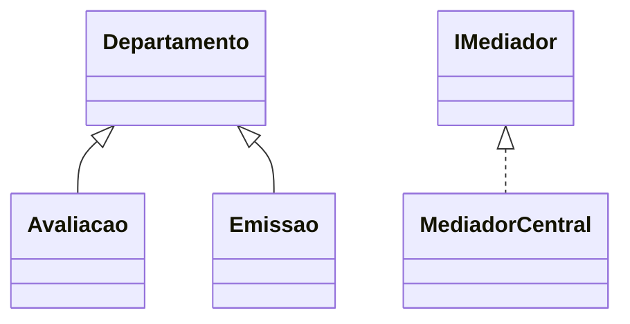
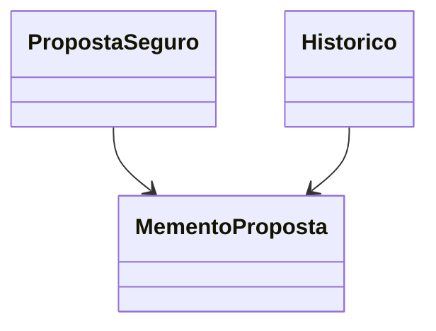
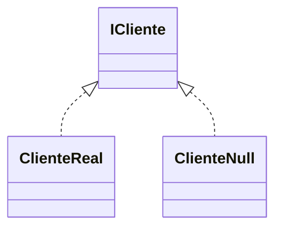
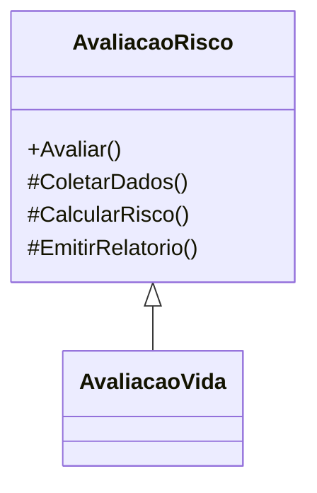

# ✅ Aula 10 – Padrões Comportamentais: Parte 3

## 🎯 Objetivos da Aula

Ao final da aula, os alunos deverão ser capazes de:

* Explicar o propósito e o funcionamento dos padrões comportamentais: Iterator, Mediator, Memento, Null Object e Template Method.
* Identificar situações práticas onde cada padrão pode ser aplicado.
* Implementar soluções usando esses padrões em C#.
* **Relacionar os padrões ao domínio de uma seguradora.**

---

## 🧩 Parte 1 – Introdução aos Padrões Comportamentais

### O que são padrões comportamentais?

São padrões que lidam com **a interação entre objetos**, focando em como os objetos se comunicam e se comportam em tempo de execução.

---

## 🧠 Parte 2 – Exemplos Genéricos dos 5 Padrões

Cada padrão é apresentado com:

* Conceito
* Diagrama UML (Mermaid)
* Exemplo em C#

Os arquivos do material contêm isso organizado por:

* **Iterator**: acesso sequencial de listas
* **Mediator**: comunicação desacoplada
* **Memento**: salvar/restaurar estado
* **Null Object**: tratamento padrão para ausência
* **Template Method**: algoritmo com passos definidos por subclasses

---

## 🏢 Parte 3 – Aplicação dos Padrões em um Sistema de Seguradora

### ✳️ Contexto

Uma seguradora lida com:

* Propostas de seguro
* Avaliação de risco
* Comunicação entre departamentos
* Histórico de alterações
* Clientes que podem estar indefinidos

Abaixo, mostramos **como cada padrão pode ser usado no domínio de uma seguradora**, com **exemplos reais em C#** e **diagramas UML em Mermaid.js**.

---

### 🔁 1. **Iterator – Propostas de Seguro**

**Uso**: Iterar sobre uma coleção de propostas aprovadas.

```csharp
public class Proposta {
    public string NomeCliente { get; set; }
    public string TipoSeguro { get; set; }
}
// Interface e implementação do iterador inclusas no projeto.
```

#### UML:



---

### 🧭 2. **Mediator – Comunicação entre Avaliação e Emissão**

**Uso**: Departamento de Avaliação envia solicitação para o Departamento de Emissão.

```csharp
public class Avaliacao : Departamento {
    public void Enviar(string msg) => _mediador.EnviarMensagem(msg, this);
}
```

#### UML:



---

### 💾 3. **Memento – Histórico de Propostas**

**Uso**: Salvar o estado anterior de uma proposta antes de alterar.

```csharp
var proposta = new PropostaSeguro { Cliente = "Ana", Cobertura = "Auto" };
var memento = proposta.CriarMemento();
proposta.Cobertura = "Residencial";
proposta.Restaurar(memento);
```

#### UML:



---

### 🚫 4. **Null Object – Cliente Indefinido**

**Uso**: Representar ausência de cliente de forma segura.

```csharp
public class ClienteNull : ICliente {
    public string ObterNome() => "Cliente não definido";
}
```

#### UML:



---

### 🧬 5. **Template Method – Avaliação de Risco**

**Uso**: Padronizar a avaliação de risco para tipos diferentes de seguros.

```csharp
public abstract class AvaliacaoRisco {
    public void Avaliar() {
        ColetarDados();
        CalcularRisco();
        EmitirRelatorio();
    }
}
```

#### UML:



---

## 🔧 Parte 4 – Projeto Integrado: Seguradora com Padrões Comportamentais

🎯 Um projeto completo está disponível no [arquivo de código](#) que implementa os 5 padrões comportamentais no mesmo contexto.

> O projeto simula um ciclo real:
>
> * Recebe clientes reais e nulos
> * Armazena propostas e permite desfazer
> * Avalia riscos com `Template Method`
> * Utiliza `Mediator` para interações departamentais

---

## ✅ Conclusão

Nesta aula, você:

* Aprendeu o propósito e funcionamento de 5 padrões comportamentais
* Entendeu como aplicar cada um em um contexto de negócio
* Viu como integrar todos em um sistema realista de **seguradora**


